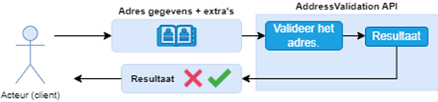
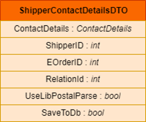
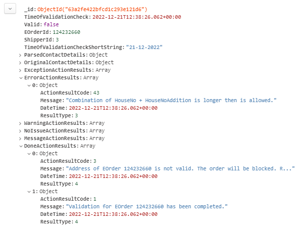
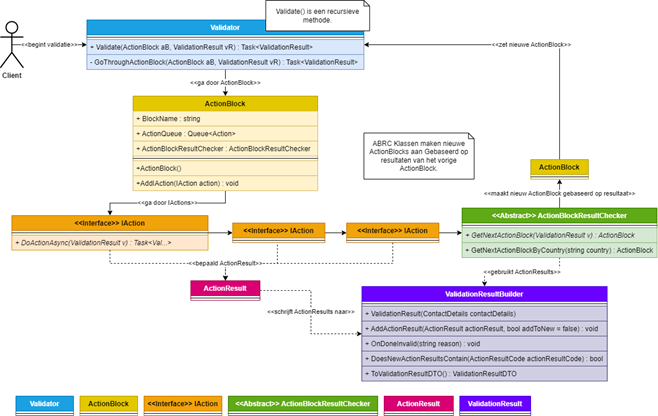
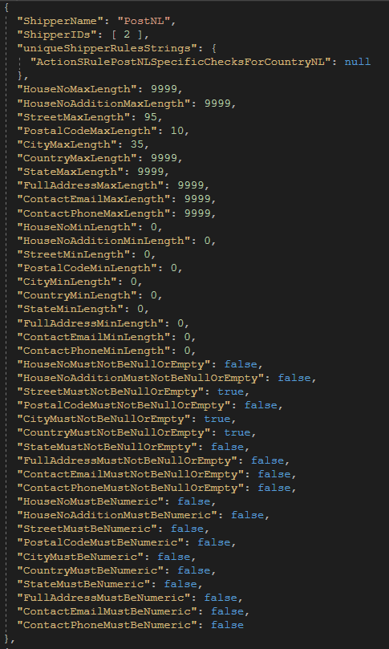
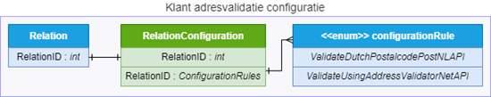
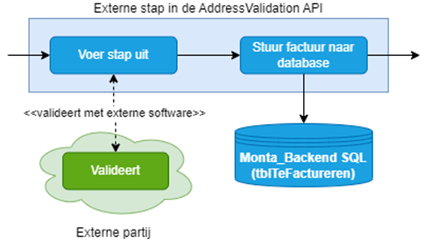

# AddressValidation API

## AddressValidation API

https://addressvalidation.monta.nl/swagger/index.html

11-01-2023, Erin

## Algemeen

De AddressValidation API is een nieuwe website binnen Monta met als doel het centraliseren en verbeteren van adresvalidatie binnen andere Monta processen. De applicatie staat momenteel live en wordt aangeroepen vanuit de Verify, maar wordt nog niet gebruikt om daadwerkelijk bestellingen te blokkeren als het adres als ongeldig wordt gezien. De applicatie gebruikt adresgegevens (ContactDetails) + extra's om een adres te valideren. Zie de afbeelding hieronder:

## Gegevens (input)
Er zijn drie adresvalidatie endpoints. Gebruik voor nu de validate-complete. Hiervoor is de volgende input nodig:

1. De ShipperID wordt gebruikt om regels per verzender te controleren.
2. De EOrderID wordt gebruikt als het uiteindelijke resultaat wordt opgeslagen.
3. De RelationID wordt gebruikt omdat voor bepaalde klanten bepaalde adresvalidatie stappen aan/uit gezet kunnen worden.
4. UseLibPostalParse wordt gebruikt om de LibPostal library wel/niet te gebruiken. LibPostal staat nog niet live. Zet deze daarom op false.
5. Als SaveToDb op true staat wordt het uiteindelijke resultaat opgeslagen in de Monta_Backend MongoDB.

 

## Gegevens (output)

Er wordt in hoofdlijnen gevalideerd op drie dingen: de regels van de verzender, de regels per land, en eventueel externe adresvalidatie software. Daarnaast zitten er ook andere checks, wordt geprobeerd gegevens automatisch te verbeteren, et cetera. De stappen zijn onderverdeeld in groepen. Zie de afbeelding hieronder:

-c6ba8d91-77bf-4923-a86e-437b572f03d8.png)

 

Adresvalidatie bestaat dus meerdere stappen. Het uiteindelijke resultaat van één adres validatie bevat algemene informatie, of het adres geldig is of niet, en de resultaten per stap. Je kan precies zien waarom een adres ongeldig is en welke stappen doorlopen zijn in het resultaat. Zie de afbeelding hieronder:

## Hoe wordt de AddressValidation momenteel gebruikt?
De AddressValidation API staat live, en wordt aangeroepen door de Verify voor elke bestelling. Het resultaat wordt opgeslagen in de Monta_Backend MongoDB, en de JSON die de API teruggeeft wordt opgeslagen. Het resultaat wordt nog niet gebruikt om daadwerkelijk bestellingen met een (volgens de AddressValidation API) ongeldig adres te blokkeren.

## Technische uitleg
Tijdens het adresvalidatie algoritme worden de stappen van adresvalidatie uitgevoerd, en per stap het resultaat toegevoegd aan een uiteindelijke adresvalidatieresultaat.

- De Validator loopt continue ActionBlocks door, totdat de adresvalidatie klaar is (het adres is (on)geldig verklaard).
- ActionsBlocks bevatten acties (IAction implementaties), en één ActionBlockResultChecker implementatie.
- IAction implementaties bevatten de businesslogica van de adresvalidatie.
- ActionResults zijn resultaten die vanuit IAction implementaties gegenereerd worden.
- ValidationResultBuilder bevat alle informatie over de validatie, en staat centraal. Wordt een keer geïnstantieerd en daarna continue aangevuld, tot de adresvalidatie voorbij is.
- De ActionBlockResultChecker controleerd of de individuele acties (van dat action block) het gewenste resultaat gaven, en maakt het volgende ActionBlock aan.

Voor elk land en elke verzender bestaan verschillende regels. Deze worden vanuit een JSON bestand opgeslagen. De regels kunnen daardoor makkelijk aangepast worden.

Naast adresvalidatie zelf heeft de AddressValidation API CRUD functionaliteiten voor:
- De adresvalidatie resultaten;
- De configuratie van klanten.

 

## Externe adresvalidatie
In de adresvalidatie zitten enkele stappen die externe software (APIs) aanroepen. Namelijk:

- PostNL Validation API https://developer.postnl.nl/browse-apis/checkout/postcodecheck/documentation/
- AddressValidator NET https://www.address-validator.net/

Voor AddressValidator net gebruik ik (Erin) nu een persoonlijk account (alleen voor testen). Om deze daadwerkelijk te gebruiken zal een algemeen Monta account ingesteld moeten worden inclusief betalingen, et cetera.

Deze staan niet standaard aan. Per klant kan bepaald worden of deze aan/uit gaan. Dit wordt ook opgeslagen in de Monta_Backend MongoDB.

Deze kunnen uiteindelijk aangezet worden via MontaPortal. Hier is een nieuwe pagina voor gemaakt (die nog niet live staat).

In de adresvalidatie wordt via de configuratie gekeken of/welke stap(pen) wel/niet doorlopen moeten worden.

Omdat deze externe adresvalidatie stappen geld (kunnen) kosten kan het zijn dat de klant gefactureerd moet worden hiervoor. Dit is ook de reden dat we willen dat klanten dit uit of aan kunnen zetten (willen klanten hier niet voor betalen kunnen ze kiezen externe adresvalidatie stappen uit te zetten

).

## Verdere stappen
De applicatie staat dus nog niet "echt" live (as of 11-1-2023). Eventueel volgende stappen zouden kunnen zijn:
- De adresvalidatieresultaten gebruiken in de Verify om bestellingen te blokkeren (eventueel eerst voor één klant).
- Alle regels van landen/verzenders te dubbelchecken.
- Externe adresvalidatie verder implementeren, om eventueel bij één klant te implementeren. Contact opnemen met externe partij(en), financiën regelen (API keys van externe partij regelen indien nodig, inbouwen dat klanten gefactureerd worden). Delen hiervan zijn al deels ingebouwd/geregeld.
- Uiteindelijke de adresvalidatie voor elke klant aanzetten, en elke klant de mogelijkheid geven externe adresvalidatie te gebruiken.
- Langzaam meer stappen/bronnen/regels/etc toe voegen aan de AddressValidation API.
- Eventueel adresvalidatie van andere processen (anders dan Verify) vervangen met de AddressValidation API, en (nu nog bestaande) adresvalidatie verwijderen uit de Verify/ShippingAPI/Etc.
