# Autostore

Autostore is een ASRS systeem (Automated Storage and Retrieval Systems). Het systeem bestaat uit een grid van maximaal 16 bins hoog. Bovenop dit grid rijden robots. Deze robots kunnen de bins optillen, neerzetten en verplaatsten. Onderstaand een video die de werking van de Autostore laat zien.

## Werking van de Autostore

::: video
<iframe width="560" height="315" src="https://www.youtube.com/embed/iHC9ec591lI?controls=0" title="YouTube video player" frameborder="0" allow="accelerometer; autoplay; clipboard-write; encrypted-media; gyroscope; picture-in-picture; web-share" allowfullscreen></iframe>
:::

## Verschillende data stromen bij de Autostore
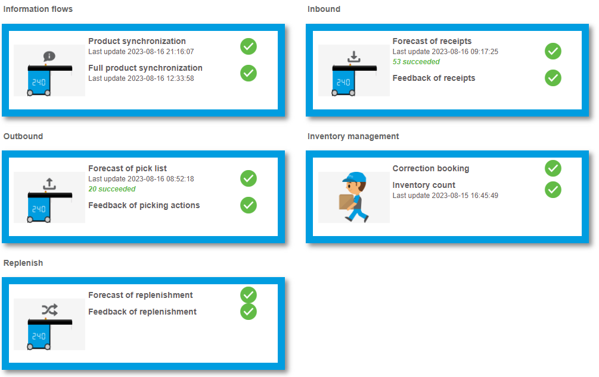

### Product synchronisatie
De nieuwe en gewijzigde producten zullen iedere vijf minuten naar de Autostore worden gestuurd. Iedere week worden alle producten gesynchroniseerd.

### Inbound
Als een inboundstation is gekoppeld aan de Autostore, dan wordt de optie autostore getoond in de inbound app. Deze staat standaard aangevinkt. Bij het inbounden van het product, zal er een AutoStoreTT01 label uit de printer komen. Ook wordt er ingepland, dat de inbound wordt doorgestuurd naar de autostore om hem daar te kunnen koppelen.

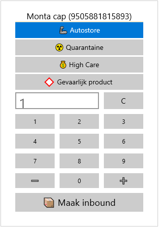

Door de barcode te scannen van de AutoStoreTT01 kan de juiste inbound gekozen worden bij het Autostore station. Zodra de producten zijn geplaatst in de Autostore, wordt de koppeling ook uitgevoerd aan de kant van Monta.

Aan de Monta kant heeft de Autostore maar één locatie. Dit is een multi product locatie, waarop alle producten die in de Autostore liggen worden geplaatst. Vanuit GoMonta is het niet mogelijk om een inbound te koppelen op deze locatie, dit moet altijd vanuit de Autostore worden gedaan.

Als een inbound wordt verwijderd in de Autostore applicatie, dan zal de inbound ook verwijderd worden aan de kant van Monta. Ook is het mogelijk om eerst de inbound te verwijderen in GoMonta. In dit geval met je deze ook handmatig verwijderen in de Autostore applicatie.

Bij het verwerken van retouren wordt gekeken of het product in de Autostore ligt. Als dit het geval is, dan komt er een AutoStoreTT01 label uit de printer en wordt de retour doorgezet naar de Autostore. Als dit niet het geval is, dan wordt de vraag gesteld of het product naar de Autostore moet.

### Outbound
De Autostore orders krijgen een aparte ready to pick status genaamd Autostore. Als een order een product heeft dat ligt in de Autostore dan krijgt de order deze status. De orders met deze status zullen niet getoond worden op de handscanner. Hierdoor moet het picken gestart worden via GoMonta.

Via de Autostore knop in GoMonta kan er een order batch worden gemaakt. Het is mogelijk om verschillende filters in te stellen. Op basis van deze filters wordt er een selectie orders doorgestuurd naar de Autostore. Ook is het mogelijk om handmatig een selectie orders te selecteren.

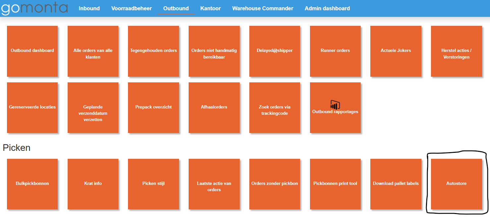

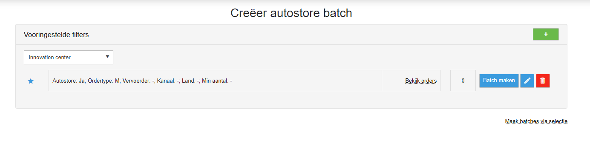

Er zijn drie soorten pickstromen:

- S-orders: In deze pickstroom zitten alleen de S-orders uit de Autostore. Deze kunnen naar het picken gelijk worden ingepakt. Het maximaal aantal orders in deze pickstroom is in te stellen in GoMonta bij de magazijn outbound instellingen. Dit is dezelfde instelling, die gebruikt wordt voor de handscanners.

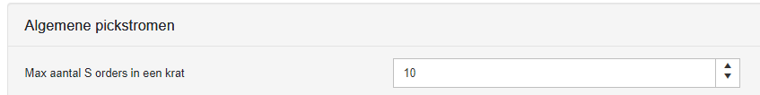

- Multiline orders volledig in de Autostore: In deze pickstroom zitten de multiline orders die alleen via de Autostore gepickt moeten worden. Deze kunnen naar het picken gelijk worden gesorteed in de Put-To-Light. Het maximaal aantal orders in deze pickstroom is in te stellen in GoMonta bij de magazijn outbound instellingen. Dit is dezelfde instelling, die gebruikt wordt voor de handscanners.

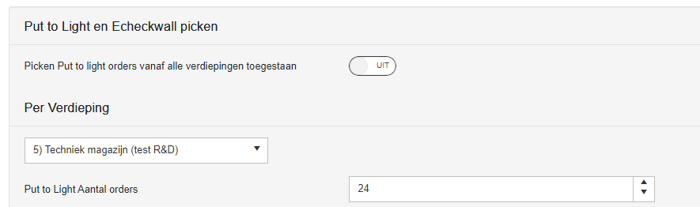

- Multiline orders gedeeltelijk in de Autostore: In deze pickstroom zitten de multiline orders die gedeeltelijk via de Autostore gepickt moeten worden. Na het picken via de Autostore, moet er nog een pickronde worden gelopen in het magazijn. De pickroute kan op de handscanner geopend worden via krat herstel. Nadat alle pickacties zijn gedaan, kunnen alle orders worden uitgesorteerd in de Put-To-Light. Het maximaal aantal orders in deze pickstroom is in te stellen in GoMonta bij de magazijn outbound instellingen. Dit is dezelfde instelling, die gebruikt wordt voor de handscanners.

Als er wordt start met picken bij de Autostore, dan komt er een label uit met het kratnummer en informatie op de bulkpickbon. Als de bulkpickbon is afgerond komt er weer een label uit de printer met het kratnummer en de vervolg stappen.

Als een bulkpickbon wordt verwijderd vanuit de Autostore, dan wordt deze direct terug erin gezet door Monta-systeem. Dit wordt gedaan, omdat een bulkpickbon niet gereset mag worden in het Monta-systeem.

### Voorraadbeheer
In GoMonta is het niet mogelijk om voorraad correcties op de Autostore locatie uit te voeren. Dit moet gedaan worden via de Autostore. De Autostore zal vervolgens een correctie boeking doorsturen naar het Monta-systeem, waar deze verwerkt zal worden.

Iedere dag wordt er een voorraadlijst vanuit de Autostore naar het Monta-systeem gestuurd. Hierbij zal worden gecontroleerd of de voorraadstanden nog kloppen. Als dit niet het geval is, dan worden deze verschillen getoond op de WCS pagina van de Autostore.

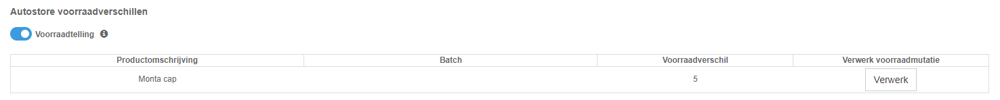

Hier kunnen de voorraadverschillen handmatig verwerk worden. De voorraadstand in het Monta-systeem zal dan gelijk worden getrokken met die van de Autostore. Verder is het optioneel om een voorraadtelling taak in de Autostore te schieten voor dit product. Standaard staat deze optie aan. In de Autostore kunnen deze taken geactiveerd worden en zullen alle Autostore locaties met dit product langskomen om geteld te worden.

### Replenish
Er kunnen geen producten direct verplaatst worden naar de Autostore locatie binnen het Monta-systeem. Als producten naar de Autostore geplaatst moeten worden, dan moeten deze eerst op een movebot-locatie geplaatst worden. Als een product op een movebot-locatie wordt geplaatst, dan krijgt de Autostore een vooraanmelding van dit product. Als dit product wordt geplaatst in de Autostore, dan zal de Autostore dit doorzetten naar het Monta-systeem. Hier wordt de verplaatsing vervolgens voltooid.

Als producten uit de Autostore moeten worden verplaatst naar het magazijn, dan dient er een order te worden aangemaakt. Vervolgens kunnen de producten geplaatst worden in het magazijn.

### Pickbon
Bij Autostore orders is het niet mogelijk om een pickbon te downloaden.

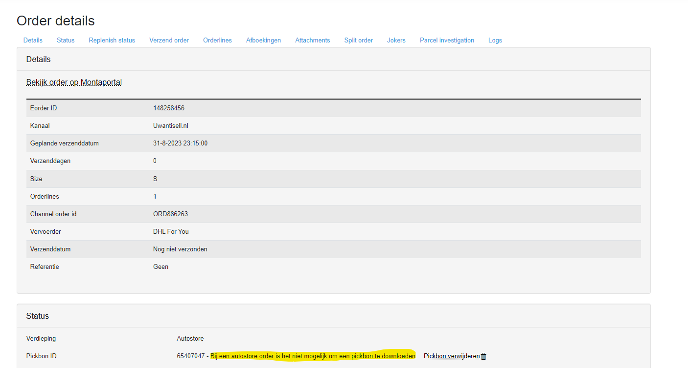

Als een order apart gepickt moet worden, dan kan via de Autostore schermen in GoMonta een handmatige selectie ingeschoten worden.

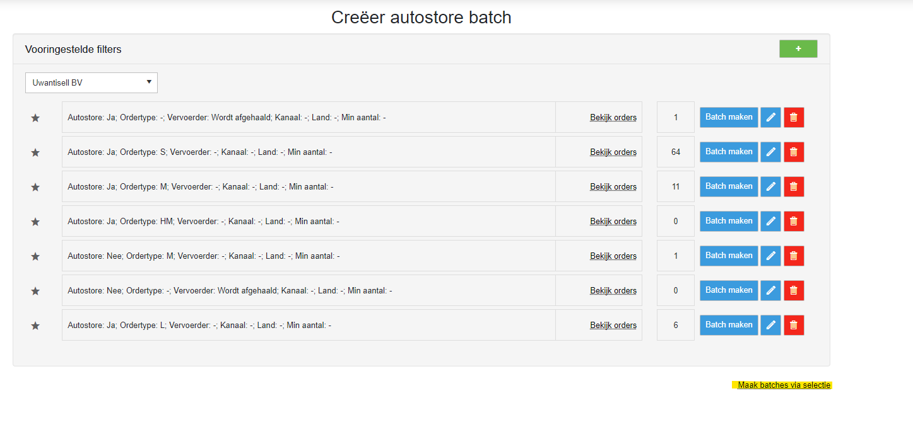

## Element Logic

https://emanager-integration.elementlogic.net/index.html

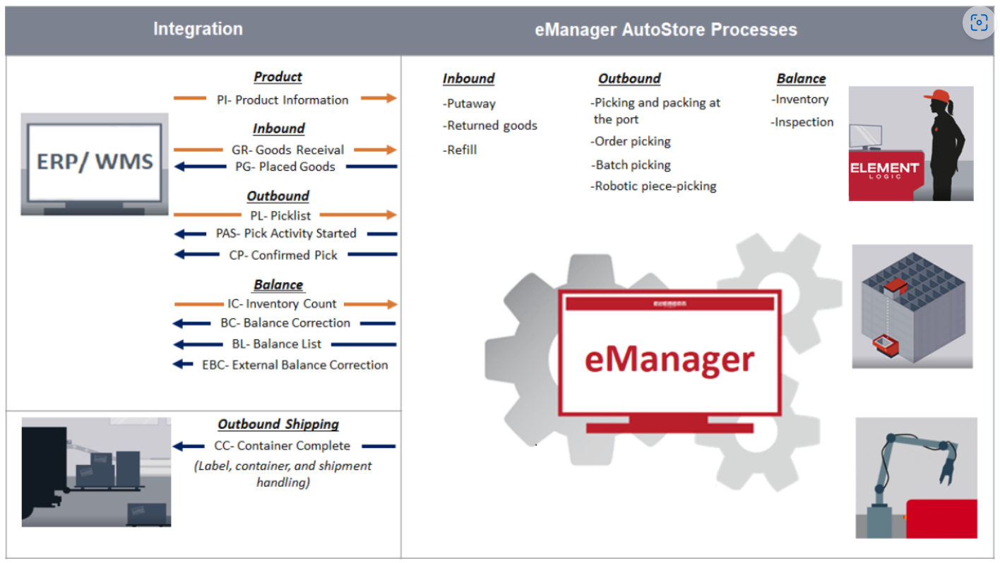

## Mogelijke problemen bij de Autostore

Een bulkpickbon kan worden afgerond in de Autostore zonder dat er gepickt wordt. Hierdoor zullen alle niet afgeronde pickacties op joker worden gezet. Om dit te herstellen neem dan contact op.

Soms wordt een bepaalde actie niet juist teruggekoppeld aan Monta. De gefaalde acties kunnen opnieuw worden verstuurd vanuit de Autostore software.

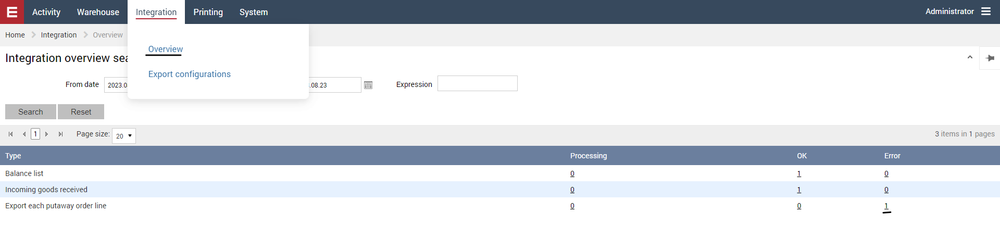

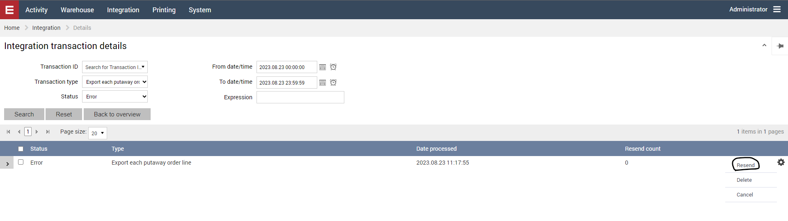

********** De informatie hieronder is meer van technische aard **********
## Technische informatie bij de Autostore

De Autostore service is te benaderen via autostore.monta.nl. Deze webservice draait op de mp-web340.montapacking.nl, mp-web341.montapacking.nl en mp-web342.montapacking.nl. De webservice bevat een backgroundservice. Hierin worden alle Autostore planningitems verwerkt.

Op deze servers is de emanager van de gekoppelde klanten ook te bereiken. De gegevens staan in de database in tblAutoStoreElementLogicSettings.

Alle tabellen voor de Autostore bevatten de naam Autostore.

### Outbound
De bulkpickbon wordt gesorteerd op productniveau doorgestuurd naar de Autostore. De pickacties worden gebundeld, zodat niet dezelfde Autostore locatie terugkomt. Dit wordt opgeslagen in de database. Als er is gepickt, dan wordt de hoeveelheid verdeeld over de pickacties.

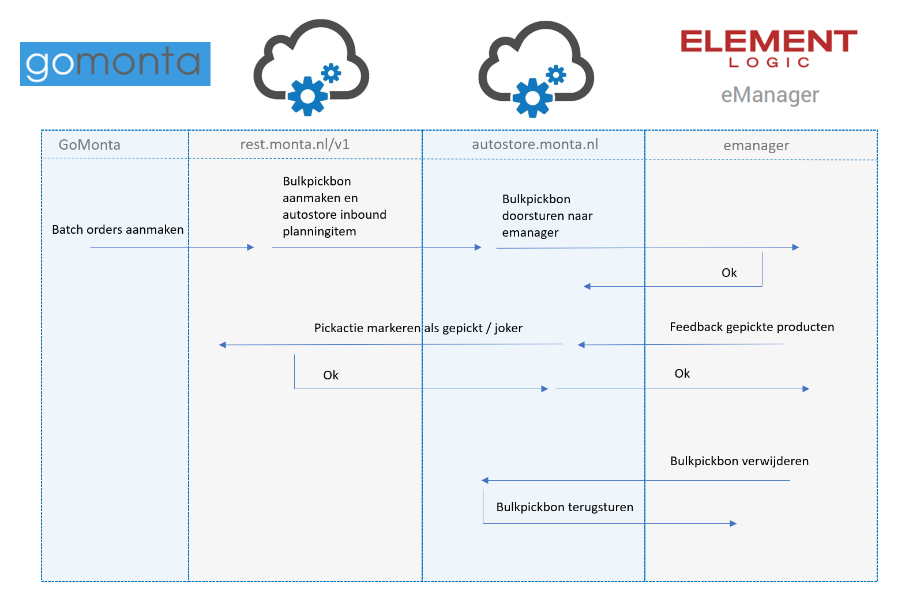

### Inbound en retouren
In de tabel tblInboundStations moet het AutoStoreId worden ingevuld om de Autostore te koppelen aan het Inbound/retouren station.

In de tabel tblMagazijnen moet de AutoStoreTT01 locatie worden ingevuld om deze te kunnen gebruiken.

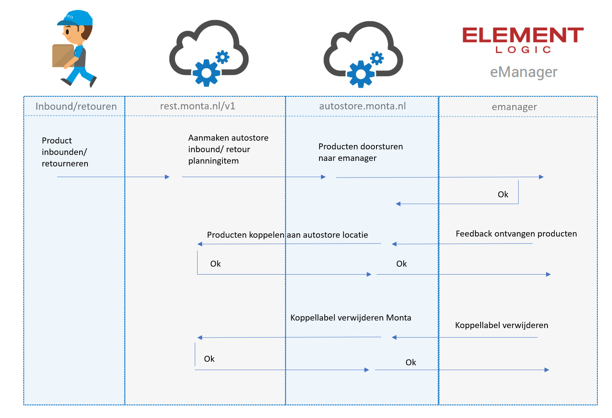

### Product synchronisatie
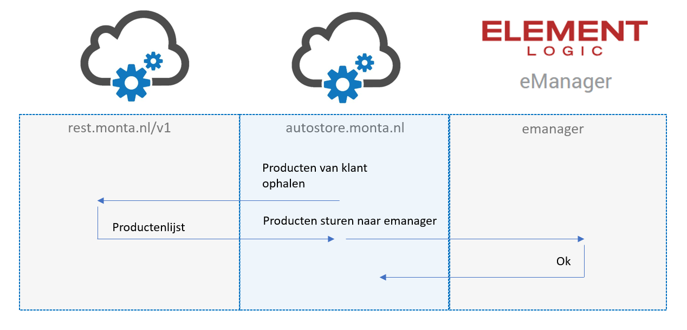

### Voorraadbeheer
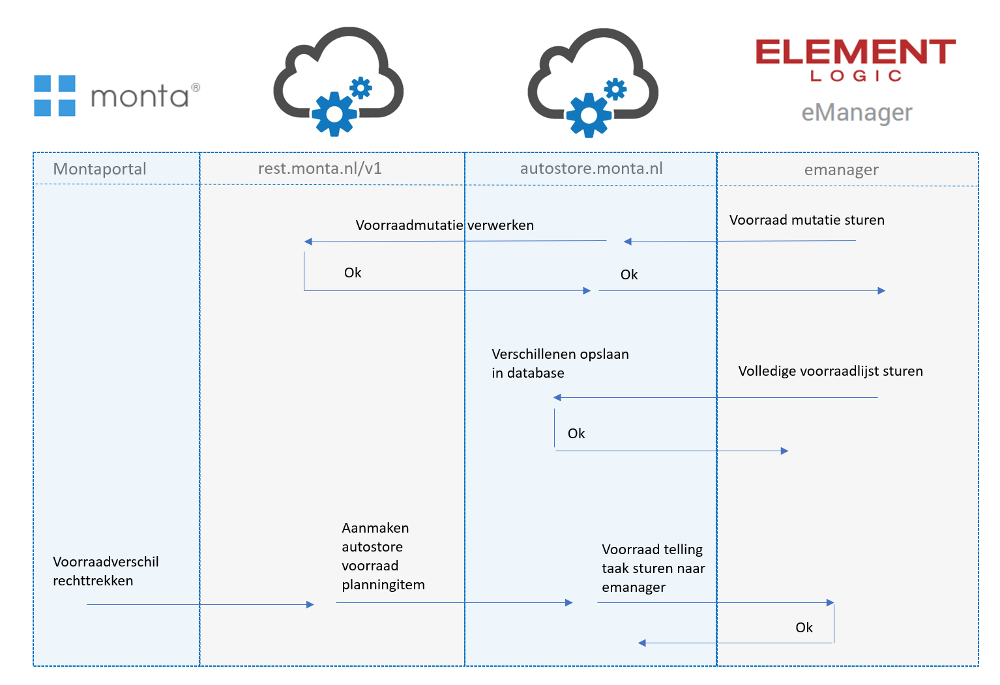

