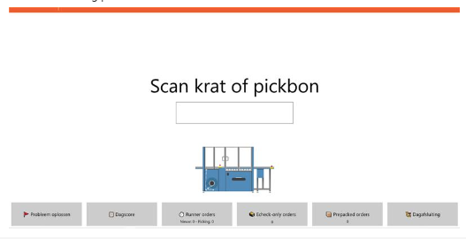
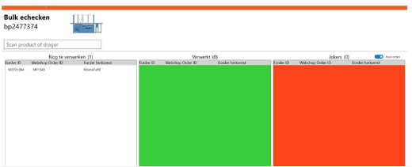
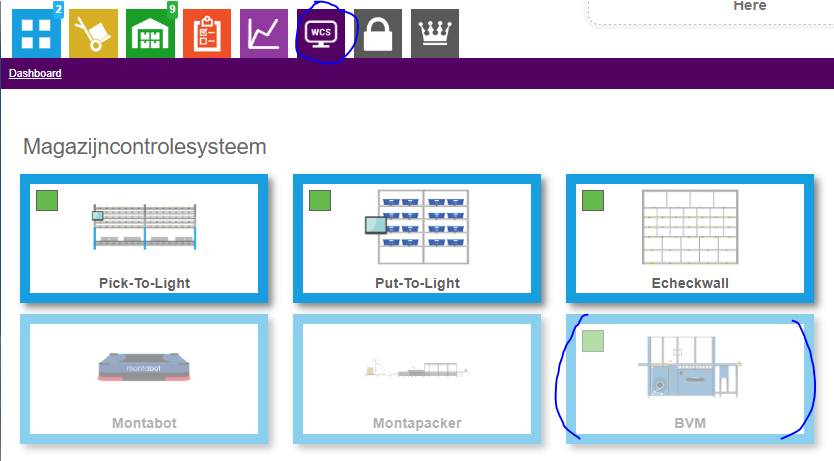
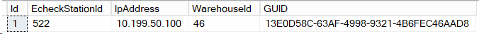

# BVM

BVM is de naam van een verpakkingsmachine. Deze verpakkingsmachine kan producten in zakken verpakken. Deze machine draait bij Monta Breda. Er worden voornamelijk S-orders op verwerkt en de machine is aangesloten op de rollenbaan om verpakte zendingen af te voeren.

## Echeck voor BVM
Op de BVM is een computer gemonteerd waarop de Monta Echeck software draait. In de Echeck schermen is duidelijk te herkennen dat het om een Echeckstation bij de BVM machine gaat doordat er een afbeelding van de BVM machine te zien is. Vanuit de Echeck software gezien gedraagt de BVM machine zich als een labelprinter.

## Drager
De zendingen die door de BVM machine verpakt zijn hebben als drager 'BVM Machine verpakkingsmateriaal'

## Pickstroom
Orders die geschikt zijn voor de BVM machine zijn te herkennen via onderstaande pickstroom op de scanner

## Business Intelligence montaWCS
Er wordt bijgehouden hoeveel orders verpakt zijn door de BVM. Deze informatie is in te zien via montaportal, onder het account van de vestiging.

## Hoe werkt de BVM machine
::: video
<iframe width="1280" height="720" src="https://www.youtube.com/embed/6-1N96Gu1oE" title="Hoe werkt de BVM machine?" frameborder="0" allow="accelerometer; autoplay; clipboard-write; encrypted-media; gyroscope; picture-in-picture" allowfullscreen></iframe>
:::

********** De informatie hieronder is meer van technische aard **********

## Technische informatie bij de Pick To Light

## Echeckstation gekoppeld aan BVM
De tabel waar een echeckstation aan een Monta BVM wordt gekoppeld is in de Monta_Backend database te vinden. De naam van de tabel is tblPackingmachineController. In deze tabel wordt het Echeckstation gekoppeld, wordt het magazijn bepaald en ook staat het IP nummer van een controller van de machine vermeld.

