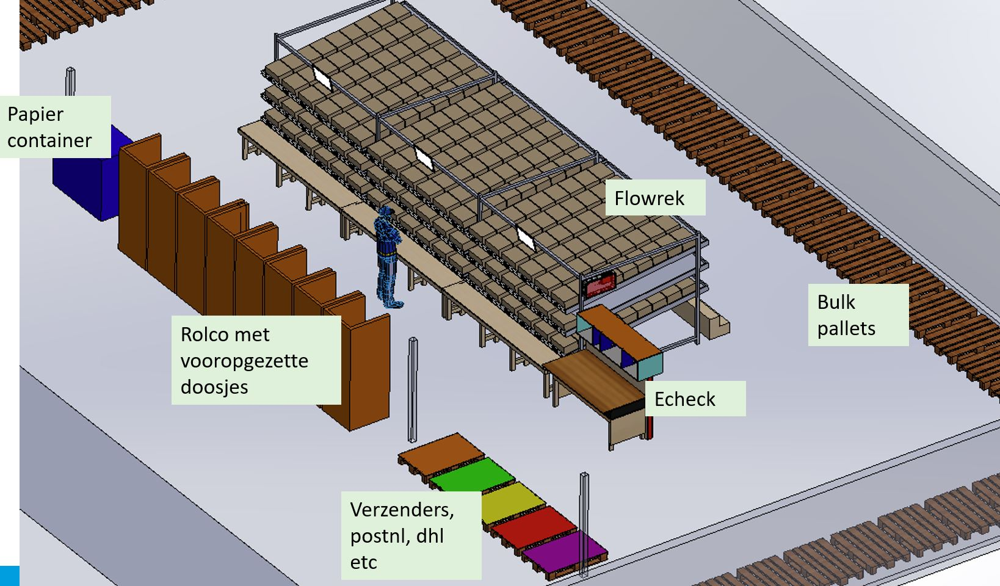

# Echeck To Light

## Echecklocaties met producten
Binnen Monta bestaat het concept Echecklocaties. Dit zijn gewone magazijnlocaties, maar ze  hebben de eigenschap Echecklocatie. Dit concept wordt gebruikt als je bijvoorbeeld bij elke order een flyer moet toevoegen. De flyers worden dan op de Echecklocatie gezet en het orderpicken van de orders wordt gedaan zonder die flyer. Daardoor worden worden sommige orders een S-order terwijl ze met flyer een M-order zouden zijn geworden. Tijdens het verpakken bij het Echeckstation, wordt door de software gevraagd om ook de flyer uit de Echecklocatie te pakken en bij de order te voegen. Per magazijn kan ingesteld worden hoeveel Echecklocaties er zijn en die Echecklocaties zijn dan voor elk Echeckstation beschikbaar.

## Echeck only order
Bij dit concept van Echecklocaties, kan het in uitzonderlijke gevallen voorkomen dat een order alleen maar producten bevat die op Echecklocaties liggen. Zo'n order wordt dan een 'EcheckOnly' order.
Van de mogelijkheid EcheckOnly orders kan gebruik worden gemaakt als een klant een heel klein aantal sku's heeft en kleine producten. Er zou den een kleine magazijnstelling geplaatst kunnen worden tegen een Echecktafel aan en in die kleine magazijnstelling kunnen dan alle sku's van zo'n klant liggen. In het volledige EcheckOnly proces van zo'n klant is dan eigenlijk de stap van orderpicken overgeslagen. Het concept van 'EcheckOnly' orders verwerken is verder uitgewerkt op deze pagina; [EcheckOnly](../../../Algemene-informatie/Outbound/Echeck-only)

## Echeck to light
Voor de klant Oot in Weide 30 is dit concept van EcheckOnly orders toegepast, maar dan met als uitbreiding dat er tijdens het Echecken een lampje gaat branden bij de Echecklocatie waarvanaf het te echecken product gepakt kan worden.

Om voor Oot een super snel proces te krijgen zijn een aantal aanpassingen gedaan.

Echeckonly orders (alleen oot zichtbaar bij echecktolight station en alle echeckonly orders op andere stations)

Volgorde: geplande verzenddatum, daarna magazijnlocatiecode

Echeckonly locatie oot001 t/m 00t070

Oot001 t/m oot010 voor dragers. Populairste drager op oot001

Dragers zijn producten die als eorderregel worden doorgegeven door oot en gewoon als producten worden gepickt (atop lampjes boven rolco’s met dragers)
Als drager als product (eorderregel) gescand is tijdens echecken, hoeft niet ook nog eens de drager gescand worden.

Als het Echeck station een Echecktolight is, wordt volgende order direct geopend (gaan lampjes branden) na afronden vorige order.
Dit gedrag is uit te schakelen door scannen van barcode ‘EcheckToLightNextOrderAutoOn’. En daarna weer in te schakelen door scannen van barcode ‘EcheckToLightNextOrderAutoOff’.

Filmpje van het EcheckToLight concept in werking

[filmpje EcheckToLight](https://youtu.be/-TI60l9h_pU)

<embed style="width:720px; height:450px;" src="https://youtu.be/-TI60l9h_pU"></embed>

********** De informatie hieronder is meer van technische aard **********
## Technische informatie bij de Echeckwall

Het systeem voor de Echeckwall bestaat uit verschillende onderdelen:

## Database
Gegevens over de EcheckToLight zijn te vinden in de tabel tblEcheckToLightStelling in Monta_Backend

Via de tabel tblEcheckToLightLocations in Monta_Backend worden de atop lampjes en magazijnlocaties aan elkaar en aan de EcheckToLight stelling gekoppeld.

via de kolom tblEcheckStations.EcheckToLightId kan bij een Echeckstation herkend worden dat het om een EcheckToLight gaat

