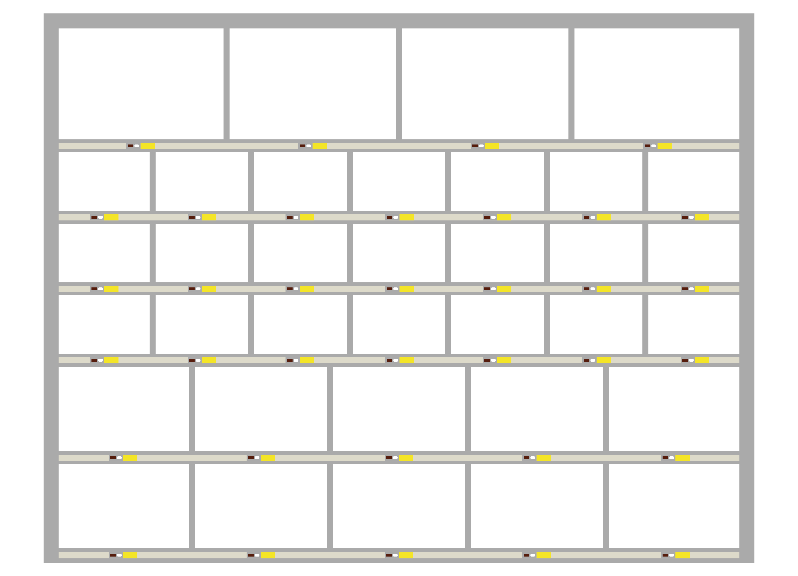
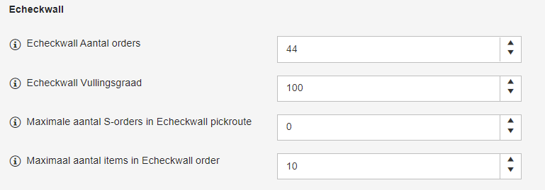
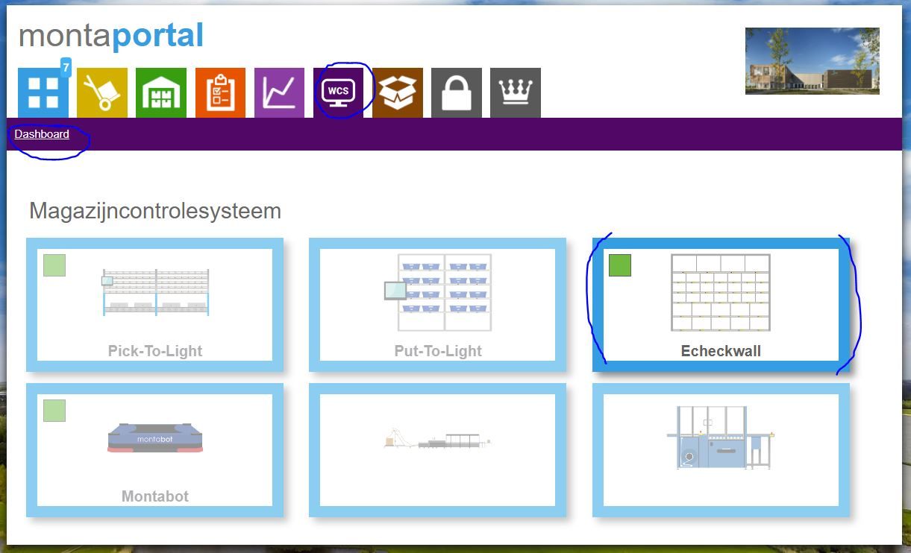

# Echeckwall

Een Echeckwall wordt gebruikt om producten die in bulk gepickt zijn uit te sorteren tot M-orders die via de Echeck verwerkt kunnen worden. Op deze pagina als eerste een stukje over de werking van een echeckwall en daarnaa een stukje over de techniek achter de echeckwall..

## Werking van de echeckwall

::: video
<iframe width="560" height="315" src="https://www.youtube.com/embed/SmCvd8nlMbc" title="YouTube video player" frameborder="0" allow="accelerometer; autoplay; clipboard-write; encrypted-media; gyroscope; picture-in-picture" allowfullscreen></iframe>
:::

## Mogelijke problemen bij de echeckwall

::: video
<iframe width="560" height="315" src="https://www.youtube.com/embed/iJRqIMffxQw" title="YouTube video player" frameborder="0" allow="accelerometer; autoplay; clipboard-write; encrypted-media; gyroscope; picture-in-picture" allowfullscreen></iframe>
:::

## Vuistregel, verhouding vakjes echeckwall en aantal orders in pickroute
Bij het werken met een echeckwall is het mooiste als er een balans ontstaat tussen picken, sorteren en echecken. Om dit te bereiken zou je vanuit de Echeck gedacht altijd voldoende volledig gesorteerde orders in de echeckwall willen hebben liggen. Maar vanuit het picken en sorteren gedacht zou je het liefst alle vakjes van de echeckwall leeg willen hebben. Om toch een balans tussen deze 2 tegenstrijdige wensen te bereiken, houden we meestal aan dat je als aantal orders in een pickroute de helft van het aantal vakjes van de echeckwall instelt. Heb je bijvoorbeeld 40 vakjes in de echeckwall beschikbaar, is het goed om het aantal M-orders in een bulkpickbak op 20 in te stellen. Hiermee wordt bereikt dat de sorteerder bij de echeckwall zo min mogelijk op de echecker hoeft te wachten en andersom.

## Instellingen
In Gomonta kan ingesteld worden hoeveel orders er in de Echeckwall pickroute kunnen "Echeckwall Aantal orders". Meestal houden we hiervoor aan om niet hoger te gaan dan de helft van het aantal beschikbare vakjes in de Echeckwall.

Daarnaast kan de vullingsgraad van de Echeckwall ingesteld worden "Echeckwall Vullingsgraad". Dit wordt voor zover ik weet niet meer gebruikt, omdat we nu met een stapelalgoritme uitrekenen of producten passen in een vakje of niet. De Echeckwall Vullingsgraad is dan alleen een soort fall-back mechanisme voor als het stapelalgoritme niet zou draaien.

Er kan worden ingesteld dat S-orders niet worden meegenomen in een Echeckwall pickroute "Maximale aantal S-orders in Echeckwall pickrout". Stel je vult hier het getal 5 in, dan zouden S-orders meegepickt worden in de Echeckwall pickroute als er minder dan 5 S-orders open staan. Zijn er meer dan 5 S-orders, dan komen die S-orders in een aparte S-order pickroute. Het idee hier achter is dat boven een bepaald aantal S-orders het efficiënter is om ze als aparte S-orders te picken en direct naar de Echecktafel te brengen.

En ook kan het maximale aantal items in een Echeckwall order worden ingesteld. Stel je hebt orders met meer dan 10 items en je denkt dat het efficiënter is die niet via de Echeckwall te verwerken, dan kun je dat hier instellen.

https://gomonta.montapacking.nl/WMS/Shift/WarehouseSettings

Een voorbeeld van zulke Put To Light instellingen is onderstaand te zien

**Klanten toevoegen in de echeckwall pickroute**

Via de onderstaande switch is het mogelijk of klanten toe te voegen of juist uit te sluiten van de echeckwall.
Deze instelling is te vinden in gomonta; Kantoor; Relaties.

## Business Intelligence montaWCS
Er wordt bijgehouden hoeveel orders gesorteerd zijn via een echeckwall en hoeveel jokers er zijn opgetreden. Deze informatie is in te zien via montaportal, onder het account van de vestiging waar de echeckwall staat.

********** De informatie hieronder is meer van technische aard **********
## Technische informatie bij de Echeckwall

Het systeem voor de Echeckwall bestaat uit verschillende onderdelen:

## Scanner

In de scanner is een nieuwe picksize toegevoegd, namelijk Echeckwall. Deze is aan te zetten op verdieping niveau in de database Monta_Backend. Dit vinkje staat in tblMagazijnLocatieVerdieping kolom 'EcheckwallEnabled' (deze instelling wordt eenmalig als een echeckwall in een vestiging geplaatst wordt, direct in de tabel gedaan). Het maximale aantal orders per ronde is ingesteld op 30 orders. Dit is instelbaar in het outbound settings scherm in gomonta.

Ook kan de Echeckwall gepicked worden met Need for Speed. Hierbij wordt de bulkkrat te de max gevuld met orders.

## Database

In de database Monta_Backend zijn een aantal tabellen aangemaakt voor de Echeckwall, deze tabellen bevatten allemaal Echeckwall in de naam. Deze tabellen hebben dezelfde structuur als de Put-to-Light.

## Check and Sort

De Echeckwall heeft een nieuwe UWP app, genaamd Check and Sort. Deze app is te vinden in Devops onder de repo: Echeckwall Check and Sort.

In de app moet je een bulkkrat scannen, vervolgens worden de orders verdeeld over de lege locaties en kan er gesorteerd worden.

Bij jokers moet iedere order aan een unieke blauwe krat gekoppeld worden.

Ook is een mogelijk om een enkele order te sorteren via de Check and Sort. Hierbij wordt er een bulkpickbon gemaakt en vervolgens kunnen de producten in de echeckwalllocatie worden gelegd.
De Check and Sort app draait op een NUC op de echeckwall.

## R-script product / vakjes afmetingen
Er draait een taak die van nieuwe orders bekijkt in welk echeckwall vaktype ze passen. Er is een R-script voor die berekening.
Heel soms draait dat R-script niet. Dat blijkt dan soms uit belletjes dat er ineens orders zijn die slecht passen in de echeckwall. Met deze query kan gecontroleerd worden welke orders open staan om door het R-script geanalyseerd te worden.

_select tblEorderPickingInfo.EorderID
from tblEorderPickingInfo
inner join tblEorder on tblEorderPickingInfo.EorderID = tblEorder.EorderID
inner join tblEcheckWallLinkFloor on tblEcheckWallLinkFloor.VerdiepingId = tblEorderPickingInfo.VerdiepingID
where EorderShippedDate is null and EcheckwallLocationTypeId is null and EorderSizeOfOrderText IN ('S', 'M', 'HM') and tblEorderPickingInfo.Aanmaakdatum < DateADD(mi, -5, GETDATE())
group by tblEorderPickingInfo.EorderID_

Bovenstaande query geeft altijd wel wat resultaten, maar als er meer dan 200 records als resultaat uit de query komen, is dat een indicatie dat het R-script niet goed gedraaid heeft. Herstarten van de Echeckwall service op de mp-proc02 is dan meestal de oplossing.

Als je vragen vanaf de werkvloer krijgt dat er veel meer uglies zijn dan gebruikelijk, kan dat ook een indicatie zijn dat het R-script niet goed gedraaid heeft.
​​​​​​​
Het herstarten van het R-script is bekend bij David, Ruurd, Kevin en JohanV.

## Inpakken

Aan de inpakkant wordt de normale echeck-app gebruikt. In principe kun je gewoon werken met een echeckwall door vanuit de Echeck-app een vakje van de echeckwall te scannen. De meeste vestigingen gebruiken die methode.
Er kan echter ook voor gekozen worden een Echeck-station te verbinden aan een Echeckwall, dan bepaalt de Echeckwall de volgorde van de te echecken orders

Om over te schakelen naar de echeckwall-modus. Moet een echeckstation gekoppeld zijn in tblEcheckWallStellingZones.

In het hoofdmenu wordt nu een knop getoond 'Zoek order' ipv 'Scan krat'.

Als er een order is gepakt vanuit de echeckwall, dan hoeven enkel de dragers gescand te worden en vervolgens kan de order worden afgerond. Hierbij zal worden gevraagd, hoeveel producten de order bevat.

Wel is het mogelijk om alle producten te scannen als extra check. Hiervoor moet in tblMagazijnen het vinkje 'EcheckwallScanProducten' worden omgezet. Dan zal de echeck op de normale manier werken met als uitzondering de knop 'Zoek order'.

## Ledstrips

Naast de atop-controllers is de echeckwall ook voorzien van ledstrips om het vak duidelijk te markeren. Hiervoor zijn 3 tabellen gemaakt in de database, namelijk:

tblLedstripController
tblLedstripMicroController
tblLedstripNodes
Voor in alle tabellen wordt de kolom Remark gebruikt om de juiste controller, microcontroller of node te vinden.

Voor de controller wordt het deviceId gebruikt. Voor de microcontroller een 7-tallig nummer. Dit is te vinden in de logs in de EmbeddedDeviceManager. Voor de nodes moet een getal tussen de 0 en de 5 worden ingevuld.

De ledstrips worden aangestuurd via een Pi met de app 'LedstripHandler'. De communicatie gaat via RabbitMQ, via de exchange 'LedStrip-Exchange'. Iedere Pi heeft een unieke queue.

Vanuit de Check and Sort en de echeck worden er berichten gestuurd naar de Exchange om het vak te belichten of uit te zetten.

## Echeckwall supervisor

Om de atop-knoppen te bedienen aan de inpakkant wordt er gebruik gemaakt van een Pi die hiermee verbonden is.

Via RabbitMQ wordt gecommuniceerd, als een knop aangezet moet worden en wanneer deze wordt ingedrukt.

Dit wordt per echeckstation geregistreerd en teruggestuurd.

Hiervoor heeft de Echeckwall supervisor een exchange (EcheckWallSupervisor-Exchange). Verder heeft iedere supervisor een unieke queue.

Voor de inpakkant is ook een exchange aangemaakt (EcheckWall_PackSide-Exchange). Hierbij heeft ieder station een unieke queue.

Dit is zo gedaan, omdat maar één device verbinding kan maken met een atop-controller.

## Business Intelligence info
Om in het montaWCS in montaportal weer te kunnen geven hoeveel orders een echeckwall verwerkt heeft en hoeveel jokers er waren, wordt deze informatie dagelijks geaggregeerd en opgeslagen in de monta_ai database op de MP-SQl06. De tabelnamen zijn: EcheckwallStats en EcheckwallPickroutes. Het script dat deze tabellen vult, draait op de proc02 via de WindowsService 'RScheduler'. De naam van dit script is EcheckwallStatistics.

Instellen van nieuwe echeckwall in de database
Het instellen van de adressen voor de atop lampjes en de ledstrips in de database is vrij complex. Daarom is er een software tool ontwikkeld om een groot deel van de complexiteit uit handen te nemen. Deze software draait op een laptop van de Technische Dienst. Meestal zal de Technische Dienst ook de afdeling zijn die nieuwe echeckwalls produceert en instelt. Martien Verhaar en Ruurd de Ronde kennen deze echeckwall instel software goed.

