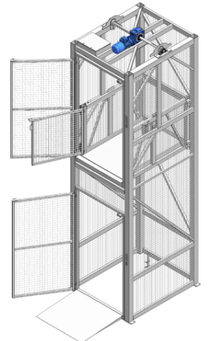

# Goederenheffer

Goederenheffers worden gebruikt om goederen verticaal te transporteren tussen verdiepingen.
De meeste goederenheffers zijn standalone systemen voor handmatige bediening. In Molenaarsgraaf zijn 2 goederenheffers automatisch en daarmee geschikt voor [Montabots](../../../Algemene-informatie/Apparaten/Montabots). Dit houdt in dat de bewegingen van de goederenheffers en de deuren vanuit de software aangestuurd wordt, waardoor de goederenheffers kunnen samenwerken met de **[Montabots](https://vragen.monta.nl/Docs/Algemene-informatie/Apparaten/Montabots/)**.

## Documentatie Goederenheffers Stapro
Stapro heeft bij de goederenheffers een map met [Instructie en documentatie Goederenheffer](../../../Algemene-informatie/Apparaten/Goederenheffer/Instructie-en-documentatie-Goederenheffer) geleverd. [Deze is hier te vinden](../../../Algemene-informatie/Apparaten/Goederenheffer/Instructie-en-documentatie-Goederenheffer)

********** De informatie hieronder is meer van technische aard **********

## Technische informatie bij de Goederenheffer

Het systeem voor de Montabot Goederenheffer bestaat uit verschillende onderdelen.

## Sigmatek ​​​​​​​PLC
De Goederenheffer wordt aangestuurd door een Sigmatek PLC. Deze is ontwikkeld door Eurotec. Deze stuurt opdrachten naar de PLC van de Goederenheffer.

## MontabotHefferWindowsService
De MontabotHefferWindowsService draait op de mp-proc03 (Eindhoven) en mp-app06 (Rotterdam). De service maakt een TCP verbinding met de  PLC. De service kan de status van de Goederenheffer uitlezen en kan de Goederenheffer ​​​​​​​een opdracht sturen. Dit zijn de volgende opdrachten: Naar een verdieping gaan, deur openen of deur sluiten.

## Montabot service
De MontabotHefferWindowsService stuurt de status van de Goederenheffer door naar de Montabot service via RabbitMQ. De exchange heet 'Lift-Exchange'. De Montabot service kan de opdrachten verdelen over de Goederenheffers. Ook wordt door de Montabot service de rekken in de Goederenheffer gezet en vervolgens eruit gehaald op een andere verdieping.

