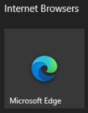

# Kioskmode op productie computers

## Inleiding,
Op de computers in de productieomgeving van Monta is een Kioskmode uitgerold om het werken met de computers te beveiligen en te vereenvoudigen. Alle functies die gebruikt kunnen worden zijn vanaf de desktop op te starten.

## Monta Apps,
In het vakje “Monta Apps” vind je de applicaties die gerelateerd zijn aan Monta.

Denk hierbij aan:
-	Monta Echeck
-	Monta Inbound
-	Monta  Retourverwerken
-	MontaPortal
-	GoMonta

Afhankelijk wat de functie van de computer is (Echeck, Inbound of Retour) start de applicatie automatisch op.

---

## Diverse Apps,
In het vakje “Diverse Apps” vind je de applicaties die verder nog gebruikt kunnen worden op de productie computer.

Denk hierbij aan:
-	Bedrijfsportal
-	Rekenmachine
-	Camera, o.a. voor het Inbound-process
-	Office 365, dit is een link naar de webversie van Microsoft Office 365 en is alleen te gebruiken door collega’s die ook een Microsoft account hebben van Monta.
-	Google, Zoekmachine
-	Afdrukbeheer, voor het toevoegen van een lokale printer. Neem voor meer info contact op met de [Servicedesk](mailto:servicedesk@monta.nl?subject=Toevoegen%20van%20printer%20productie%20werkplek).

---

## Internet Browsers,
In het vakje “Internet Browsers” vind je de applicaties die gerelateerd zijn aan Monta.

Het internet in de Montakiosk heeft restricties. Kun je een website van een klant niet bezoeken geef dit dan per email door aan de [Servicedesk](mailto:servicedesk@monta.nl?subject=Toevoegen%20van%20website%20aan%20kioskmode).
