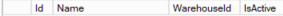

# LedControl handleiding

Dit is de handleiding om een LedControl systeem op te zetten.

---

## Benodigde hardware

- Voeding
- Ledcontrollers
- Ledstrips
- Pc

Gebruik een voeding die het wattage van de ledstrip aan kan! (Voor de Havana pixel strip is dit 14,4W per meter)

Sluit de voeding als volgt aan op de ledcontroller en de ledstrips om knipperen van de ledstrips te voorkomen:

---

## LedController instellingen

### Showtec SPI-2 Install
De instellingen van de ledcontroller kunnen gedaan worden op de controller zelf of via de webpagina van de controller.

Neem de volgende instellingen over

Vul bij `LED Quantity` het aantal meter van de ledstrip keer 10 (elke 10 centimeter is apart aanstuurbaar).

Let op dat de `Universe` bij de 2 ports verschillend zijn, `DMX Address` maakt niet uit.

Als er niets is aangesloten op een van de uitgangen vul 1 in bij `LED Quantity` 0 is niet toegestaan.

Volledige handleiding: https://www.highlite.com/en/mwdownloads/download/link/id/17426620/

---
### Showtec NET-2/3 Pocket
Ook deze controller heeft een web interface wat het instellen wat makkelijker maakt.

De username is `Admin` en het wachtwoord is `Admin`.

Neem de volgende instellingen over:

Let weer goed op bij `Network` dat deze verschilt bij de 2 uitgangen.

Volledige handleiding: https://www.huss-licht-ton.de/images/products_download/Manual_34954_1.pdf

Bij het instellen van DMX adressen in de lampen is het belangrijk dat er goed doorgeteld wordt. Bijvoorbeeld 2 lampen met 3 adressen, lamp 1 start op adres 1, lamp 2 start op adres 4, enzovoorts.

Belangrijk! bij beide uitgangen wordt er begonnen met tellen vanaf 1.

---

## Database instellingen
### Controllers instellen
De tabellen staan in de Monta_Backend database

De eerste tabel die ingesteld moet worden is `tblDmxController`

Het `LocalIpAddress` is niet verplicht om in te vullen

Vervolgens kan de tabel `tblDmxUniverses` ingesteld worden

In deze tabel moet voor elke uitgang van de controller een rij toegevoegd worden, voorbeeld:

Het `ControllerId` is het `Id` uit tabel `tblDmxController`

De waardes `Universe` en `SegmentQty` komt overeen met de instelling in de controller.

De waarde `Order` kan gebuikt worden om aan te geven welke uitgang eerst komt zoals bij een trap.

---

### Groepen maken
In de tabel `tblDmxWarehouseGroup` kunnen nu groepen gemaakt worden.

De `Name` die hier ingesteld wordt is ook de naam die op MontaPortal getoond wordt.

Met `IsActive` kan een groep aan of uit gezet worden

Nu we de groepen hebben kunnen er subgroepen gemaakt worden in de tabel `tblDmxGroups`.

De `DisplayName` die hier ingesteld wordt is ook de naam die op MontaPortal getoond wordt.

Het `GroupId` is het `Id` uit de tabel `tblDmxWarehouseGroup`.

Het `GroupTypeId` kan meerdere waardes hebben hieronder een lijst van de mogelijkheden
- 1 = controller, de groep bestaat uit een volledige uitgang
- 2 = segmenten, de groep bestaat uit bepaalde segmenten van controlleruitgangen
- 3 = sensoren, de groep bestaat uit segmenten en is specifiek bedoeld voor LedSensorControl
- 4 = dmx kanalen, de groep (of eigenlijk lamp) bestaat uit een aantal kanalen, altijd 3 of 4!

Het `ControllerId` moet altijd ingevuld worden, dit kunnen er ook meerdere zijn.

De `Segments` hoeven alleen bij `GroupTypeId` 2 en 3 ingevuld worden. Een aantal segmenten kan bij elkaar horen zoals bij een traptrede. Om dit te doen kun je de segmenten zo noteren:

Bij elkaar horende segmenten worden doorgeteld met `-` en gescheiden segmenten door `,`.

Om segmenten goed aan te sturen moeten de segmenten doorgeteld worden, als er 4 uitgangen gebruikt worden (2 controllers) begin je dus niet overnieuw met tellen bij een volgende uitgang maar wordt er doorgeteld.

De `Channels` wordt alleen ingevuld bij `GrouptypeId` 4. Kanalen worden alleen gescheiden door `,` en kunnen alleen bestaan uit 3 of 4 kanalen (RGB en RGBW)

Controllers kunnen bij meerdere groepen horen mits die groepen hetzelfde `GroupTypeId` hebben.

----

### Scenes
In de tabel `tblDmxWarehouseScenes` staan de scenes die gemaakt kunnen worden in MontaPortal.

Hier is het niet nodig om iets toe te voegen.

---

## MontaPortal
In MontaPortal moet er een thumbnail worden toegevoegd om duidelijk te maken waar de verlichting zicht bevindt.
Deze afbeelding moet dezelfde naam hebben als de `Name` zoals die in de database in tabel `tblDmxWarehouseGroup` staat.

De afbeelding moet in de map `\\mp-web320.montapacking.nl\cdn.montaportal.nl\PublicFiles\Images\Hardware afbeeldingen\LedControl` staan. (Graag zoveel mogelijk in dezelfde stijl als Molenaarsgraaf)

---

## Lokale PC
Om het LedControl programma te kunnen runnen moet er een pc lokaal in het pand zijn om de ledcontrollers aan te sturen.
Het programma LedControl moet met 1 argument aangeroepen worden, dit argument is het WarehouseId waar de pc zich bevindt.

Bij het LedSensorControl programma hoeft dat niet omdat dit programma specifiek voor Molenaarsgraaf is en niet op andere locaties wordt gebruikt.

De Pc moet toegang hebben tot MontaWebserviceREST en de ledcontrollers.
