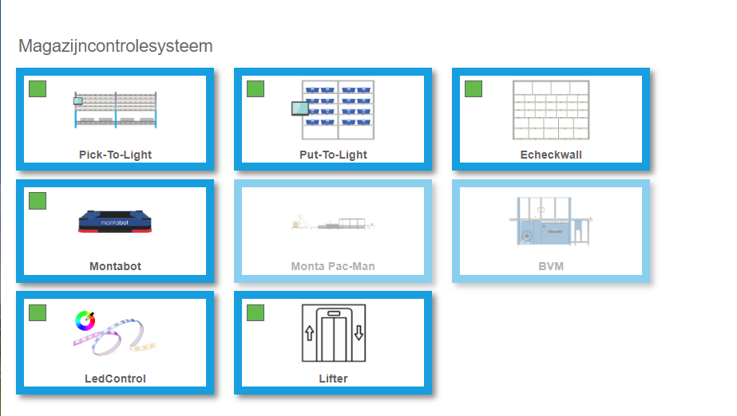
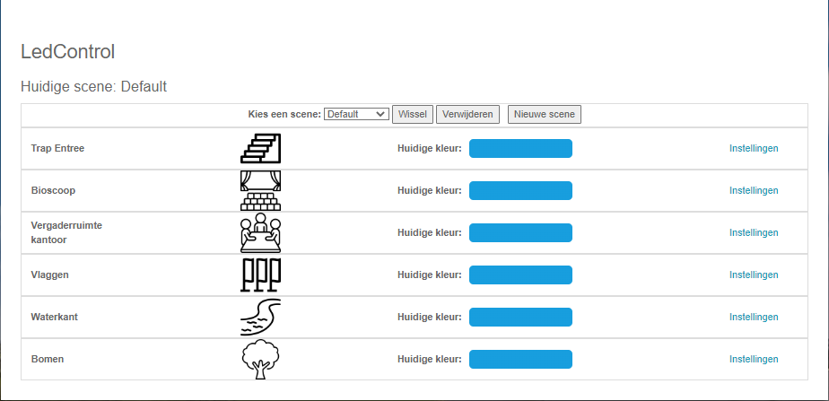
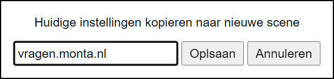
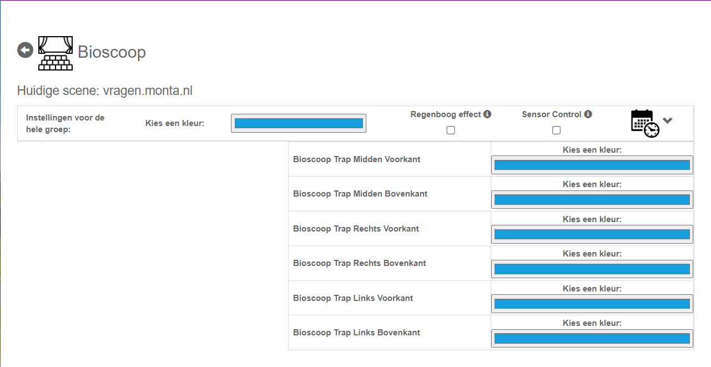
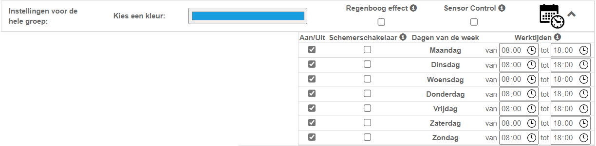
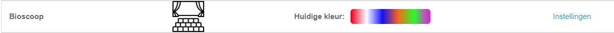
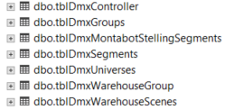

# LedControl

LedControl is een systeem dat gebruikt wordt om alle sfeer / effect verlichting in en rond het pand aan te sturen. Met dit systeem kunnen kleuren, effecten en werk tijden ingesteld worden.

## Waar kunnen de instellingen gedaan worden?
In MontaPortal onder WCS is een apart kopje gemaakt voor LedControl:

Op deze pagina zie je alle groepen en welke kleur deze hebben. Ook kunnen er scenes gemaakt en verwijderd worden.

Om een nieuwe scene te maken druk je op de knop "Nieuwe scene", je ziet dan een pop up venster met de vraag welke naam de scene moet krijgen. Het systeem kopieert de huidige instellingen naar de nieuwe scene.

Wanneer er meerdere scenes zijn kan er gewisseld worden tussen scenes.

Om instellingen van een groep te veranderen druk je op instellingen, je ziet dan de volgende pagina:

Hier kan je de kleur voor de hele groep aanpassen of de kleur per subgroup. Ook kan je effecten kiezen die voor de hele groep gelden, bijvoorbeeld het regenboog effect. Wanneer er meerdere effecten gekozen kunnen worden, kan er maar 1 actief zijn.

Als er op het timer symbool wordt gedrukt opent de volgende tabel:

Hier kan er per dag aangegeven worden of de verlichting in die groep aan moet staan. (Let wel op dat de eindtijd niet later mag zijn dan de begin tijd). De sluimerschakelaar zorgt ervoor dat de verlichting uit gaat 1 uur na zonsopgang en weer aan 1 uur voor zonsondergang, mist er tijden zijn ingesteld.

Als de dag aan is gezet maar er zijn geen tijden ingevuld dan zal de verlichting de hele dag en nacht branden.

Als er bij subgroepen verschillende kleuren worden gekozen dan kan je dit ook zien op de hoofdpagina wordt dit ook aangepast op de hoofdpagina:

********** De informatie hieronder is meer van technische aard **********

## Technische informatie bij LedControl

## Tabelstructuur
de tabellen voor LedControl staan in Monta_Backend Database

Hierin worden scenes, controllers, groepen en subgroepen opgeslagen. Lees de handleiding hoe je dit in moet stellen.

## Hardware
De voorkeur ledstrip gaat naar de Artecta Havana Pixel Strip RGB 24V.

De voorkeur ledcontroller om ledstrips aan te sturen gaat naar de Showtec SPI II Install. Deze controller kan 2 keer 17 meter van de pixel ledstrip aansturen.

De voorkeur ledcontroller om led lampen (dmx) aan te sturen gaat naar de Showtec NET-2/3 Pocket.

## Structuur
Hieronder is de structuur die LedControl gebruikt aangegeven:

De software LedControl en specifiek voor Molenaarsfraaf LedSensorControl moeten lokaal in het pand draaien en toegang hebben tot de LedControllers en indien nodig een PLC. Deze pc moet ook rabbitmq kunnen bereiken.

In Molenaarsgraaf staat deze pc in de bioscoop.
