# Gebruik en schoonhouden van Monta Pacman

Monta Pacman is een verpakkingsmachine die momenteel in Lelystad gebruikt wordt. Op deze pagina zijn instructies en video's te vinden voor het gebruiken en schoonmaken van de Monta Pacman

## Quick reference guide
De Quick reference guide als PDF te zien, zodat je kunt printen of inzoomen.
[Quick Reference.pdf](../../../../Attachments/Quick%20Reference-f17efd40-6383-4b2b-88f2-61cfad94a5d2.pdf)

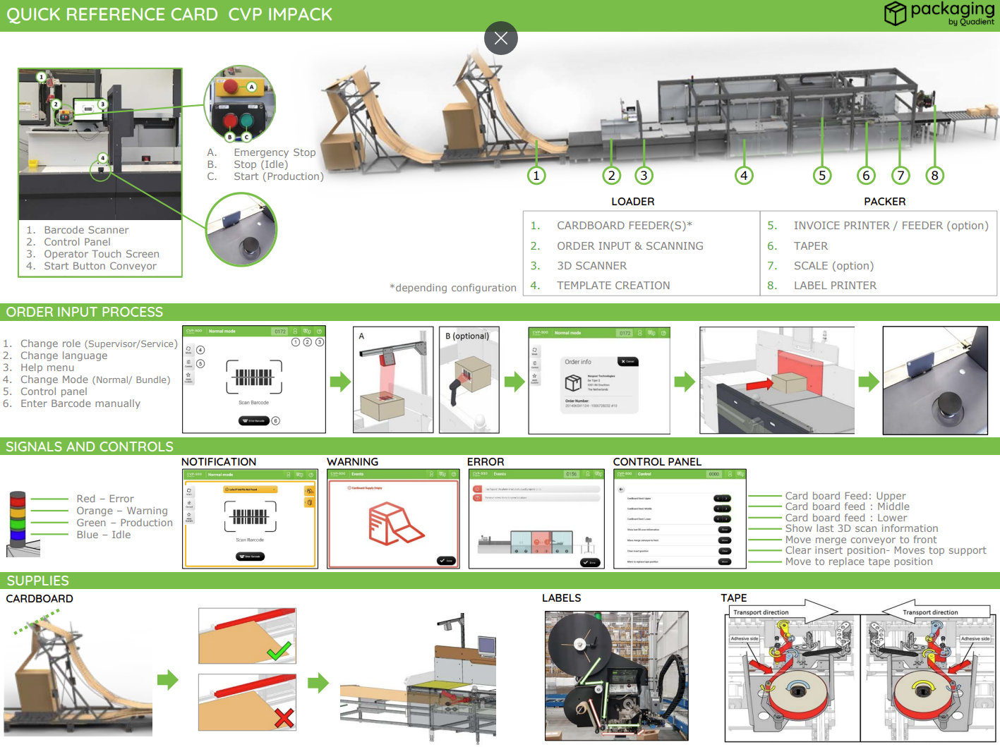

## Algemene machine bediening gegevens
Onderstaand zijn video's te vinden over voorkomende werkzaamheden bij de Monta Pacman machine

**Gevaren symbolen**

**Overzicht van machine met benamingen**
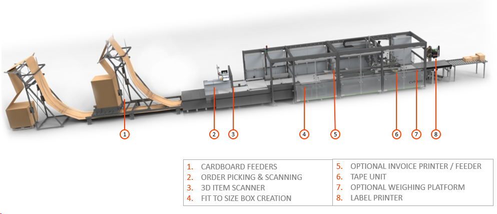

**Linker en rechter operator**

**Aanzetten en uitzetten van de machine**
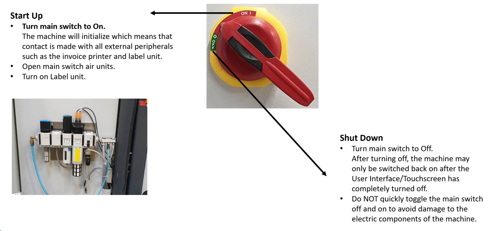

**Hoofdbedieningspaneel**
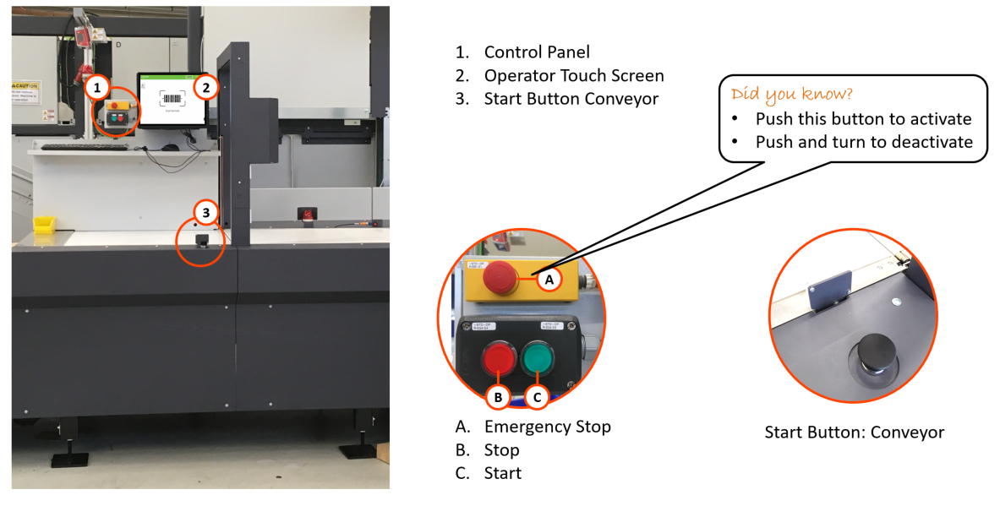

**Bedienings modus**
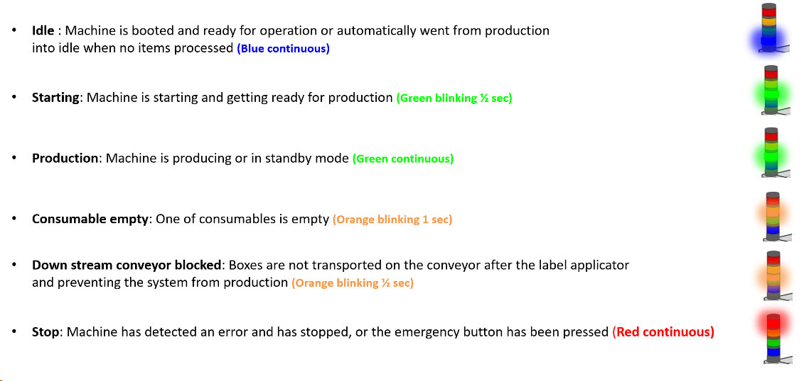

## Verbruiksmaterialen
De machine heeft verschillende soorten verbruiksmaterialen. Karton, Tape en Verzendetiketten.

### Laden karton

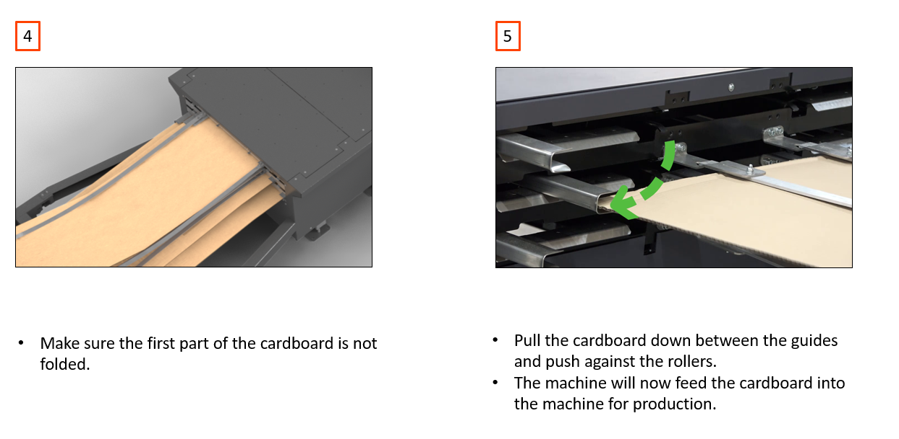

Laden karton vaste molen
<iframe width="560" height="315" src="https://www.youtube.com/embed/XQGpuUVdwus" title="YouTube video player" frameborder="0" allow="accelerometer; autoplay; clipboard-write; encrypted-media; gyroscope; picture-in-picture" allowfullscreen></iframe>

Laden karton variabele molen
<iframe width="560" height="315" src="https://www.youtube.com/embed/emOtDYyC-Iw" title="YouTube video player" frameborder="0" allow="accelerometer; autoplay; clipboard-write; encrypted-media; gyroscope; picture-in-picture" allowfullscreen></iframe>

### Tape

Vervangen van tape
<iframe width="560" height="315" src="https://www.youtube.com/embed/CLXyiuy_rpc" title="YouTube video player" frameborder="0" allow="accelerometer; autoplay; clipboard-write; encrypted-media; gyroscope; picture-in-picture" allowfullscreen></iframe>

Nieuw tape
<iframe width="560" height="315" src="https://www.youtube.com/embed/hlaHGUB8-FM" title="YouTube video player" frameborder="0" allow="accelerometer; autoplay; clipboard-write; encrypted-media; gyroscope; picture-in-picture" allowfullscreen></iframe>

### Labels
Filmpjes en instructies voor Evolabel label printer zijn aangevraagd (Bart Lucht heeft dit gevraagd bij Michel van Sparck)

## Orders verwerken
In dit gedeelte worden wat zaken beschreven die van belang zijn tijdens het verwerken van orders.
### Schermen rondom orderverwerking.

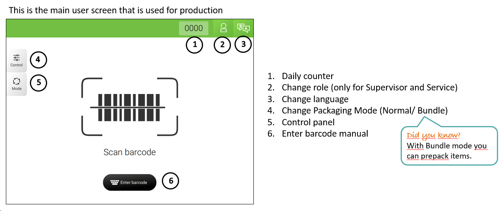

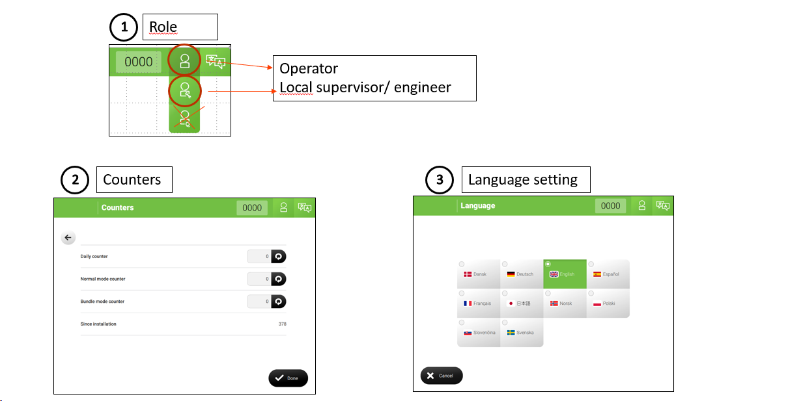

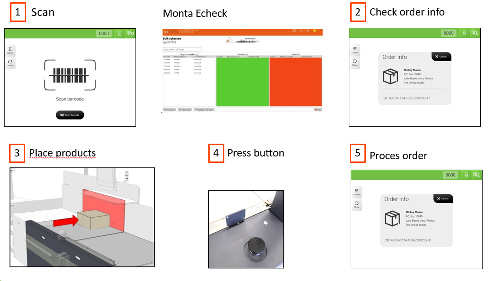

### Instructies voor het plaatsen van de producten.
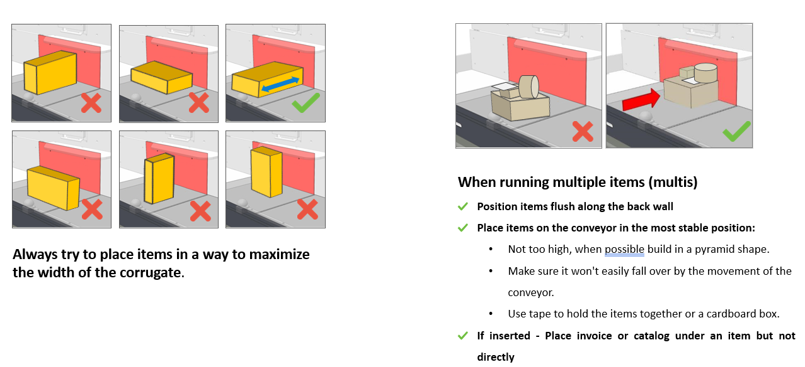

## Errors afhandelen
In dit deel worden enkele errors beschreven en wordt uitleg gegevens hoe de errors het beste afgehandeld kunnen worden.
Allereerst wat toelichting over de typen meldingen die kunnen voorkomen.

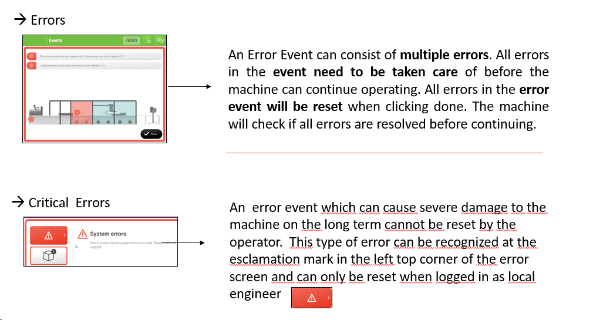

### Indicator lamp op de invoer lopende band
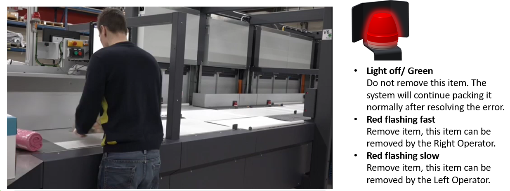
@kevin, graag hier filmpje invoegen van pagina 31 van de presentatie "How to Operate Impack v1.pptx" uit map RandD - General\Verpakkingsmachines\Sparck - Quadient

Dual induct station
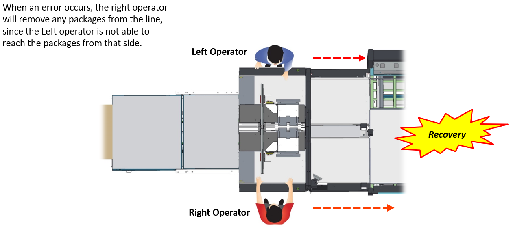

control panel:
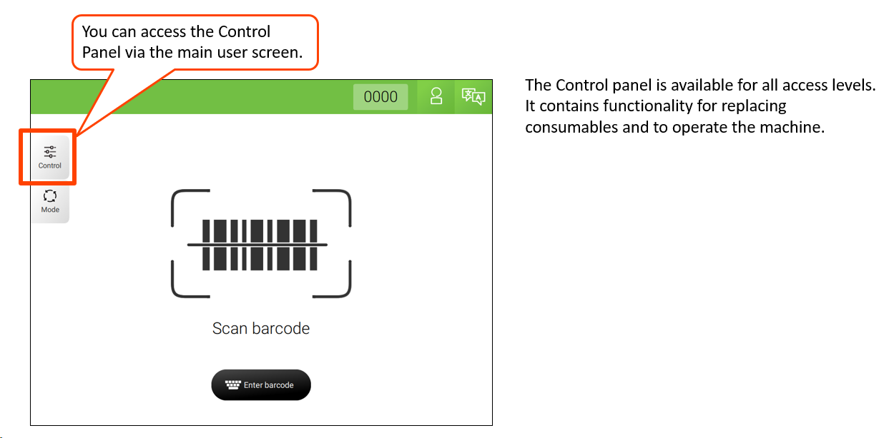

Control cardbord feed:

Control panel 3D scanner:

Control panel Insert Position:
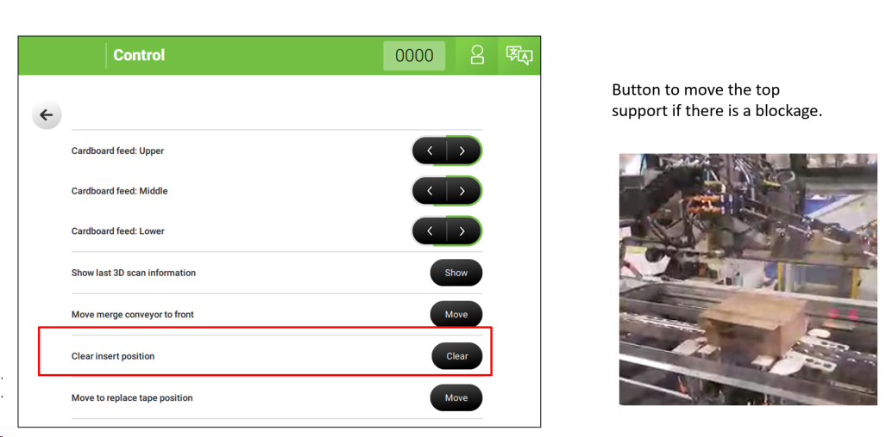

Control panel Taper Position:
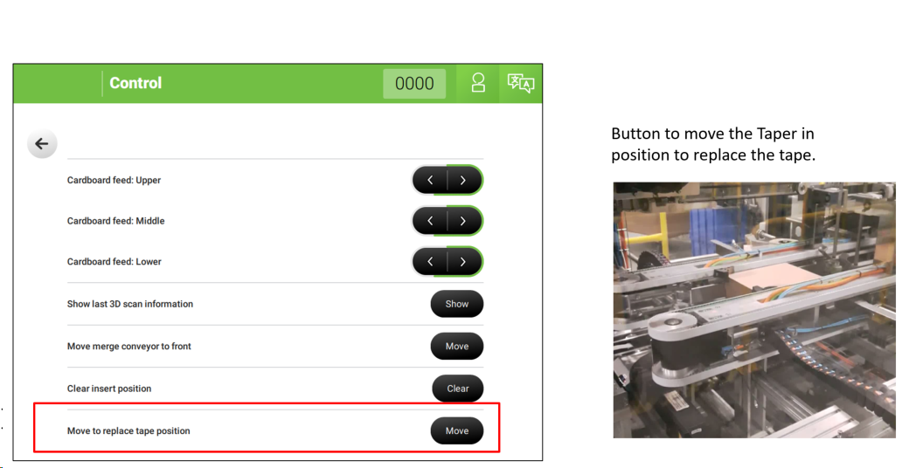

Remove cardbord after jam in Cut & Crease
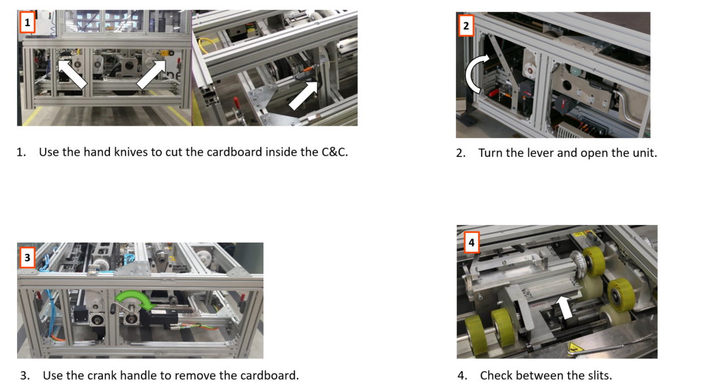

Orders verwijderen (top support)

<iframe width="560" height="315" src="https://www.youtube.com/embed/IYPd3KkD0YI" title="YouTube video player" frameborder="0" allow="accelerometer; autoplay; clipboard-write; encrypted-media; gyroscope; picture-in-picture" allowfullscreen></iframe>

Orders en tape verwijderen (taper unit)

<iframe width="560" height="315" src="https://www.youtube.com/embed/SknDfNxEO_g" title="YouTube video player" frameborder="0" allow="accelerometer; autoplay; clipboard-write; encrypted-media; gyroscope; picture-in-picture" allowfullscreen></iframe>

## Onderhoud
In dit gedeelte wordt aangegeven hoe de machine het best onderhouden kan worden.

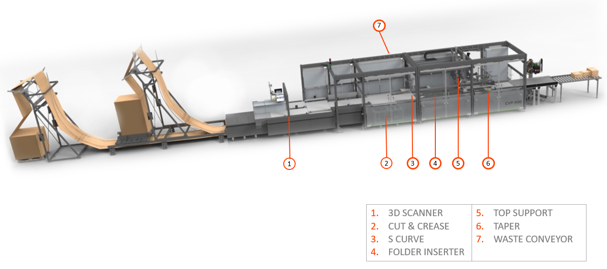

Dagelijks Schoonmaken door Operator

<iframe width="560" height="315" src="https://www.youtube.com/embed/33OCopjpY5Q" title="YouTube video player" frameborder="0" allow="accelerometer; autoplay; clipboard-write; encrypted-media; gyroscope; picture-in-picture" allowfullscreen></iframe>

Dagelijks schoonhouden Cut & Crease
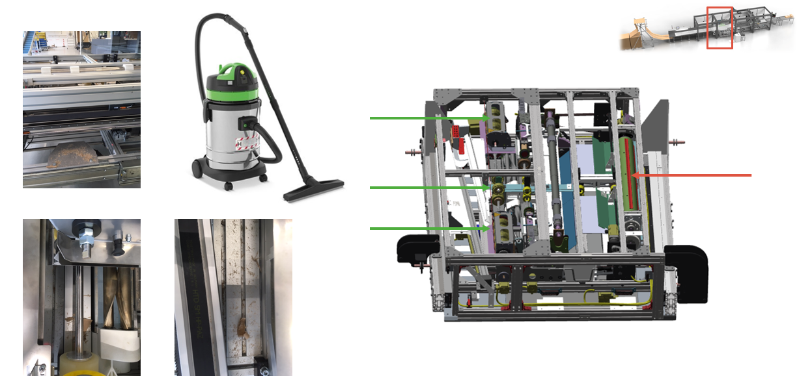

Dagelijks schoonhouden S-curve
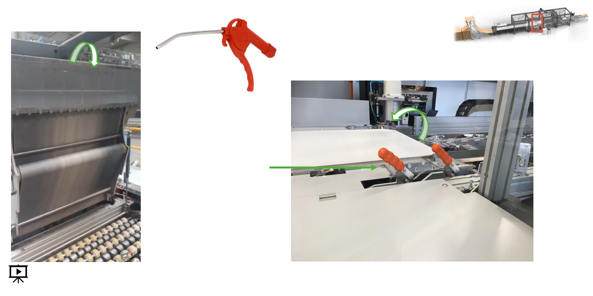

Dagelijks onderhoud folder-inserter
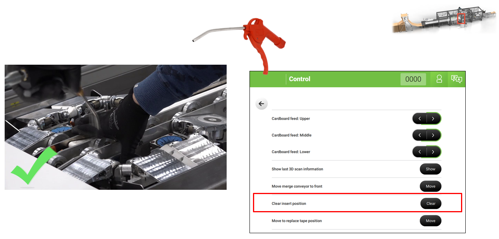

Dagelijks onderhoud top-support
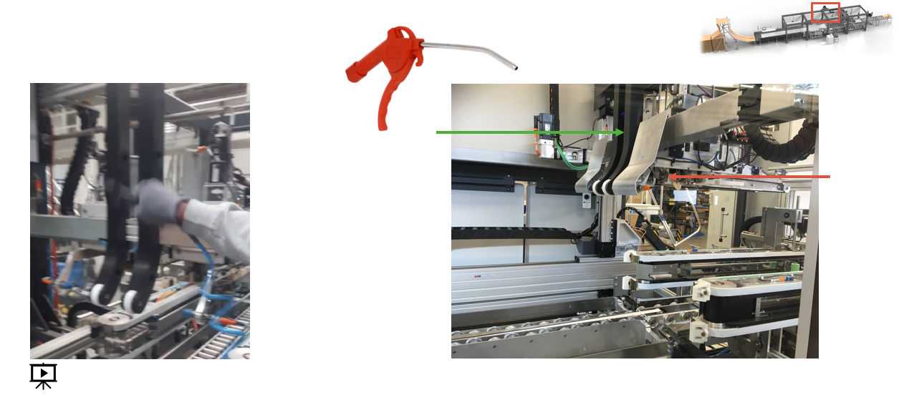

Dagelijks onderhoud taper

Dagelijks onderhoud waste conveyor

## Schoonmaken door Technische Dienst
<iframe width="560" height="315" src="https://www.youtube.com/embed/FVuZE17qotE" title="YouTube video player" frameborder="0" allow="accelerometer; autoplay; clipboard-write; encrypted-media; gyroscope; picture-in-picture" allowfullscreen></iframe>

