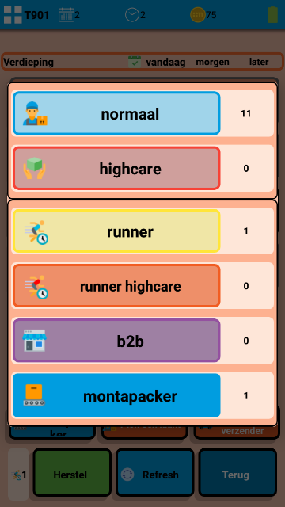
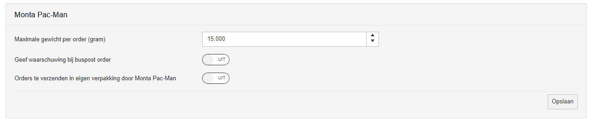
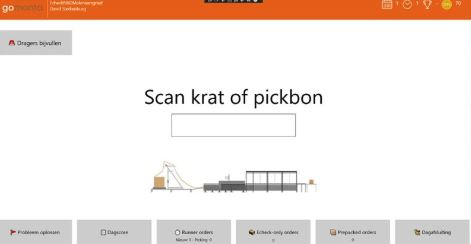
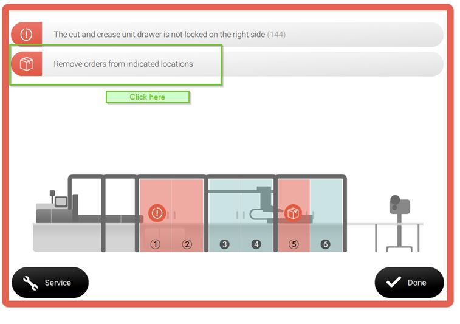
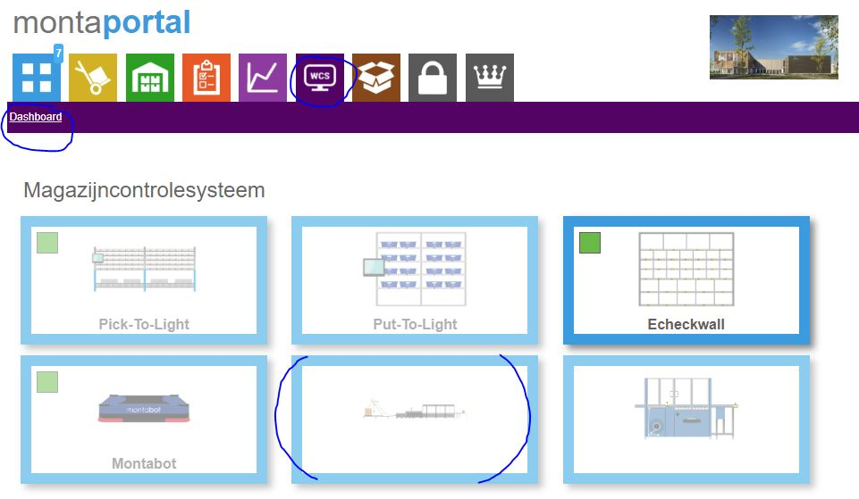
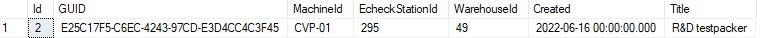
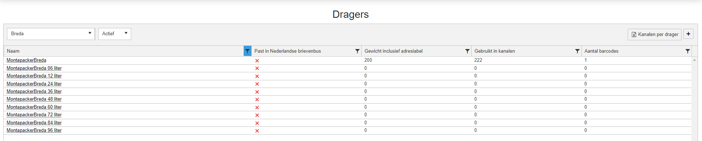

# Monta Pacman

Monta Pacman is de naam van een verpakkingsmachine.
Deze verpakkingsmachine kan dozen op maat maken door de producten van een order te meten en op basis daarvan een doos van het juiste formaat te maken. Onderstaand een video die de werking van de Monta Pacman laat zien.

::: video
<iframe width="560" height="315" src="https://www.youtube.com/embed/ND1bpDGHfnw" title="YouTube video player" frameborder="0" allow="accelerometer; autoplay; clipboard-write; encrypted-media; gyroscope; picture-in-picture" allowfullscreen></iframe>
:::

## Instructies over gebruik en schoonhouden van de machine.
[Klik hier voor een aparte pagina over het gebruik en het schoonhouden van de Monta Pacman machine.](https://vragen.monta.nl/Docs/Algemene-informatie/Apparaten/Monta-Pacman/Gebruik-en-schoonhouden-van-Monta-Pacman/)

## Pickstroomfilter voor Monta Pacman
De Monta Pacman heeft een minimale en maximale afmeting voor producten binnen een order.
Grofweg is de minimale afmeting (binnenkant doos) 18 cm x 24 cm x 10 cm (Lengte x Breedte x Hoogte).
De maximale afmeting is afhankelijk van welke rollen karton er gekozen zijn, het maximum van de machine is (binnenkant doos) 60cm x 60cm x 35cm (Lengte x Breedte x Hoogte).
Om ervoor te zorgen dat alleen orders die binnen deze afmetingen vallen naar de Monta Pacman toe gaan, is een nieuw pickstroom filter gedefinieerd. Het Monta Pacman pickstroom filter. Zie voor uitgebreider informatie over dit filter deze [pagina](https://vragen.monta.nl/Docs/Algemene-informatie/Outbound/Pickstromen-op-basis-van-specifieke-Hardware/#monta-pac-man-verpakkingsmachine)

In GoMonta kan per klant worden ingesteld of de orders in de Monta Pacman pickstroom terecht mogen komen. Ook kan per klant het maximaal aantal items per order worden ingesteld.

In GoMonta kan bij de magazijn outbound instellingen worden ingesteld, wat het maximale gewicht is van een order. Ook kan er worden ingesteld, dat een waarschuwing in de e-echeck wordt gegeven, als de orders geschikt is voor buspost. Als laatste kan worden ingesteld of orders, die in eigen verpakking verzonden mogen worden, in de Monta Pacman pickstroom terecht komen.
https://gomonta.montapacking.nl/WMS/Shift/WarehouseSettings#MontaPacMan

## Echeck voor Monta Pacman
De Monta Pacman heeft 2 zogeheten induct stations. Dit zijn de plaatsen waar producten op de machine gelegd kunnen worden. Op die plekken staat ook een Echeck station, waarmee de orders binnen het montaWMS ge-echeckt worden.
In de Echeck schermen is duidelijk te herkennen dat het om een Echeckstation bij de Monta Pacman machine gaat doordat er een afbeelding van de Monta Pacman machine te zien is.

## Jokers
De Monta Pacman machine kan een aantal orders gelijktijdig op de lopende band hebben liggen. De Monta Pacman kan storingen hebben. Denk aan een mislukte verpakking, of producten die zijn gaan schuiven op de lopende band. In dat geval geeft de Monta Pacman in de software door dat er een storing is. In de schermen die op de Monta Pacman zelf zitten is te dien op welke positie(s) in de Monta Pacman machine de storing is. Dan is er de behoefte om de producten uit de machine te halen. Op dat moment willen we de producten graag bij elkaar houden met de orderinformatie. Omdat we voor veel klanten zonder papieren pakbon verzenden, wordt een joker geprint om de producten te markeren bij welke order ze horen. Soms kunnen meerdere orders tegelijk storing hebben. Om dan het juiste joker label te gebruiken bij de juiste producten, is een joker label gemaakt waar ook de product barcodes en benaming op staan.

Voorbeeld van een joker label van een order met 1 product

Voorbeeld van een storing die wordt weergegeven in het scherm van de Monta Pacman machine

## Business Intelligence montaWCS
Er wordt bijgehouden hoeveel orders verpakt zijn door de Monta Pacman en hoeveel jokers er zijn opgetreden. Deze informatie is in te zien via montaportal, onder het account van de vestiging waar de machine staat.

_(plaatje nog updaten als er meer te zien is)_

[[Doelgroep: IT

********** De informatie hieronder is meer van technische aard **********

## Technische informatie bij de Monta Pacman
Onderstaand worden wat zaken toegelicht zodat de structuur van de software rondom de Monta Pacman helder is.

## Echeckstation gekoppeld aan Monta Pacman
De tabel waar een echeckstation aan een Monta Pacman machine wordt gekoppeld is in de Monta_Backend database te vinden. De naam van de tabel is tblMontapacker

Een Monta Pacman kan 2 echeckstations hebben, omdat er 2 inductstations op de machine zitten waar producten neergelegd kunnen worden.

## Afmetingen en gewicht
Doordat de Monta Pacman de producten opmeet voordat de verzend doos op maat gemaakt wordt, kunnen deze afmetingen en het gewicht gebruikt worden bij het kiezen van de verzender en het aanvragen van het verzendlabel. De gemeten afmetingen en gewicht worden opgeslagen in tblEcheckedShippingBoxes.

## Pickstroom
Om ervoor te zorgen dat alleen orders met passende producten bij de Monta Pacman terecht komen, is er een aparte pickstroom voor gemaakt. Voor de berekening of de producten van een order passen in de formaat dozen die de Montapacker machine kan maken, wordt gebruik gemaakt van een stapel algoritme. Dit algoritme zit in het MontaModel in de map ContainerPacking. Als een order geschikt is voor de Monta Pacman , dan wordt de ReadyToPickState op Monta Pacman gezet. Dit wordt gedaan bij het verifiëren van de order.

## Jokers
Voor de Monta Pacman is een apart joker type gemaakt en is een apart joker label ontwikkeld waarop ook de product informatie te zien is, zodat het joker label bij de juiste producten/order gebruikt kan worden.
tblEcheckJokerType

## Business Intelligence info
Om in het montaWCS in montaportal weer te kunnen geven hoeveel orders de Monta Pacman verwerkt heeft en hoeveel jokers er waren, wordt deze informatie dagelijks geaggregeerd en opgeslagen in de monta_ai database op de MP-SQl06.
De tabelnaam is MontapackerStats. Het script dat deze tabellen vult, draait op de proc02 via de WindowsService 'ScheduleR'. De naam van dit script is MontapackerStatistics.

## Montapacker service
Voor de Monta Pacman is een webservice ontwikkeld, namelijk https://montapacker.monta.nl. Deze webservice handelt vragen van de Monta Pacman af. De webservice draait op de mp-web115 en als back-up op de mp-web215. De orders die ge-echecked zijn, worden in een RabbitMQ queue gezet. De exchange naam is MontapackerService. Ieder Montapackerstation heeft een eigen queue. Hierbij is het MachineId de routingkey.

## Monta Pacman video's
De Monta Pacman machine neemt video's op. Dit zijn per verpakking twee video's.
1) Integrity video
2) Shipment video
De integrity video laat het inpakproces zien. Daarbij is bijvoorbeeld te zien of alle producten in de verpakking gaan. Deze video is ongeveer 15Mb
De Shipment video laat het ingepakte pakket zien. Deze video is ca 5 Mb.
Bij vol bedrijf van de machine, is het heel wat data die opgeslagen moet worden. Daarom is er in het Lelystad netwerk lokaal een NAS geplaatst met voldoende schijfruimte voor 6 maanden aan video.

\\\ley21-nas01.montapacking.nl\Shipment

\\\ley21-nas01.montapacking.nl\Integrity

We zijn nog bezig te kijken hoe en waar we deze video's willen ontsluiten. En ook het verwijderen van de video's binnen 6 maanden zal dan geregeld worden.

## Verzenddoos beheer
Voor de Monta Pacman wordt een standaard verzenddoos aangemaakt. Deze wordt toegevoegd aan alle kanalen, die gekoppeld zijn aan het magazijn. Deze verzenddoos wordt altijd gekozen in de e-check. Om de verzenddoos automatisch te scannem, moet de barcode ingevuld worden in tblMontapacker kolom ShippingBoxBarcode.

Bij de Monta Pacman kan worden ingesteld, dat op basis van het volume de juiste verzenddoos categorie wordt gekozen. Deze verzenddoos zal de standaard Monta Pacmanverzendoos vervangen, zodra de order verzonden is. Deze drager zal vervolgens op de factuur staan voor de klant. Deze functionaliteit kan worden aangezet in tblMagazijnen kolom MontapackerCalculateCupboard. Vervolgens moeten de verzenddozen worden gekoppeld aan de Monta Pacman in tblMontapackerDrager. Deze verzenddozen moeten worden aangemaakt in GoMonta.

