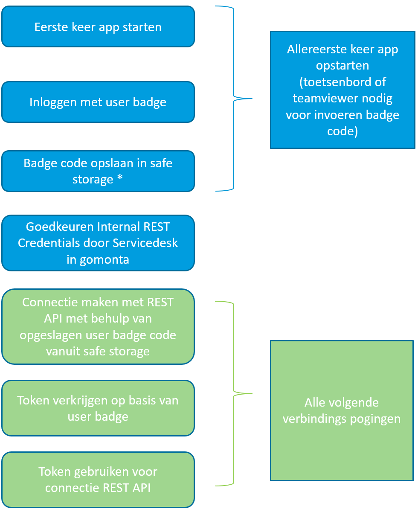

# MontaCast

### Wat is de Montacast?
De Montacast bestaat uit een kleine computer (Intel celeron nuc) die achter een TV gemonteerd kan worden en verschillende dashboards in carrouselvorm kan weergeven. De Montacast wordt gebruikt om (onder andere) logistieke informatie weer te geven op beeldschermen, zoals in een magazijn of op kantoor. Het systeem is beschikbaar voor zowel Monta zelf, als voor WMS-klanten.

Er is een mogelijkheid om meerdere dashboards te tonen op één scherm, middels de zogenoemde 'carrousel'-functionaliteit. Hiermee kunnen er achter elkaar verschillende dashboards worden getoond op hetzelfde beeldscherm met een instelbare interval. In dit geval zal er onderaan het scherm een timer-balk getoond worden die de timing van de carrousel aangeeft. Dit is op de onderstaande afbeelding aangeduid.

Momenteel kunnen de volgende dashboards getoond worden:
- 10-Inbound dashboard
- 10.1-Inbound dashboard large
- 20-Outbound dashboard
- 20.1-Outbound scherm (Large)
- 21.1-Werkverdeling per afhaaltijd dashboard
- 21.2-Werkverdeling per type order dashboard
- 21.3-Werkverdeling per klant dashboard
- 21.4-Werkverdeling per kanaal dashboard
- 21.5-Werkverdeling per verdieping dashboard
- 22-MontaPacMan dashboard
- 23-EcheckToLight dashboard
- 28-MontaSorter dashboard
- 30-Performance dashboard
- 31-Scanner beheer
- 32-Joker dashboard
- 40-Monta neuws
- 41-Gamification dashboard
- 42-Website pagina weergave
- 43-Welkom scherm
- 90-Montacast Health dashboard (scherm voor IT afdelingen)
- 91-Killswitches status (Scherm voor IT afdelingen)

Bij onderstaande schermafdrukken zul je soms Nederlands zien en soms Engels als taal. Een van deze talen kan gekozen worden bij het instellen van het MontaCast dashboard.
Momenteel zijn de beschikbare talen; Engels, Nederlands, Duits en Frans.

### Welke schermen zijn er en hoe zien de schermen eruit?
Momenteel kan er gekozen worden uit de volgende schermen:

----------

#### 10-Inbound dashboard
In dit scherm zijn het aantal openstaande en verlate TT's  (koppellabels) per relatie te zien.

#### 10.1-Inbound dashboard Large
In dit scherm wordt dezelfde informatie getoond als op het inbound dashboard, maar ingezoomd. Dit is geschikt voor magazijnen waar de TV's zo hoog hangen dat de informatie anders niet leesbaar zou zijn. Keerzijde van het zo groot weergeven van de informatie is uiteraard dat er minder informatie op het TV scherm past. Op deze manier kun je kiezen wat het beste past bij de situatie in je magazijn.

----------

#### 20-Outbound dashboard
In dit scherm zijn alle openstaande, verzonden, verlate en toekomstige orderregels te zien per relatie. Bij langere lijsten zal dit scherm automatisch naar beneden scrollen.

#### 20.1-Outbound scherm Large
In dit scherm wordt dezelfde informatie getoond als op het outbound scherm, maar ingezoomd voor bijvoorbeeld hooggeplaatste schermen.

----------

#### 21.1-Werkverdeling per afhaaltijd dashboard
Dit dashboard toont de werkverdeling per afhaaltijd van de te verwerken orderregels over de verschillende outboundactiviteiten, zoals het picken, sorteren (consolideren) en verpakken.
Dit dashboard heeft als extraatje dat je een filter op Relatie (Klant) kunt instellen. Heb je bijvoorbeeld een speciaal proces rondom 1 Relatie, dan kun je van die specifieke Relatie zien op welke afhaaltijden er nog orders verwerkt moeten worden.

#### 21.2-Werkverdeling per type order dashboard
Dit dashboard toont de werkverdeling per type order van de te verwerken orderregels over de verschillende outboundactiviteiten, zoals het picken, sorteren (consolideren) en verpakken.

#### 21.3-Werkverdeling per klant dashboard
Dit dashboard toont de werkverdeling per relatie/klant van de te verwerken orderregels over de verschillende outboundactiviteiten, zoals het picken, sorteren (consolideren) en verpakken.

#### 21.4-Werkverdeling per kanaal dashboard  (komt week 35 beschikbaar)
Dit dashboard toont de werkverdeling per kanaal/esetting van de te verwerken orderregels over de verschillende outboundactiviteiten, zoals het picken, sorteren (consolideren) en verpakken. Dit dashboard is vooral interessant voor WMS klanten die meerdere kanalen hebben.

#### 21.5-Werkverdeling per verdieping dashboard
Dit dashboard toont de werkverdeling per verdieping van de te verwerken orderregels over de verschillende outboundactiviteiten, zoals het picken, sorteren (consolideren) en verpakken.

----------

#### 23-EcheckToLight dashboard
Dit dashboard toont de prestaties en overige inzichten van het Echeck-To-Light proces. Uiteraard is dit scherm alleen interessant voor de magazijnen die gebruik maken van een Echeck-To-Light opstelling.

#### 28-MontaSorter dashboard
Voor de magazijnen waar een door Monta ontwikkelde pakket sorter staat, is een MontaSorter dashboard beschikbaar.

#### 29-MontaPacMan dashboard
Dit scherm is gemaakt om de statistieken van Monta Pac-man weer te geven. Dit dashboard maakt het extra leuk om nieuwe records met de inpakmachine neer te zetten. Uiteraard is dit scherm alleen interessant voor de magazijnen die gebruik maken van een Monta Pac-man inpakmachine.

----------

#### 30-Performance dashboard
Dit is het scherm dat de productiviteit of performance toont. De dagen dat de begroting behaald is qua productiviteit zijn de balken van de grafiek groen, op de andere dagen blauw.

#### 31-Scanner beheer
Dit Montacast scherm laat zien welke scanners in de laadkast staan en welke in gebruik zijn. Op deze manier kan ook bijgehouden worden of er scanners kwijtraken. Vaak zie je dit op een monitor boven op de scanner kast, maar je kunt het dashboard ook op andere Montacasts tonen. Op het dashboard wordt een 🚨 weergegeven wanneer een scanner defect is en een ⚠️ wanneer er meer dan 24 uur geleden is ingelogd op de scanner.

#### 32-Joker dashboard
In het joker scherm is te zien wat het percentage jokers is ten opzichte van de verzonden orderregels.

----------

#### 40-Monta neuws
Dit Montacastscherm toont het Montanieuws. Doordat dit scherm op zichzelf al een carrousel is, kan dit scherm niet in combinatie met andere Montacast schermen gebruikt worden.

#### 41-Gamification dashboard
Dit is het scherm dat de gamification uur-winnaars toont. Ieder uur is er per categorie een winnaar Monta breed. Deze winnaar wordt op dit scherm getoond.

#### 42-Website pagina weergave
In dit Montacast scherm kun je webpagina's embedded. Dit kan bijvoorbeeld handig zijn voor Servicedesk als je een aantal status  pagina's wilt zien. Of een bepaald Power BI scherm. Door web pagina's via Montacast te bekijken, kun je de webpagina's als carrousel langs laten komen. Het instellen van de url's voor web pagina's is niet mogelijk voor kantoor gebruikers, maar alleen in het admin gedeelte.

#### 43-Welkom scherm
Dit Montacast scherm laat zien welke welkom teksten en afbeeldingen je hebt ingesteld in [gomonta](https://gomonta.monta.nl/Office/Visitors/Index)

----------

#### 90-Montacast Health dashboard (scherm voor IT afdelingen)
Op dit dashboard is te zien hoe de MontaCasts het doen. De Montacasts de 6 oudste screenshots worden hier getoond.

#### 91-Killswitches status (Scherm voor IT afdelingen)
In dit dashboard wordt de status van de killswitchers getoond. Een killswitch is een digitale schakelaar die stukjes van de systemen kan uitschakelen bij eventuele storingen.

----------------------------------------------------------

### Waar kan bekeken worden hoe de Montacasts in je vestiging het doen?
In het kantoor gedeelte van Gomonta kun je zien hoe de Montacast in je vestiging het doen.
Via Kantoor - TVs MontaCast

Regelmatig wordt een schermafdruk gemaakt van de MontaCast welke te zien is in gomonta. Als de schermafdruk recent is, is er een groene balk te zien. Als het lang geleden is dat het screenshot gemaakt is, dan is de balk rood. In dat geval kan gekeken worden of de MontaCast wel aan staat.

### Waar kunnen de Montacast pagina's ingesteld worden?

#### Vanuit het Gomonta kantoor gedeelte
In het kantoor gedeelte van Gomonta kun je instellen welke dashboards je op de MontaCast wilt hebben.
Via Kantoor - TVs MontaCast

https://gomonta.montapacking.nl/Office/MontaCast

Wanneer je op een tegel van een MontaCast klikt, verschijnt een popup waar je dashboards kunt kiezen.

Via de knop Toevoegen (A), kun je een nieuw dashboard toevoegen, er opent dan een keuzelijst bij (B), waar je een dashboard kunt kiezen. Bij (C) kun je instellen hoeveel seconden het scherm in beeld blijft voor het geval je meer dan 1 dashboard hebt ingesteld. Vervolgens kun je de gekozen instellingen opslaan met (D)

#### Vanuit het Gomonta Admin gedeelte (IT-ers)
Op GoMonta/Admin/MontaCast kunnen er instellingen worden gewijzigd van de MontaCast. Op de eerste pagina wordt een overzicht getoond van alle MontaCast devices per vestiging:

https://gomonta.montapacking.nl/Admin/MontaCast

Zodra een device wordt opengeklikt, kan deze specifiek geconfigureerd worden:

Zoals bij de blauwe pijltjes in de bovenstaande afbeelding te zien is, kunnen hier verschillende typen Montacast schermen worden toegevoegd. Daarnaast kan er van ieder dashboard ingesteld worden hoe lang deze getoond mag worden in de carrousel.

Als er maar één dashboard is ingesteld, zal de carrousel niet geactiveerd worden. Daarnaast zal de carrousel ook niet actief zijn als één van de ingestelde pagina's de Montanews pagina is. De Montanews pagina kan namelijk niet in gebruik met andere dashboards gebruikt worden.

### Is er aan de veiligheid gedacht?
Voor de veiligheid is er een eenmalige login vereist indien het apparaat niet is verbonden met een Monta-netwerk. Dit inloggen gebeurt met een geldige personeelsbadge. Daarnaast moet het apparaat worden goedgekeurd door Servicedesk qua Internal Rest Credentials. Hiermee ligt het nivo van beveiliging ongeveer gelijk aan de gebruikelijke Echeck en Inbound stations.

Het inloggen werkt nu volgens onderstaande schema's:

### Herstart
De Intel Celeron Nucs die voor Montacast gebruikt worden, worden geïnstalleerd via intune. Via intune is het geregeld dat elke nacht om 02:00 er een herstart is.

### Hoe werkt het update mechanisme.
Als er nieuwe dashboards ontwikkeld worden, is het over het algemeen niet nodig dat de Montacast app wordt ge-update. Maar soms zullen er updates aan de Montacast app zelf zijn. In het geval er een update is, zitten we met de uitdaging dat een TV vaak geen toetsenbord en muis heeft en we geen update meldingen in beeld willen hebben waar je op klikken moet.

#### Automatische update
In intune wordt de nieuwste versie van de Montacast app geladen als er een nieuwe versie is. IT Operations kijkt elke donderdag of er een nieuwe versie van de Montacast app beschikbaar is op https://software.monta.nl/uwpupdate/
Als dat het geval is, wordt de Montacast update in Intune verwerkt en bij de eerstvolgende herstart van de intel celeron nuc, wordt de nieuwe versie van Montacast geïnstalleerd.
https://vragen.monta.nl/Docs/Operations/Werkstations/Productie-machines/Installatie-proces-Productie-machines/

#### Manuele update
Mocht er een update zijn waarbij je niet maximaal een week wilt wachten voordat de update gedaan is, is er ook een mogelijkheid manueel te updaten. Links bovenin de Montacast app komt een onopvallende knop 'New update'
Daarop kan geklikt worden op een moment dat updaten gelegen komt, vervolgens komen er wat schermpjes uit de update wizard langs.

--

--

--

### Waar is er meer technische informatie te vinden?
Via onderstaande link wordt er doorverwezen naar de pagina met technische beschrijvingen:
https://vragen.monta.nl/Docs/Operations/Werkstations/Productie-machines/MontaCast/

