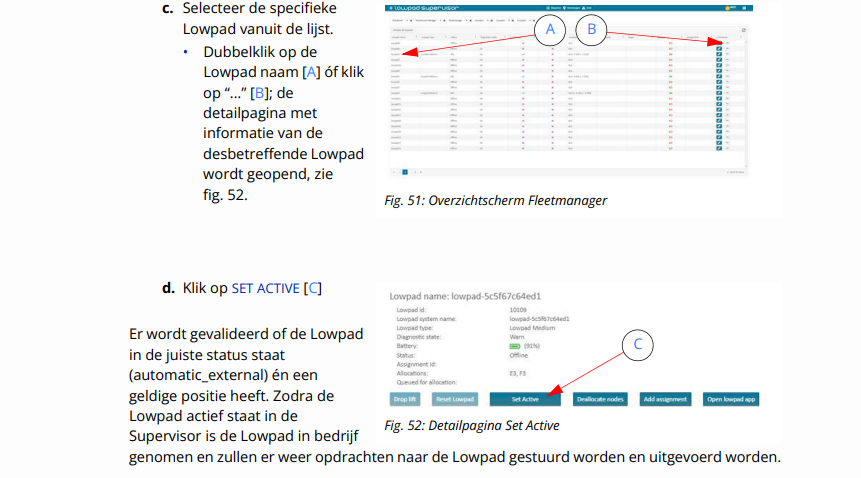
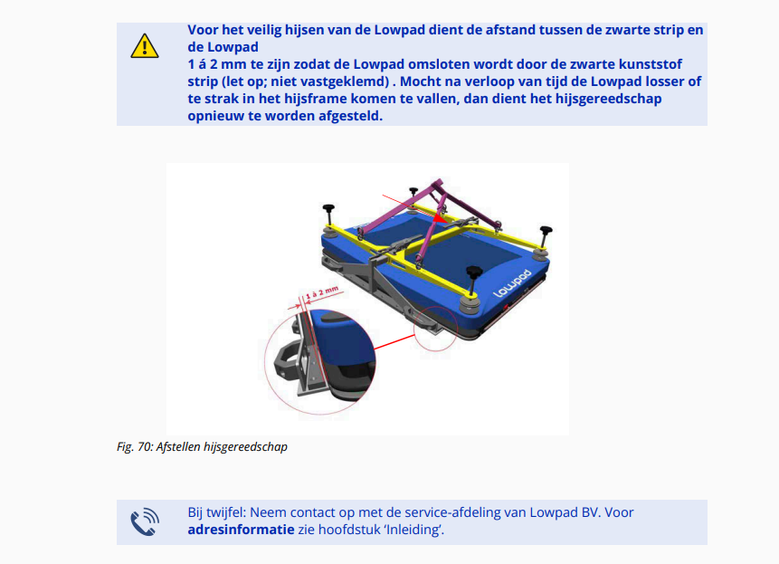

# Lowpad Gebruikershandleiding

## Voorwoord

## 1 Inleiding
### 1.1 waarschuwing

### 1.2 Fabrikant

### 1.3 Machinerichtlijn

### 1.4 Doel en doelgroep van dit document

#### 1.4.1 Overige documenten

### 1.5 Copyright

### 1.6 Aansprakelijkheid

### 1.7 Garantie

#### 1.7.1 Garantieperiode

#### 1.7.2 Garantiedekking

#### 1.7.3 Uitsluiting van garantie

### 1.8 Herkomst en jaar van productie

### 1.9 veiligheidssymbolen in de gebruikershandleiding

### 1.10 Overige symbolen

### 1.11 Terminologie

## 2 Aflevering en opslag
### 2.1 schade bij aflevering

### 2.2 Opslag

### 2.3 Transport

#### 2.3.1 Hijsen

#### 2.3.2 Verplaatsen korte afstand

#### 2.3.3 Verplaatsen lange afstand

#### 2.3.4 Afzetten werkgebied

## 3 Veiligheid
### 3.1 Beoogd gebruik

### 3.2 Algemene veiligheidsvoorschriften

#### 3.2.1 Installatie/Gebruiksgereed maken

#### 3.2.2 Veiligheidsvoorschriften

#### 3.2.3 Veiligheidszones en veiligheidsafstanden

#### 3.2.4 Gebruiker

#### 3.2.5 Onderhoud

### 3.3 Machinespecifieke veiligheidsinstructies

#### 3.3.1 Waarschuwingssymbolen op de Lowpad

#### 3.3.2 Persoonlijke beschermingsmiddelen

#### 3.3.3 Veiligheidsvoorzieningen

### 3.4 Restrisico’s (uit de risicobeoordeling)

## 4 Installatie
### 4.1 In gebruikname

### 4.2 Vloerconditie

### 4.3 Omgevingsfactoren

### 4.4 Eisen aan te laden ladingdragers

## 5 Beschrijving
### 5.1 Functie

### 5.2 Werking

### 5.3 Buitenkant van de Lowpad

### 5.4 Delen van de Lowpad

#### 5.4.1 Onderdelen onder de bovenkap

#### 5.4.2 Liftsysteem

### 5.5 Accu
#### 5.5.1 Algemeen

#### 5.5.2 Specificaties accu

#### 5.5.3 Specificaties lader

#### 5.5.4 Veiligheid

### 5.6 Bedieningselementen

#### 5.6.1 Overzicht

#### 5.6.2 Sleutelschakelaar

#### 5.6.3 LED-verlichting

#### 5.6.4 Handbediening

## 6 Bediening

### 6.1 Voorzorgsmaatregelen

### 6.2 In bedrijfstellen

### 6.3 Uitschakelen
#### 6.3.1 Uitschakelen van de machine

#### 6.3.2 Geforceerd uitschakelen

#### 6.3.3 Herstart na onderbreking

### 6.4 Noodstop

#### 6.4.1 Starten na een noodstop

#### 6.4.2 Let op bij beide stopfuncties

### 6.5 Storing

### 6.6 Foutcodes van veiligheidsscanner

### 6.7 Handelingen

#### 6.7.1 Identificatie Lowpad

#### 6.7.2 Lowpad overnemen via handbediening

#### 6.7.3 Lowpad terug in bedrijf plaatsen

#### 6.7.4 Instructie handmatig laden via kabel (optioneel)

## 7 Onderhoud
### 7.1 Veiligheid

### 7.2 Onderhoudshistorie

### 7.3 Periodiek onderhoud
#### 7.3.1 Dagelijks onderhoud

#### 7.3.2 Wekelijks onderhoud

#### 7.3.3 Maandelijks onderhoud

#### 7.3.4 Driemaandelijks onderhoud

#### 7.3.5 Jaarlijks onderhoud

### 7.4 Liftsysteem smeren

### 7.5 Onderdelen verwisselen

#### 7.5.1 Accu vervangen

#### 7.5.2 Bufferbatterij van PLC (PS-101) vervangen

#### 7.5.3 Hefdop/positioneerpen vervangen

#### 7.5.4 Voor- en achterkappen vervangen

#### 7.5.5 Aardlitze verlengen

## 8 Afdanken
### 8.1 Veiligheidsaspecten

### 8.2 Milieuaspecten

### 8.3 Lithium-Ion accu

## BIJLAGE 3 SMEERMIDDELEN

### B3.1 Vet voor kogellagers, linear geleidingen en tandheugels

## BIJLAGE 8 AFSTELLEN HIJSGEREEDSCHAP

