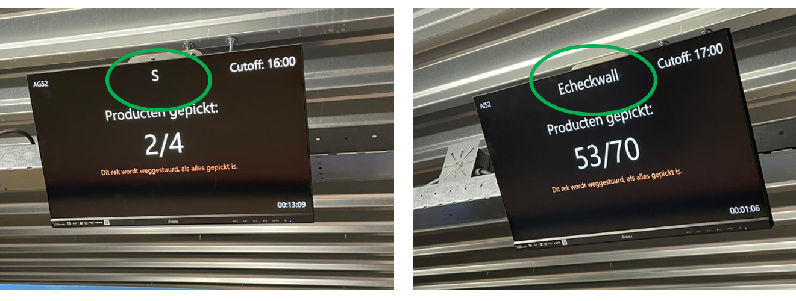
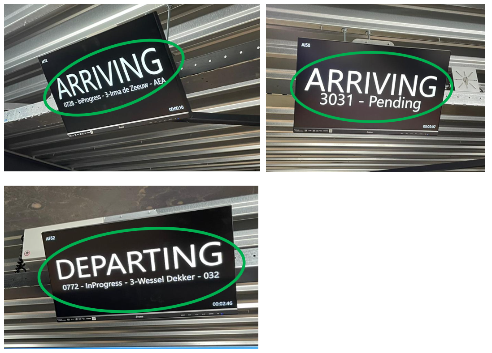

# Montabots updates

Updates in de monta software rondom de montabots worden onderstaand weergegeven.

## Update 4-8-2022: Weergave S of Echeckwall orders schermen pickeiland.

Door de weergaven van S of Echeckwall orders op de schermen boven de transportbakken is beter te zien welk type orders momenteel gepickt wordt. Dit helpt ook om de juiste instellingen te kiezen rondom tijdigheid.

## Update 4-8-2022: Pickeiland schermen tonen aankomst en vertrek van de rekken

Op de schermen boven de pickrek posities is te zien wat de montabots gaan doen voor die posities.

## Update 4-8-2022: Lege rekken van de 3e naar de inbound
Lege rekken vanaf de 3e verdieping worden nu automatisch naar inbound gebracht.

## Update 4-8-2022: Afhaaltijd prio bij het plannen van de orders
Bij het inplannen van orders voor de montabots wordt nu allereerst gekeken naar de afhaaltijd en pas daarna naar de rekken met de meeste picks. Dit om ervoor te zorgen dat het relatief grote aantal orders met vroege afhaaltijden (zoals buspost) tijdig ingepakt kunnen worden.

## Update 4-8-2022: Supervisor 2.1 draait op de 3e verdieping
De software van Eurotec (supervisor) is naar een hogere versie gegaan. Ook de monta software is daarop aangepast. Deze supervisor 2.1 draait op de 3e verdieping.

## Update 4-8-2022: Voorbereiden replenishen pickeiland
De software bij het pickeiland op de 3e verdieping is voorbereid op het kunnen replenischen op het pickeiland.

## Update 4-8-2022: Afhaaltijd prioriteit verdelen over de dag
Om de beste combinatie te vinden van tijdigheid en efficiency, zijn er veel keuzen mogelijk op de 3e verdieping bij het pickeiland. Er is nu een mogelijkheid om voor verschillende perioden op de dag verschillende instellingen te doen. Vooralsnog is dat nog in de database en niet via een scherm. (David kan dan de gewenste instellingen doen). Op termijn, als deze manier van werken bevalt, wordt er ook een scherm voor gebouwd.

