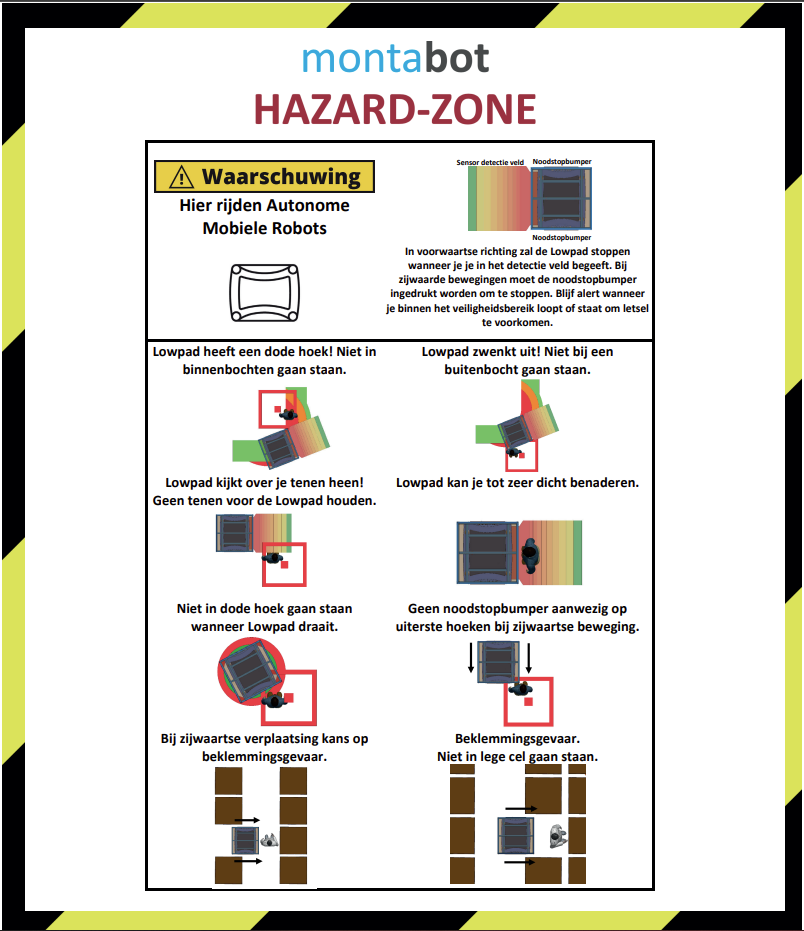
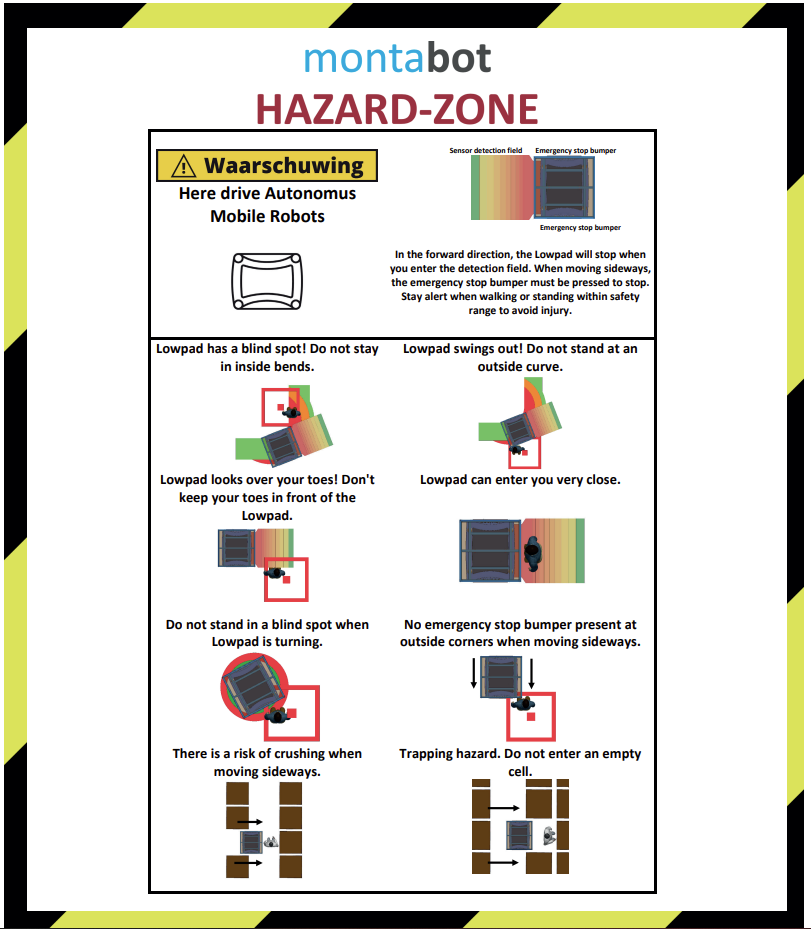

# Veiligheid Montabots

De Montabots hebben sensoren waardoor ze afremmen voor obstakels. Hierdoor is het mogelijk voor Monta medewerkers om in dezelfde ruimte te werken als de Montabots. Wel is het goed de veiligheid flyer te bekijken voordat je in het Montabot gebied gaat werken. Deze flyer is hier te vinden en hangt op bij de ingangen van de Montabot gebieden.

## Veiligheid flyer Nederlands

## Safety flyer English

