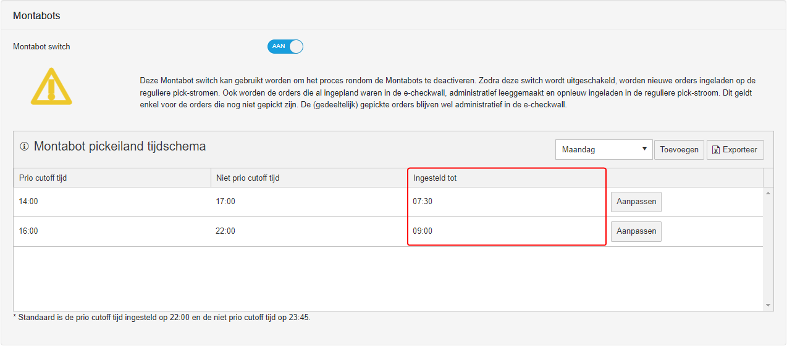

# Montabots

 

De Montabots zijn Autonome Mobiele Robots (AMR's) van het merk [Lowpad](https://lowpad.com/). De Montabots worden gebruikt voor het transporteren van opslagrekken. Een Montabot is in staat een rek op te tillen, ergens heen te rijden en weer neer te zetten. De Montabots hebben sensoren waardoor ze afremmen voor obstakels. Hierdoor is het mogelijk voor Monta medewerkers om in dezelfde ruimte te werken als de Montabots. Wel is het goed de veiligheid flyer te bekijken voordat je in het Montabot gebied gaat werken.  [Deze flyer is hier te vinden](https://vragen.montapacking.nl/Docs/Algemene-informatie/Apparaten/Montabots/Veiligheid-Montabots/)  en hangt op bij de ingangen van de Montabot gebieden.

Naast deze pagina met algemene informatie is er ook een [handleiding](https://vragen.monta.nl/Docs/Handleidingen/Montabots/) en een pagina over [troubleshooting](https://vragen.monta.nl/Docs/Troubleshooting/Montabots-Troubleshooting/)

## Introductie
Als introductie een filmpje van monta uit 2021, waarin de montabots ook te zien zijn

::: video
<iframe width="560" height="315" src="https://www.youtube-nocookie.com/embed/4ICnwRn68AI" title="Monta 2021 met montabots" frameborder="0" allow="accelerometer; autoplay; clipboard-write; encrypted-media; gyroscope; picture-in-picture" allowfullscreen></iframe>
:::

## Einde dag script
Aan het einde van de werkdag is het op de 2e verdieping van belang dat montabots aan de goede kant van de branddeuren terecht komen, omdat bij het afsluiten van het pand de branddeuren gesloten worden. De kant bij de echeckwalls, met de betonnen vloer en de montabot laders is de kant waar de montabots 's nachts horen te zijn.
Om dit mogelijk te maken is er een 'einde dag script'. Dit zorgt ervoor dat rekken die nog bij de echeckwalls staan in de hal gezet worden en dat er daarna geen nieuwe opdrachten aan de montabots gegeven worden. Daarnaast worden de opportunity laadpunten naar measured gezet. (dit is iets dat nodig is in supervisor 1, de versie van lowpad software die op de 2e verdieping draait, omdat bij opportunity laders de lowpads niet op hun plek blijven 's nachts)

## Liften
De liften logica van de Montabots:
Eerst wordt er gekeken naar  transportrekken die naar de 2de verdieping moeten.\
Daarna wordt er gecheckt over er voldoende transportrekken zijn op de 3de verdieping.\
Vervolgens wordt er gekeken of er rekken van de inbound naar de 3e verdieping moeten om orders te voltooien.
Als laatst zal de lijst in volgorde worden afgerond.

## Pickpoortjes
Op de pickpoortjes van het transportrek wordt getoond hoeveel producten op een andere verdieping liggen. Standaard wordt er net zolang gewacht totdat deze gepickt zijn. Door de krat gereed te melden, zal dit worden genegeerd en zal het rek naar de 2de verdieping gaan.

In het pickscherm staan nu 2 knoppen. "**Blokkeer krat**" en "**Krat gereed**".

#### Blokkeer krat
In deze krat mogen geen nieuwe orders worden toegevoegd door de planner.

#### Krat gereed
In deze krat mogen geen nieuwe orders worden toegevoegd door de planner en alleen de producten op de 3de verdieping hoeven gepickt te worden.\
**! let op mogelijke jokers worden hiermee geaccepteerd !**

## Pickeiland
Het pickeiland is een pick concept dat op de 3e verdieping draait. Montabots brengen pickrekken, waaruit een medewerker pickt en de producten in een transport rek legt. Wanneer de transportrekken vol zijn qua orders, worden de transportrekken door montabots in de goederenheffer gezet en vervolgens door een andere montabot op de 2e verdieping er weer uit gehaald. Vervolgens wordt het transportrek als het S-orders bevat bij een echecktafel gezet en als het transportrek een bulkpick voor M-orders is, wordt het transportrek bij een echeckwall gezet.

### In en uitschakelen van het Pickeiland

### Instellingen pickeiland.
Instellingen zijn te vinden in gomonta - outbound - magazijn outbound instellingen - montabots
[https://gomonta.montapacking.nl/WMS/Shift/WarehouseSettings]()

Bij het pickeiland kan het "Montabot pickeiland tijdschema" aangepast worden.
In dit tijdschema kan je de **prio cutoff tijd**, **niet prio cutoff tijd** en **ingesteld tot** tijden aanpassen.

#### Prio cutoff tijd
Dit geeft aan tot en met welke **afhaaltijd** orders prioriteit hebben.

In het voorbeeld staat een **prio cutoff tijd** van 14:00 dit betekent
dat orders die een **afhaaltijd** hebben tot en met 14:00 gepickt worden en **geprioriteerd**.

**Let op!** Dat wanneer een **prio cutoff tijd** is ingesteld, dat **alleen orders** die **binnen de aangegeven afhaaltijden** gepickt worden.

#### Niet prio cutoff tijd
Dit geeft aan tot en met welke **afhaaltijd** orders die geen prioriteit hebben gepickt.

In het voorbeeld staat een **niet prio cutoff tijd** van 17:00 dit betekent
dat orders die een afhaaltijd hebben van 14:00-17:00 wel gepickt worden, alleen zonder een prioriteit.

**Let op!** Dat wanneer een **niet prio cutoff tijd** is ingesteld, dat **alleen orders** die **binnen de aangegeven afhaaltijden** gepickt worden.

#### Ingesteld tot
Dit geeft aan tot hoelaat de **prio cutoff** en **niet prio cutoff** instellingen gelden.

In dit voorbeeld is een **ingestelde tijd** van 07:30 ingesteld. Dit geeft aan dat de instellingen van **prio cutoff** en **niet prio cutoff** gelden vanaf de **starttijd** tot  **07:30**. Daarna is een **tijd ingesteld** van **09:00**, dit betekent dat de tweede set van **prio cutoff** en **niet prio cutoff** tijden gelden van **07:30** tot **09:00**.

**Let op!** als er daarna geen instegelde tijde meer zijn gaat het tijdschema werken met de standaard instellingen
**_*Standaard is de prio cutoff tijd ingesteld op 22:00 en de niet prio cutoff tijd op 23:59_.**

#### Per afhaaltijd
De instellingen van het tijdschema kunnen aangepast worden zodat orders met een bepaalde afhaaltijd gepickt kunnen worden.

#### voorbeeld scenario

De huidige opstelling voor het pickeiland ziet er als volgt uit:

Met het volgende tijdschema:

Je kunt in de opstellingen zien dat **4 posities wit** zij. Dit zijn de bakken waar de gepickte orders geplaats worden op basis van grote order en **prioriteit**. Zo worden in **echeckwall prio** de orders geplaatst met **prioriteit**. In de **S bak niet prio** worden **S orders** geplaatst die **geen prioriteit** hebben.

De dag begint met een **prio cutoff tijd** van **16:00** en een **niet prio cutoff tijd** van **17:00** tot een ingestelde tijd van **07:30**.
Dit betekent dat eerst orders met een **afhaaltijd** van **16:00 of eerder** gepickt worden met prioriteit. Daarna worden orders gepickt met een **afhaaltijd** vanaf **16:00 tot en met 17:00** zonder prioriteit. Dit wordt gedaan tussen de **starttijd** en de **ingestelde tijd 07:30**.

Daarna gaat **het tweede deel** van het schema inwerking.
De **prio cutoff tijd** is nu **17:00** en de **niet prio cutoff tijd** is nu **22:00**. Deze instellingen zijn nu geldig **vanaf 07:30 tot 09:00**. Daarna is er geen **Prio cutoff of niet prio cutoff** ingesteld, dus worden vanaf **09:00** de **standaard instellingen gebruikt**.
**_Standaard is de prio cutoff tijd ingesteld op 22:00 en de niet prio cutoff tijd op 23:59_**. Dit blijf gelden totdat de nieuwe werkdag begint.

## Troubleshooting

