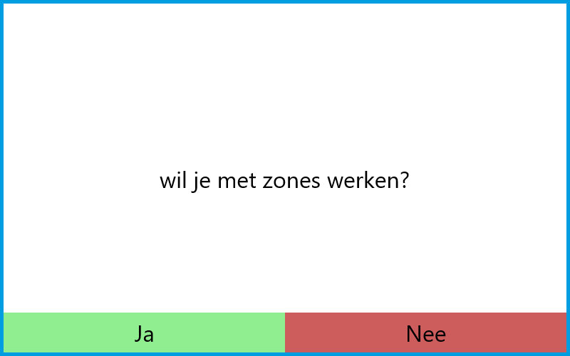
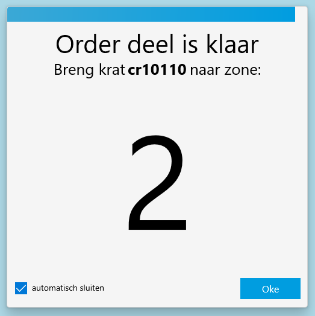

# Zone Pick To Light

Met Zone picking is het mogelijk om met meerder mensen een Pick To Light stelling te bedienen. Dit wordt gedaan door de stelling op te delen in kleinere delen, zones.

## Hoe werkt zone picking

Als een systeem ingesteld staat krijgt een medewerker een pop-up die vraagt of je met zones wilt werken.

"Nee" stuurt de medewerker het standaardscherm.
"Ja" stuurt de medewerker naar het zone pick scherm. Orders zullen nu per zone behandeld worden.

Door met zones te werken wordt elke order opgedeeld in delen. Deze delen worden één voor één verwerkt.
Hieronder is een schema te zien hoe dit er uit ziet.

1. De eerste picker scant een krat om het picken te beginnen.
1. De eerste picker pickt de producten in zijn/haar zone.
1. De picker vervoert het krat naar de volgende zone via de rollerbaan die aan de stelling vast zit.
1. De volgende picker verzamelt het deel in zijn/haar van de order en vervoert het krat naar de volgende zone.
1. dit herhaalt zich totdat de order klaar is.
1. de laatste picker plaatst het krat op de aangestuurde rollerbaan.

Als een deel verzamelt is, wordt er een signaal gegeven om aan te geven naar welke zone de order moet.
Dit gebeurt via de stelling en het scherm. op de stelling geven de lampjes oranje licht, met het zonenummer op de displays naast de knoppen. Het scherm weergeeft deze informatie ook in een pop-up, zoals hieronder te zien is.

Deze pop-up samen met de lampjes op de stelling na 5 seconden uit. Dit wordt aangegeven met de aflopende balk boven in de pop-up. Dit kan ook uitgezet worden met de checkbox links onderin.
Als een order klaar is wordt het standaard eindsignaal gegeven op de laatste zone van de order.

een order kan opgehaald worden vanuit elke zone. Er is echter op dit punt nog geen garantie dat de opgehaalde order daadwerkelijk in die order start.

Om te voorkomen dat zones stil staan, is het mogelijk gemaakt om meerdere orders tegelijkertijd te verwerken. dit kan door een nieuw krat te scannen.

Als er meerdere orders in dezelfde zone moeten zijn, wordt de laatst aangekomen order in een wachtrij gezet. Deze order wordt automatisch getoond zodra de order daarvoor de zone verlaat. Hieronder is uitgebeeld hoe dit er met drie orders uit ziet.

Alle orders worden bijgehouden in een lijst in de software die aangeeft in welke volgorde de orders staan. Hier wordt ook verdere informatie gegeven, zoals de hoeveelheid producten en de zone waar de order zich bevindt. Om de details van een order te zien, zoals kan op de niet zone pick pagina druk je op de knop rechts in de order regel onder **Details**.

## Zones instellen

[[Doelgroep: IT

********** De informatie hieronder is meer van technische aard **********

## Technische informatie bij de Pick To Light

## technisch kopje 1

