# Pick To Light

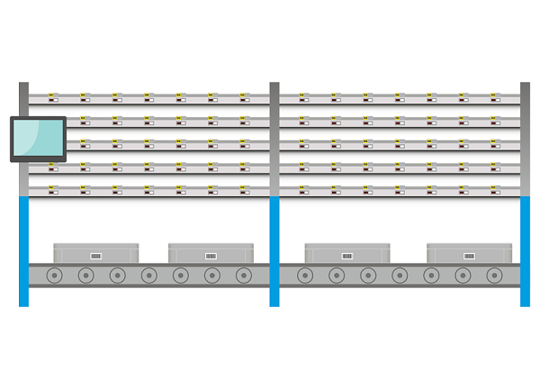

Pick To Light is een systeem dat we gebruiken om te kunnen orderpicken zonder dat je veel scans met je pistoolscanner hoeft te doen. Van de systemen die we nu (2022) hebben is Pick To Light het snelste picksysteem.​
Het picken gaat door een krat te scannen waar de order in gaat. Dan gaan lampjes branden met het te picken aantal eronder. Als de producten uit het juiste vakje gepakt zijn, wordt door het indrukken van het knopje bij het vak aangegeven dat het picken gelukt is.
Deze pagina geeft informatie over de werking van de Pick To Light stelling en sluit af met technische informatie over de Pick To Light.

## Hoe werkt een Pick To Light

* Bij het verifiëren van een order herkent het systeem dat de producten gepickt moeten worden via de pick-to-light stelling. Zie [Outbound - Locatie keuze](../../../Algemene-informatie/Outbound#locatie-keuze). Bij de order wordt opgeslagen van welke pick-to-light stelling hij gepickt moet worden.
* Bij de stelling hangt een monitor waarop wordt aangegeven hoeveel orders er gepickt moeten worden
* De gebruiker scant een krat
* Het pick-to-light systeem kiest een order en wijst deze toe aan de krat
* Het pick-to-light systeem geeft bij de locaties waar een product gepakt moet worden met het display aan hoeveel er gepakt moeten worden
* De gebruiker pakt het aangegeven aantal producen van de locatie, drukt op de knop ter bevestiging en legt de producten in de krat.
* Gebruiker scant de volgende krat, tot alle orders gedaan zijn

Mocht er een probleem zijn met de pick-to-light stelling, dan is het ook mogelijk om de orders met de scanner te picken. Hiervoor is een filter optie bij het kiezen van een pickstroom.

Zie ook onderstaand filmpje:

::: video
<iframe width="560" height="315" src="https://www.loom.com/share/aa76fcc6820e4470ade23f1c4e2edf90" title="YouTube video player" frameborder="0" allow="accelerometer; autoplay; clipboard-write; encrypted-media; gyroscope; picture-in-picture" allowfullscreen></iframe>
:::

## Verschillende typen Pick To Light stellingen
Verspreid over de vestigingen bestaan er verschillende soorten Pick To Light stellingen.
De meest voorkomende variant is een Pick To Light met flowracks. De producten staan in bakjes in een flowrack, zodat de voorraad aan de achterkant van de Pick To Light stelling kan worden bijgevuld en de producten door de zwaartekracht naar voren rollen, naar de kant waar het daadwerkelijke picken gedaan wordt.

Dan is er nog een Pick To Light met vakken.

En er bestaat ook een Pick To Light in een palletstelling. De vakken zijn daar wat groter, zodat er ook hele pallets in gezet kunnen worden.

## Typen orders in een Pick To Light
In principe is een Pick To Light stelling vooral geschikt voor M-orders. Maar als er ook S-orders gepickt kunnen worden van de locaties van de Pick To Light, kan bij het picken gekozen worden een krat met S-orders te picken. ...

## Picken op een specifiek kanaal
Het is mogelijk een kanaal te kiezen, waardoor alleen orders van dat kanaal gepickt worden. Dit kan gebruikt worden om orders van bijvoorbeeld een bol of amazon kanaal eerst te picken.
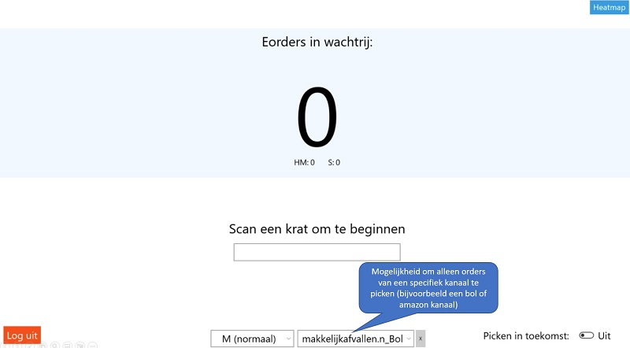

## Bijvulmonitor
Door op de omcirkelde knop te drukken kan de picker aangeven, dat de voorraad van de bijhorende locatie bijna leeg is. Zodra deze knop is ingedrukt wordt er een melding gestuurd naar de Bijvulmonitor.

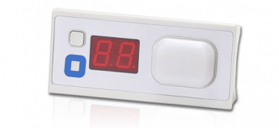

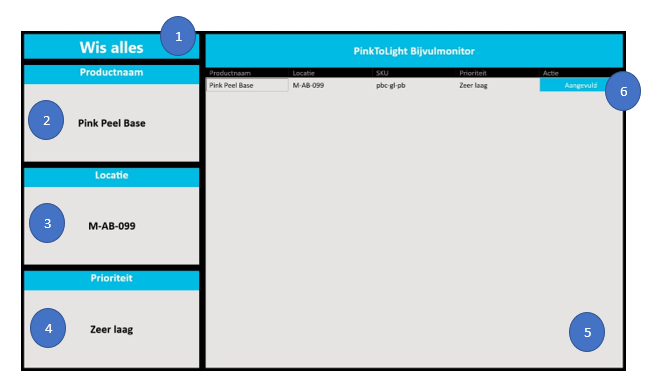

1.	Via de knop ‘Wis alles’ kunnen alle meldingen worden gewist.
2.	De naam van het product met de hoogste prioriteit.
3.	De locatie van het product met de hoogste prioriteit.
4.	De prioriteit, dat de voorraad bijvult moet worden. Dit is verdeeld in 5 niveaus, namelijk zeer laag, laag, gemiddeld, hoog en zeer hoog. Door meerdere keren dezelfde melding te sturen, wordt de prioriteit hoger.
5.	Lijst met alle meldingen, die binnen zijn gekomen.
6.	Via de knop ‘Aangevuld’ kan worden aangegeven, dat de voorraad is aangevuld. Vervolgens zal de melding verwijderd worden vanuit de lijst.

## Bijvullen algemeen
Voor de Pick To Light stellingen die geen bijvulmonitor hebben, kan bijvullen gedaan worden zoals ook reguliere magazijnlocaties kunnen worden bijgevuld. Een omschrijving van hoe dit werkt is [hier te vinden](https://vragen.monta.nl/Docs/Algemene-informatie/Voorraadbeheer/Bijvullen/).

## Heatmap
Bij een Pick To Light is het vaak wenselijk om de producten waar er het meest van gepickt worden dichtbij elkaar te leggen. Omdat het in de loop van de tijd kan wijzigen hoeveel een product gepickt wordt, is er een scherm beschikbaar waarin gekeken kan worden of de producten nog logisch verdeeld liggen in de Pick To Light. Via onderstaande schermen kan aangegeven worden dat de heatmap getoond kan worden en dan gaan de lampjes op de Pick To Light branden in verschillende kleuren.

In het volgende scherm kan gekozen worden over hoeveel dagen in het verleden de heatmap berekend kan worden.

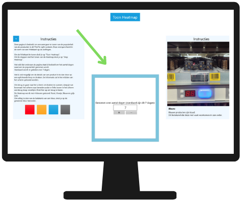

Vervolgens gaan de lampjes op de Pick To Light branden in verschillende kleuren.
Bij artikelen die het meest gepickt zijn gaat een rood lampje branden. Door de artikelen bij rode lampjes te verplaatsen naar de 'beste' locaties binnen de Pick To Light stelling, wordt de Pick To Light efficiënter in gebruik.

## Business Intelligence montaWCS
Er wordt bijgehouden hoeveel orders gepickt zijn via een Pick To Light en hoeveel jokers er zijn opgetreden. Deze informatie is in te zien via montaportal, onder het account van de vestiging waar de Pick To Light staat.

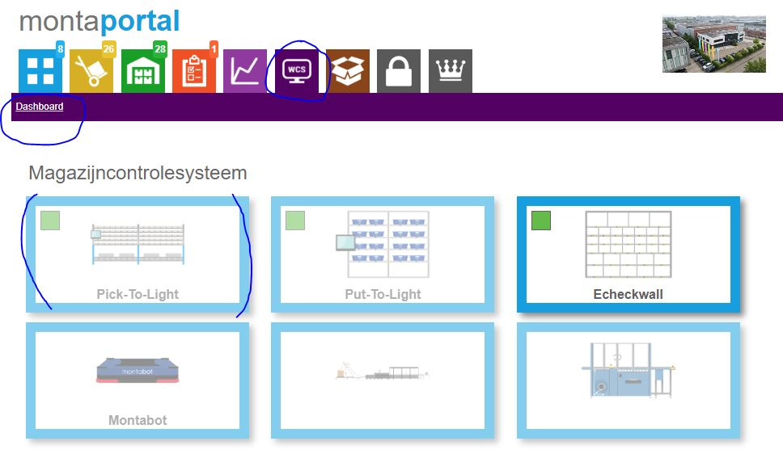

## Zone picking
Wanneer een Pick To Light stelling erg groot is, of op drukke momenten, kan het wenselijk zijn om met meerdere mensen tegelijk met de Pick To Light stelling te kunnen werken. Dat kan door zone picking toe te passen.
Zone picking binnen Pick To Light heeft een aparte pagina met uitleg die [hier](https://vragen.montapacking.nl/Docs/Algemene-informatie/Outbound/Pick-To-Light/Zone-Pick-To-Light/) te vinden is

[[Doelgroep: IT

********** De informatie hieronder is meer van technische aard **********

## Technische informatie bij de Pick To Light

De tabellen voor Pick To Light staan gewoon in de Monta_Backend database.
## Tabelstructuur
In tblPickToLightStellingen worden PickToLight stellingen gedefinieerd.
Hierin kunnen onder andere zaken geregeld worden zoals:

- Naam van de PickToLight stelling en aangeven in welk magazijn de Pick To Light stelling staat.
- Gekoppelde computer/nuc ID instellen
- Instellen of de Pick To Light knopjes heeft met waarop 2 karakters of 3 karakters worden weergegeven.
- Instellen van Rabbit Mq exchange voor communicatie met de bijvulmonitor
- Instellen welke Pick To Light stellingen bij elkaar horen als er gewerkt wordt met gekoppelde stellingen

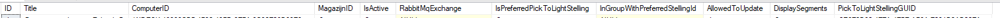

## Pick To Light locaties
In tblPickToLightLocations kan worden ingesteld welke Pick To Light locaties bij een Pick To Light stelling horen. In deze tabel wordt een link gelegd tussen de Pick To Light stelling, een magazijnlocatie en een Atop knopje. (Atop is de naam van de hardware die wordt gebruikt bij Pick To Light stellingen. Dit zijn knopjes die gekleurd kunnen oplichten en een display hebben waarin een getal getoond kan worden)

## Gekoppelde Pick To Light stellingen
Er zijn gevallen waarbij het wenselijk is om met 2 Pick To Light stellingen te werken die dezelfde producten bevatten. Vaak wordt dan op rustige dagen met 1 stelling gewerkt en op drukke dagen kunnen er 2 stellingen ingezet worden. Via tblPickToLightStellingen kan in de velden InGroupWithPreferredStellingId en IsPreferredPickToLightStelling worden ingesteld welke Pick To Light stellingen bij elkaar horen.
Er zijn 2 manieren van werken;

In onderstaand screenshot staan 2 Pick To Light stellingen in Waspik, daarbij is het zo dat als "Waspik-To-Light 1" aan staat, de orders om en om verdeeld worden met "Waspik-To-Light 2". De beide Pick To Light stellingen in Waspik zijn identiek qua indeling en bevatten dezelfde producten op dezelfde Pick To Light locaties

De "Pink-To-Light Groot" en "Pink-To-Light Klein" in Papland werken net iets anders. De "Pink-To-Light Klein" bevat minder Pick To Light locaties dan de "Pink-To-Light Groot". Als de "Pink-To-Light Klein" aan staat, zullen orders die volledig op de "Pink-To-Light Klein" gepickt kunnen worden standaard op de "Pink-To-Light Klein" worden gezet. Orders die ook producten bevatten die niet in de "Pink-To-Light Klein" liggen, worden op de "Pink-To-Light Groot" gezet.

tblPickToLightStellingen

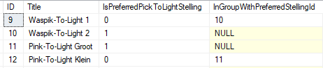

## Shipper
Het is mogelijk om specifieke verzenders te koppelen aan een Pick To Light. Als een verzender aan een Pick To Light is gekoppeld, dan kunnen alleen orders van deze verzender gepickt worden van de Pick To Light. Dit is in te stellen in de tabel tblPickToLightSettingsShippers.

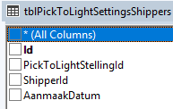

## BijvulMonitor
De bijvulmonitor is een scherm dat achter de picktolight kan staan om adviezen te geven over bijvullen. In onderstaande tabel kan dit geconfigureerd worden. Als op de onderste kleine knop van de A-Top node wordt gedrukt tijdens het picken, dan wordt er een bericht naar de ingevulde RabbitMQ exchange gestuurd. Dit bericht wordt door de bijvulmonitor uitgelezen en getoond op het scherm. Als hetzelfde bericht vaker wordt gestuurd, dan wordt de prioriteit van deze bijvulactie hoger.

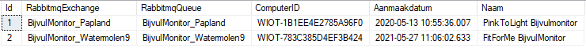

## Zone picking
In tblPickToLightZone kan zone picking worden ingesteld. Dit is mogelijk via het WCS Pick To Light scherm in montaportal.
_Verdere toelichting schrijven samen met Jerke_

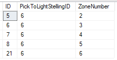

