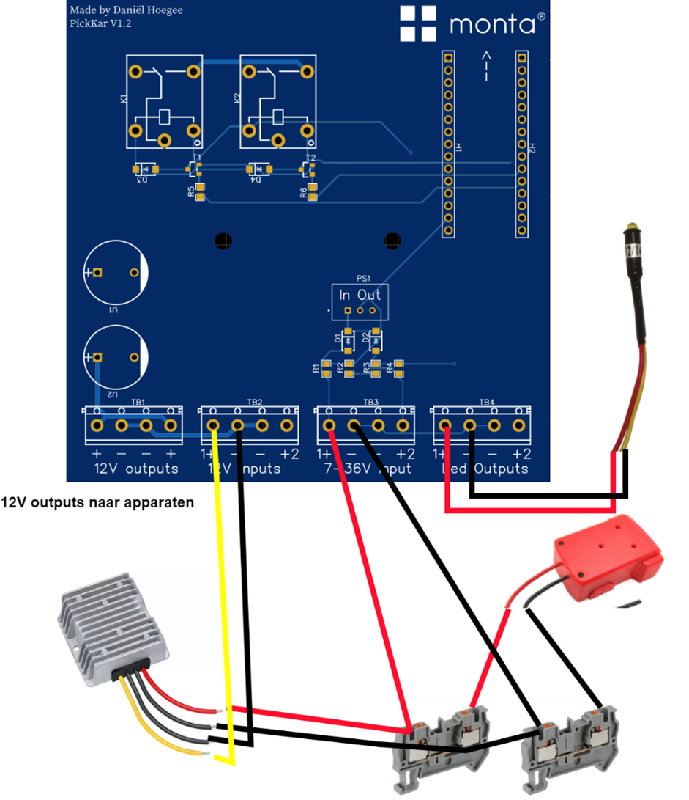
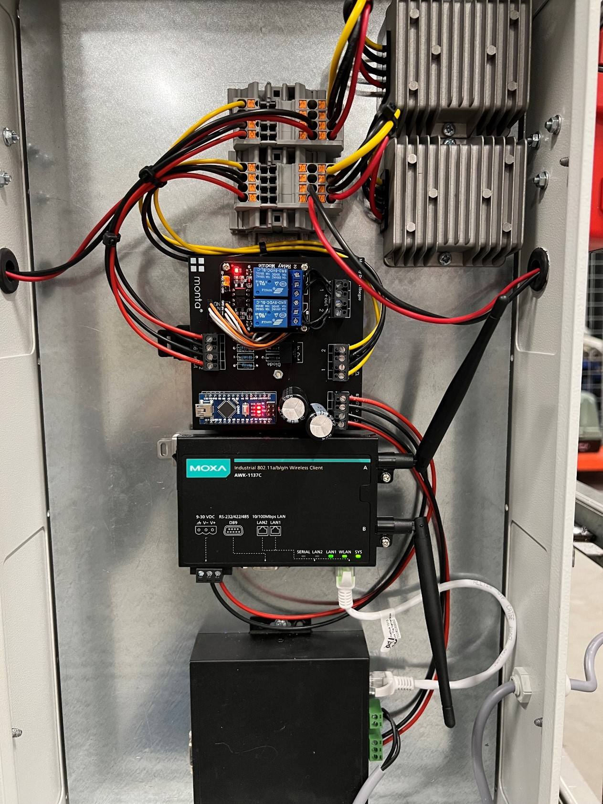
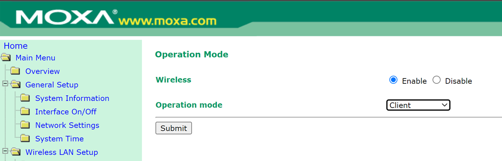
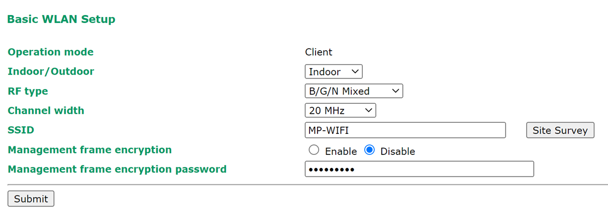
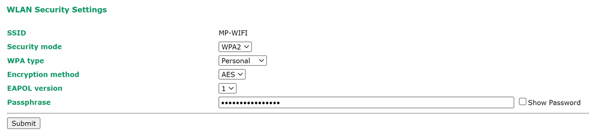

# Put To Light Cart

## Handleiding

Solderen langere draden accuhouders.
1.	Schroef de houders open met de 2 zwarte schroeven.
2.	Desoldeer de bestaande draden
3.	Soldeer nieuwe langere draden met minimale diameter 0.75mm2 (let goed op + en -)

## Uploaden arduino programma
1.	Download de Arduino ide (https://apps.microsoft.com/store/detail/arduino-ide/9NBLGGH4RSD8?hl=nl-nl&gl=nl&ocid=badge&rtc=1)
2.	Open het arduino programma op de volgende locatie (Monta Services BV\RandD - General\22-PickToLight-PutToLight\23-GaaskarMetLampjes)
3.	Selecteer bij tools, board: Arduino nano, port: de weergegeven COM-port
4.	Druk op ctrl+U of op de knop met de pijl linksboven
5.	Als het uploaden niet lukt probeer dan een van de voorbeelden up te loaden. Onder file, examples, 01-basics, blink. Druk weer op de pijl of ctrl+U
6.	Probeer nogmaals het Arduino programma up te loaden
Aansluiten pcb, 2 accu houders, signaallampen en 12V converters.

Arduino met usb aansluiting bij de pijl op printplaat plaatsen.
Wanneer alles is aangesloten ziet het er zo uit:

Nb dit is een oude versie van de printplaat maar de werking is hetzelfde.

 
## Instellen Moxa Wifi Bridge

Onder interface On/Off moet de operation mode op client staan:

Bij Wireless LAN Setup de MP-WIFI invullen (met site survey kun je de beschikbare netwerken weergeven)

Hier wpa2 selecteren en bij Passphrase het wachtwoord invullen

Hierna functioneert de moxa als een bridge en kunnen de apparaten die via de ethernet kabel aangesloten zijn benaderd worden via netwerk.

De atop controller stel je in op een IP-adres in de reeks van het wifi netwerk waarmee je verbind.

MP-WIFI bijvoorbeeld = 10.32.0.210

De Moxa bridge zelf heeft ook een IP-adres, deze kun je als standaard houden en dan met kabel verbinden naar de bridge. Of ook in de reeks zetten van het wifi netwerk

MP-WIFI bijvoorbeeld = 10.32.0.222

## Instellen Atop Controller
1.	Sluit de atop controller aan op een laptop.
2.	Zet de laptop in de reeks 10.0.50.X
3.	Ga naar 10.0.50.100 in de browers om naar de Atop controller te gaan.
4.	Bij settings kan het IP-adres veranderd worden naar bijvoorbeeld 10.32.0.X
5.	Sluit de Atop controller aan op de Moxa wifi bridge
6.	De Atop controller kan nu benaderd worden via het ingestelde IP-adres (dit kan getest worden met ping 10.32.0.X)

Uiteindelijk is de strucutuur van het aansturen als volgt:

