# Costo sorter Oosterhout

In de vestiging Oosterhout staat een pakket sorteermachine die geleverd is door Costo. Op deze pagina is de bedieningshandleiding te vinden. '

## **Starten en stoppen van de installaties**

##Opstarten schakelkast X1
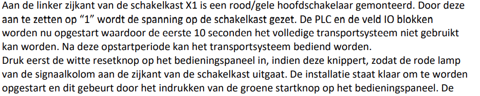

## **Lampen bediengspaneel X1**
### _**Lampen in drukknoppen kast X1**_
#### **Witte lamp in resetknop**
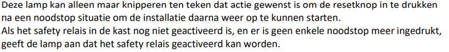

#### **Groene lamp in startknop**

### **_Lampen signaalkolom bovenop X1_**
#### **Groene lamp (in bedrijf)**

#### **Rode lamp(storing)**

#### **_Continu aan_**

##### _**Storing veiligheid**_

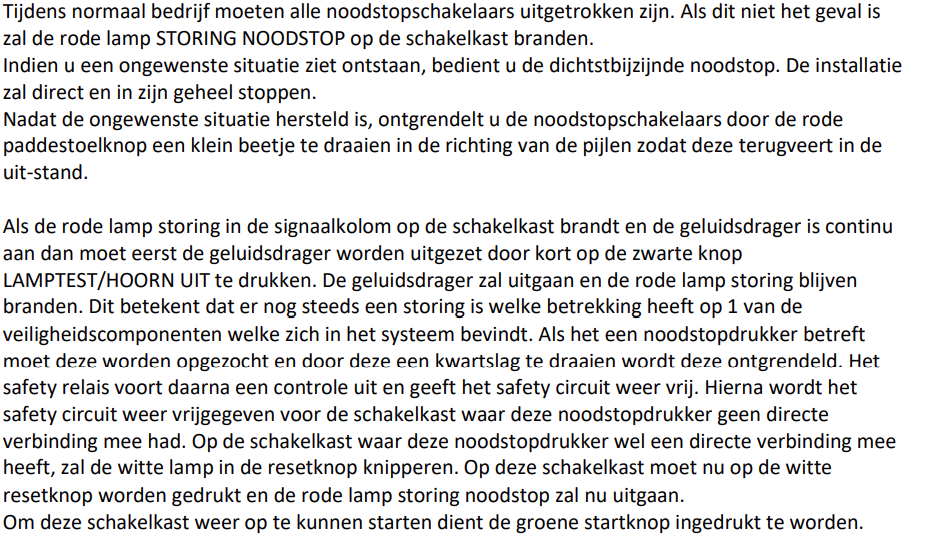
#### _**Knipperen (1 sec.puls)**_

##### _**Storing 400V voeding motor(en)**_

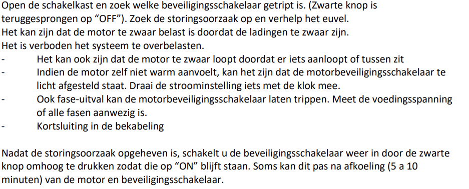

##### **_Storing motor_**

##### _**Storing luchtdruk**_

##### _**Storing 24VDC**_

##### _**Storing bus unit**_

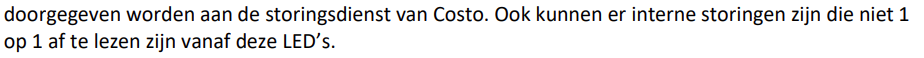

#### _**Knipperen (0,2 sec. puls)**_

##### _**Communicatiefout Ethernet/IP**_

##### **_Oranje lamp storing algemeen_**

#### _**Knipperen (1 sec. puls)**_

#### _**Alle lampjes knipperen snel**_
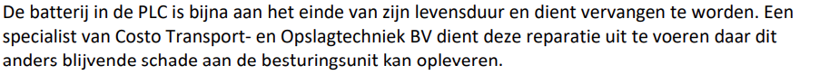

#### _**Algemeen**_
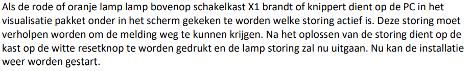

## _**Lampen veld**_

### **_Signaalkolommen verdieping 2_**
#### _**Lamp groen**_
##### _**Continu aan**_

##### _**Knipperen(1 sec.puls)**_

#### _**Lamp rood**_

##### _**Continu aan**_
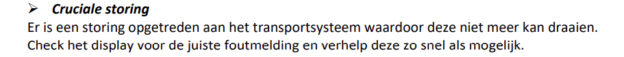
##### _**Knipperen (1 sec. puls)**_

### _**Signaalkolom kruispunt begane grond/verdieping**_
#### _**Lamp rood**_

##### _**Continu aan**_

##### _**Knipperen (1 sec. puls)**_
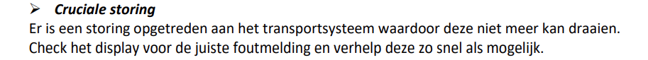
#### _**Lamp geel**_

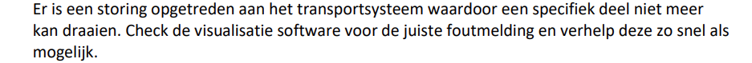
### _**Lampen geel sorter**_
#### _**Lampen geel chutes**_

##### _**Knipperen (1 sec.puls)**_
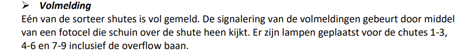

## _**Resetten van de installatie na een noodstopstoring**_

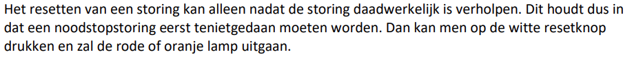

## **_Spanningsuitval_**

## _**Noodstop**_
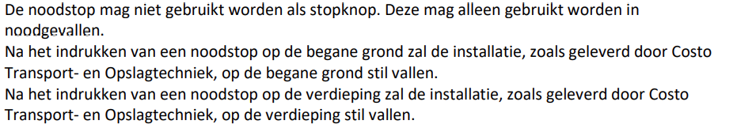

## _**Veiligheid**_
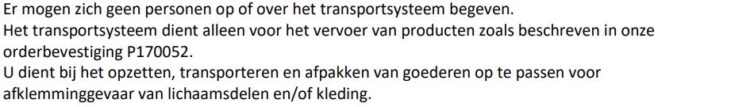
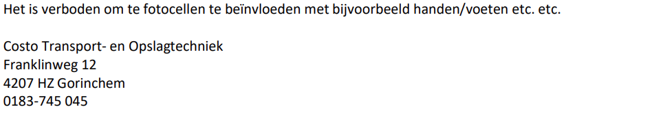

## _**Hoofdscherm**_
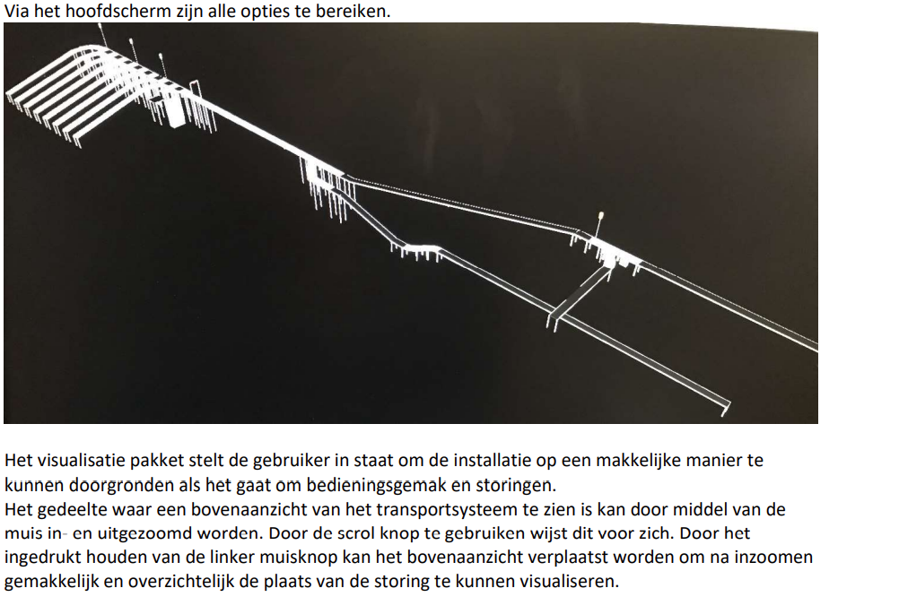
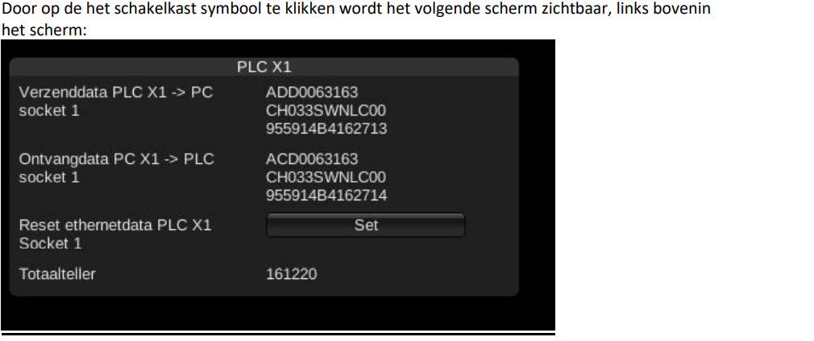

## **_Verzend- en ontvangdata_**

## _**Reset ethernetdata**_
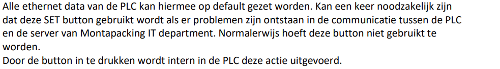

## **_Totaalteller_**

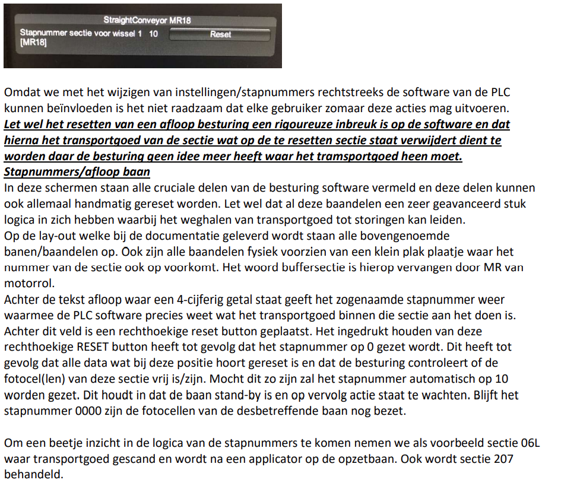

### **Flowcontrol**

## **STORINGSMELDINGEN X1**

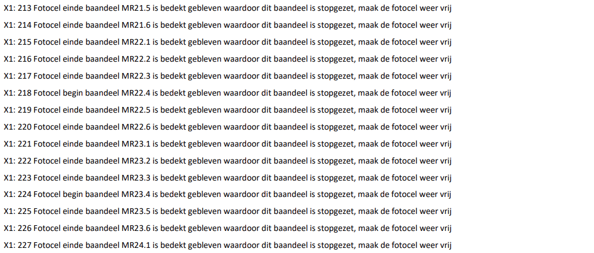
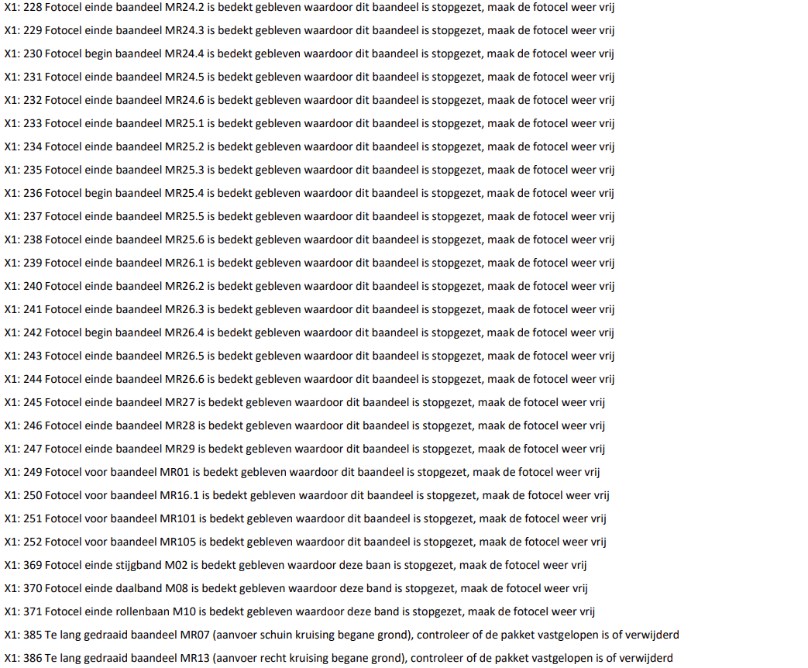
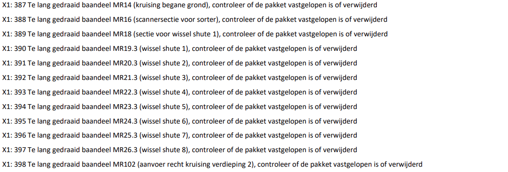

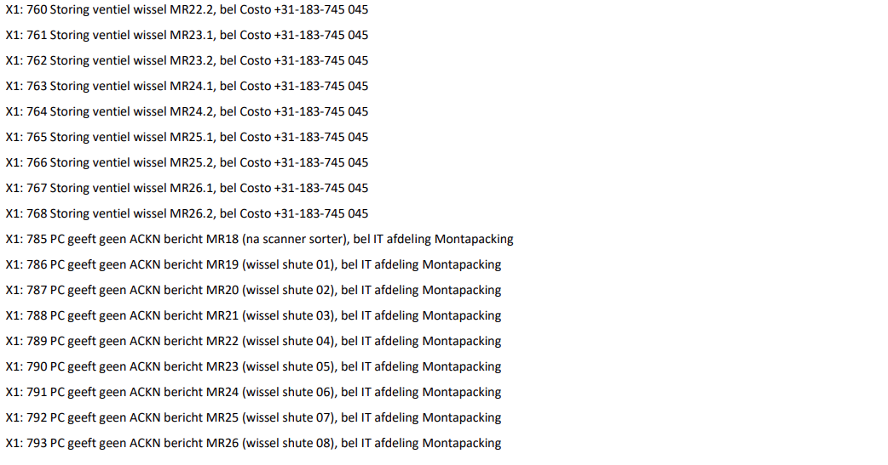

## **01 Pilz linkmodule geeft geen vrijgave, bel Costo +31-183-745 045**

## **11 Storing RS232 poort op CPU**

## **13 Storing Ethernet/IP, druk resetknop in. Bij blijvende melding bel Costo +31-183-745 045**

## **14 Brandalarm via de brandmeldcentrale, schakel de melding op de centrale uit**

## **15 Geen Socket connectie X1 (geen verbinding met server) mogelijk, bel IT afdeling MONTAPACKING FULFILMENT SERVICES**

## **16 Geen communicatie tussen PLC X1 <-> PC (socket 1), bel IT afdeling MONTAPACKING FULFILMENT SERVICES**
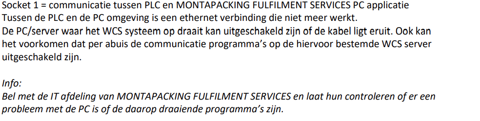

## **17 Veiligheidscircuit kast X1 niet vrijgegeven, druk op de resetknop van kast X1**
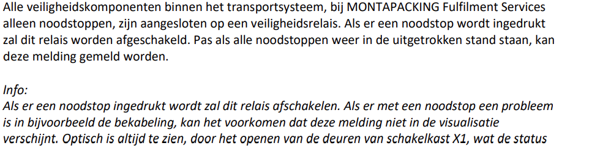

## **18 Noodstop gedrukt op paneel van kast X1, draai de noodstop een kwart slag uit**
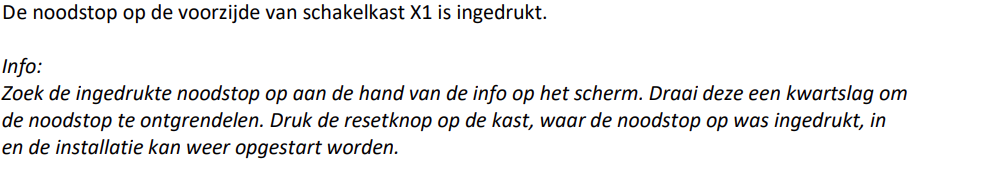

## **19+25+33+41 Noodstop gedrukt veld locatie, draai de noodstop een kwart slag uit**
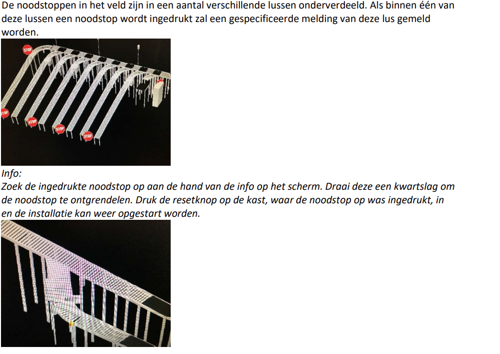

## **49-50 Storing motorvoeding 400V xxFx, check de motorbeveiliging in kast X1**

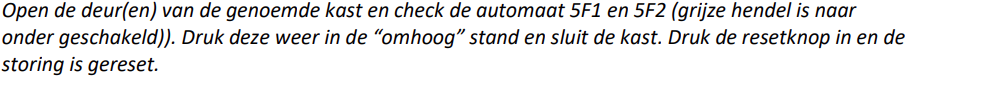

## **64 Luchtdruk is te laag, controleer de compressor en de leidingen**

## **65 Storing 24VDC (2U1/2F3) in kast X1, bel Costo +31-183-745 045**
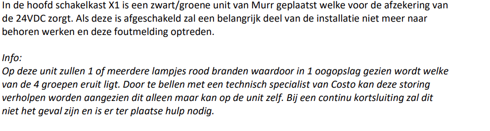

## **66-77 Storing 24VDC in veldkast X80-X84, bel Costo +31-183-745 045**

## **81-83 Storing Smartmotor, schakel de werkschakelaar bij de motor uit**
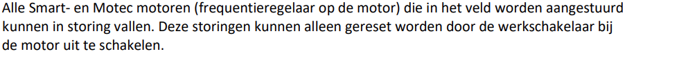
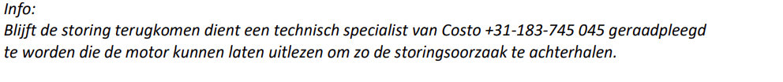

## **97-114 Storing module X100-X115 E/IP veldbussyteem, bel Costo +31-183-745 045**

## **177-371 Fotocel start/einde baandeel is bedekt gebleven waardoor dit baandeel is stopgezet**
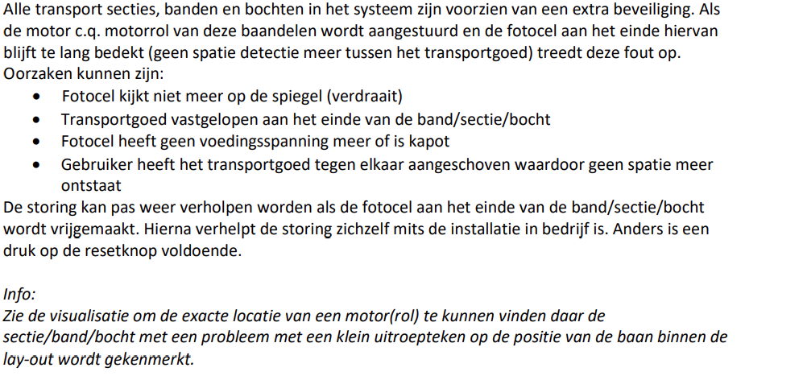

## **385-400 Te lang gedraaid baandeel, controleer of de pakket vastgelopen is of verwijderd**

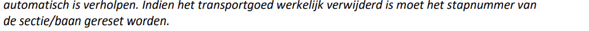

## **481-496 Fotocel niet vrij (gekomen) baandeel, check stapnummer en de pakket**

## **625-640 Stapnummer blijft 0000, fotocel blijft bedekt baandeel, verwijder de (onbekende) pakket en/of controleer de fotocel(len)**
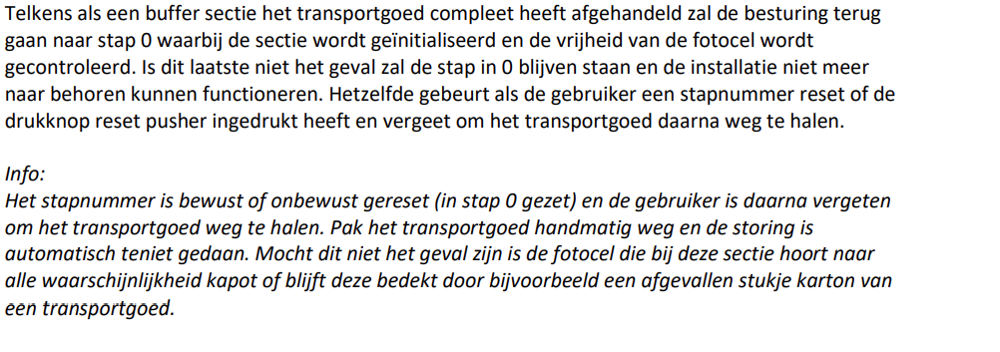

## **753-768 Storing ventiel wissel**

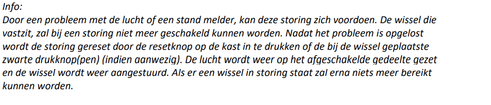

## **785-804 PC geeft geen ACKN bericht, bel IT afdeling Montapacking**

