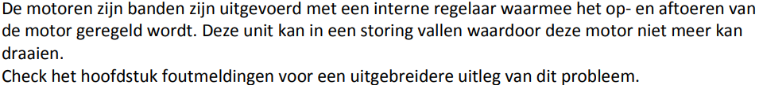

# Costo sorter Waspik

**BEDIENINGSHANDLEIDING TRANSPORTSYSTEEM Montapacking Waspik (NL).**

Het transportsysteem is uitsluitend bedoeld voor het transporteren van transportgoed
gespecificeerd volgens onze orderbevestiging 140121.

## **Starten en stoppen van de installaties**

## **X1**

## **Lampen bedieningspaneel X1 (hoofdkast)**

## **Lampen in drukknoppen kast X1**
### **Witte lamp in resetknop**

### **Groene lamp in startknop**

## **Lampen signaalkolom bovenkant X1**
### **Groene lamp (in bedrijf)**

### **Rode lamp (storing)**

### **Continu aan**

#### **Storing veiligheid**

### **Knipperen (1 sec. puls)**

#### **Storing 400V voeding motor(en)**

#### **Storing motor**

#### **Storing 24VDC**

#### **Storing luchtdruk**

### **Knipperen (0,2 sec. puls)**

#### **Brandalarm (optioneel uitgevoerd aan Costo zijde)**

#### **Communicatiefout tussen PLC en PC**

#### **Oranje lamp storing algemeen**

### **Knipperen (1 sec. puls)**

#### **Alle lampjes knipperen snel**

#### **Algemeen**

## **Signaalkolommen veld**

### **Oranje lamp**

#### **Continu aan**

#### **Knipperen (1 sec. puls**

### **Resetten van de installatie na een noodstopstoring**

### **Spanningsuitval**

### **Noodstop**

### **Veiligheid**

## **Hoofdscherm**

## **Statusweergave links bovenin het scherm**

## **Button noodmodus**

## **Button reset alle PLC software**

## **STORINGSMELDINGEN X1**

### **Overzicht meldingen met codes**

)

### **01 Storing noodstop**

### **13 Ethernet/IP storing**

### **14 Brandalarm van de brandmeldcentrale (optioneel)**

### **15 Geen socket 1 connectie mogelijk**

### **16 Geen communicatie tussen PLC <-> PC(socket)**

### **17-19 Storing 11Fx voeding in kast X1 voor motor**

### **32 Luchtdruk te laag**

### **33-35 Storing motor**

### **49-53 Storing 24VDC**

### **65-71 Storing node X100-X106 bussysteem, bel Costo +31-183-745045**

### **98-102 Pusher storing**

### **112 Zwarte drukknop(pen) bij pusher is lang ingedrukt**

### **113-121 209-215 Band/sectie/bocht vast einde**

### **162-176 Er staat een doos op de sorter te wachten voor de shute**

### **225-234 Te lang gedraaid sectie**

### **241-250 Fotocel niet vrijgekomen buffer**

### **257-266 Stapnummer blijft 0, fotocel blijft bedekt motorrol**

### **273 Foutmelding RS232 poort**

