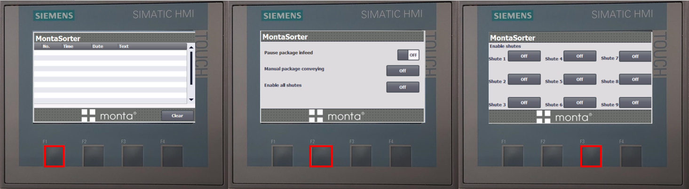
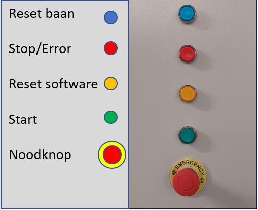
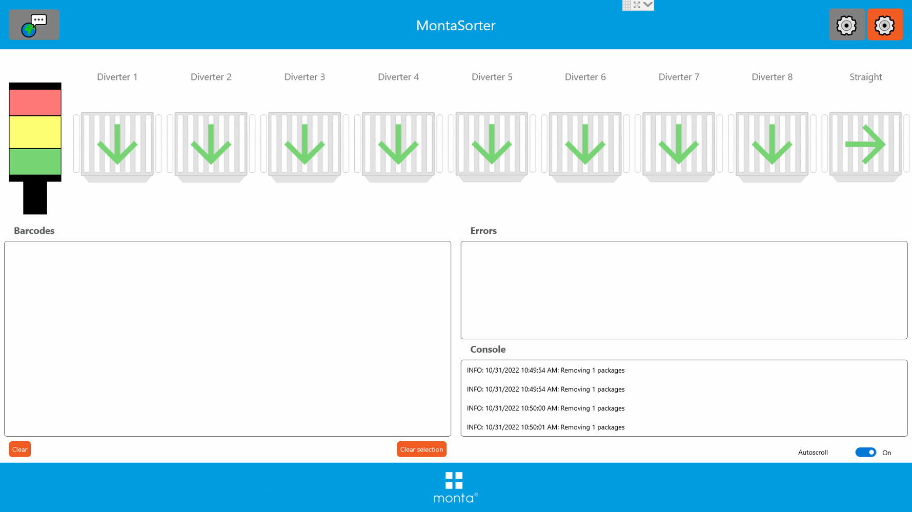
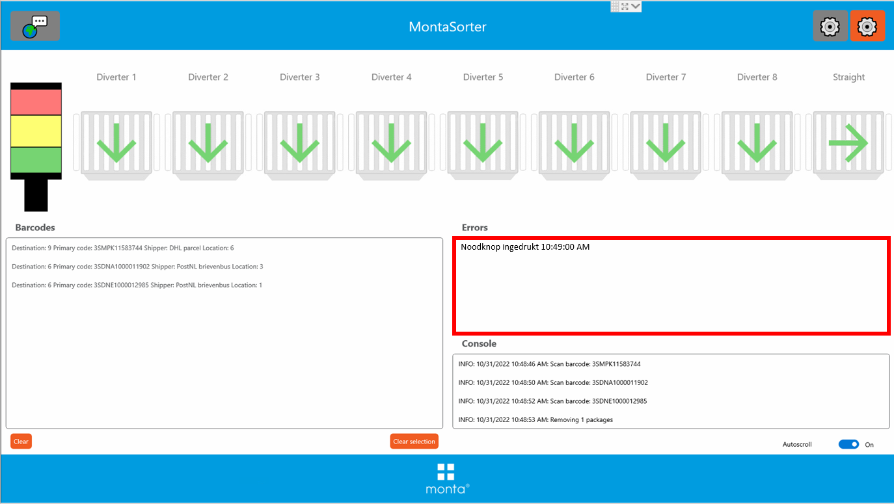
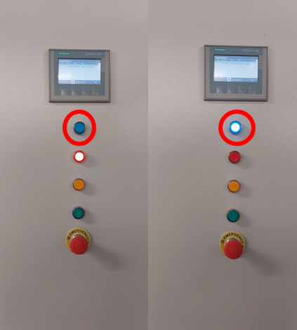
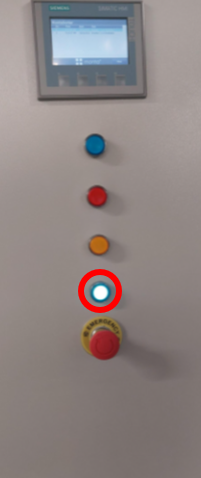

# MontaSorter Papland

Monta sorter is de naam van een in 2022 ontwikkelde sorteermachine van Monta die als bouwblok kan worden ingezet.

Voor het gebruik van deze machine komen handleidingen beschikbaar die op deze plek te vinden zullen zijn.

## Interface
### Hardware

#### Scherm
De MontaSorter heeft een touchscreen op de elektriciteitskast dat met behulp van 3 knoppen verschillende schermen kan laten zien.
Op deze schermen kunnen er verschillende functies aan en uit gezet worden.

#### Knoppen
De hardware interface van de MontaSorter bestaat ui 5 knoppen:

### software
De software interface van de MontaSorter is een applicatie:

#### Diverters
In de applicatie zijn de verschillende diverters weergegeven met hun huidige status:

Als er een diverter een probleem heeft wordt er op de desbetreffende diverter een rode kruis weergegeven. Om het probleem op te lossen zie [Probleem oplossen](#Probleem-oplossen).

#### Barcodes
Bij de sectie barcodes wordt live weergegeven welke pakketjes geregistreerd zijn door de scanner en naar welke baan ze gaan:

Onderaan van de barcode sectie staan twee knoppen: "**Clear**" en "**Clear selection**" deze worden gebruikt om de geregistreerde pakketjes te verwijderen.

#### Errors
De sectie errors geeft weer welke errors er opgetreden zijn binnen het proces.

#### Console
De sectie console geeft een logboek weer van de acties die het systeem heeft uitgevoerd.

#### [Oranje tandwiel] Indeling veranderen
Met het oranje tandwiel kan je de indeling aanpassen per loopbaan( **shute** ) en vervoerder. Wanneer er veranderingen zijn gemaakt in de instellingen dan moet de applicatie altijd opnieuw opgestart worden.

#### [Grijze tandwiel] Verzender en barcode aanpassen
Bij deze instellingen is een wachtwoord vereist, alleen de admin kan veranderingen aanbrengen.

Na het invoeren van het wachtwoord worden de instellengen van de verzenders met hun bijhorende condities. Contacteer de R&D afdeling als je hier instellingen wilt aanpassen.

## Probleem oplossen
### Rode lamp
Rode lamp brand als MontaSorter aanstaat kan 2 dingen betekenen: sorteerslag mislukt of baan vol.

1. controleer of er een diverter omhoog staat.
- als dat het geval is dan is de sorteerslag mislukt.
- haal alle pakketjes tot en met het scan huis van de baan af.
- Start [Reset reeks](#Reset-reeks).

2. kijk of de baan vol is
- Maak de baan leeg die vol is.
- druk op de "**Groene knop**" om het proces te starten.

### Noodknop
Als de noodknop ingedrukt geeft hij een melding weer:

Om dit probleem op te lossen ga je dit stappenplan langs:
1. Draai de **noodknop** zodat hij weer omhoog staat.
2. Druk op de "**oranje knop**" om weer stroom op de rolbaan te zetten.
3. start [Reset reeks](#reset-reeks).

## Reset reeks
druk op de de "**clear**" knop en zorg dat er geen pakketjes meer in de **barcodes** sectie staan.

Druk daarna op de "**blauwe klop**" op de kast om de baan te resetten. De knop gaat licht geven en wacht tot deze weer uit is.

Druk vervolgens op de "**Oranje knop**" om de software te resetten.

Druk als laatst op de "**groene knop**" om het proces weer te starten.

