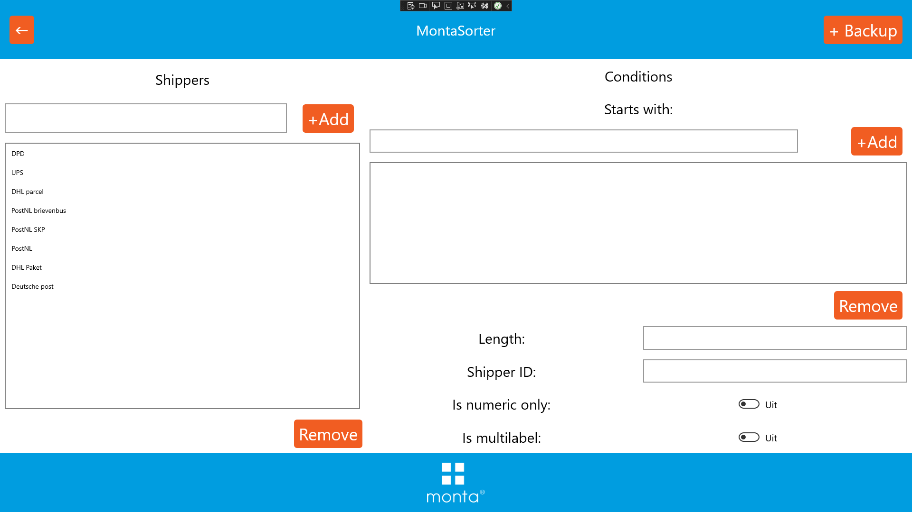
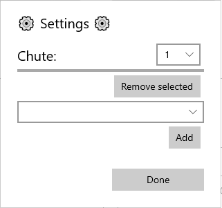

# Sorteermachine


Met een sorteermachine kunnen de pakketten van de verschillende vervoerders uitgesorteerd worden. Er worden binnen Monta 2 typen sorteermachines gebruikt;
1) Costo sorters, in Waspik en Oosterhout
2) Montasorters, in Gorinchem Papland en Molenaarsgraaf

## Costo sorter Oosterhout

[Bedieningshandleiding Costo sorter Oosterhout](../../../Algemene-informatie/Apparaten/Sorteermachine/Costo-sorter-Oosterhout)

## Costo sorter Waspik

[Bedieningshandleiding Costo sorter Waspik](../../../Algemene-informatie/Apparaten/Sorteermachine/Costo-sorter-Waspik)

## Montasorter Papland

[Handleiding Montasorter Papland](../../../Algemene-informatie/Apparaten/Sorteermachine/MontaSorter-Papland)


## Costo sorter

De sorteermachine scant de barcode van een pakket en vraag aan de bijbehorende PC naar welke goot het pakket moet. Op de PC draait een applicatie (console venster) die de barcode uitleest, herkent van welke verzender de barcode is en de juiste goot teruggeeft. In een bestand staat ingesteld welke verzender naar welke goot moet. Dit bestand staat op C:\SorterServer\BS.txt.
Monta IT heeft invloed op het toekennen van goten aan de hand van de gescande barcode.
Voor alle andere meer hardware gerelateerde zaken en voor onderhoud is Costo de juiste partij om vragen aan te stellen. Contactgegevens van Costo zijn bekend op de vestigingen Waspik en Oosterhout

## Montasorter

In 2022 is de eerste Montasorter opgebouwd. Monta techniek heeft een eigen sorteermachine ontwikkeld zodat we geen afhankelijkheden hebben van integrators. Levertijden en prijzen van sorteermachines loopt steeds verder op, en onderhoudscontracten worden duurder. Ook zijn de reactietijden bij storingen te lang voor ons proces. Vanaf 2022 is de Montasorter een bouwblok dat kan worden ingezet.
De sorteermachine bestaat uit modulaire bouwblokken, waardoor hij in elke vestiging toepasbaar is. De sorter helpt bij het verminderen van sorteerfouten en helpt bij het efficiënter vullen van postkarren. Ook wordt van elke pakket een foto gemaakt, die via de eorderattachments beschikbaar is in GoMonta en de Montaportal.


[[Doelgroep: IT


********** De informatie hieronder is van technische aard **********

## Technische informatie bij de Montasorter

De Montasorter bestaat uit twee onderdelen: hardware met aansturing en software. In dit kopje gaan we verder in op de werking.

## Componenten
De sorteermachine bestaat uit de volgende onderdelen:
1) X aantal diverters met chutes
2) Schakelkast met PLC en diverse componenten voor de aansturing van de motoren in de sorter
3) Barcodescanner
4) PC met sorteersoftware
5) PC met lokale FTP server

### Software onderdelen
De Montasorter bestaat uit een aantal diverters, ofwel wissels, waar pakketjes af kunnen slaan, of rechtdoor gevoerd kunnen worden. Deze keuze wordt gemaakt aan de hand van het vezendlabel op het te sorteren pakket. Van te voren wordt voor elke goot aangegeven welke vervoerder er op uitgesorteerd moet worden. Een barcodescanner leest de barcodes op de verzendlabels. Daarna worden de pakketjes gevolgd over de sorter. Zodra ze bij de juiste goot zijn aangekomen, worden ze gesorteerd. De aansturing van de hardware, en het bijhouden van de pakketten gebeurt in 2 verschillende stukken software:
1) PLC software
2) UWP app

#### PLC software
De PLC software is verantwoordelijk voor de aansturing van alle bewegende, en elektrisch gestuurde delen. Schakelen van relais, noodstopciruits e.d. worden allemaal in de PLC afgehandeld. Ook de communicatie met de voorliggende rollenbaan gebeurt in de PLC. Via een S7 verbinding praten de plc's met elkaar om door te geven of pakketjes de sorteermachine mogen betreden.

#### UWP app
De UWP app maakt verbinding met de barcodescanner, en de PLC. Als een pakket gescand wordt, bedenkt de app welke vervoerder bij de barcode hoort. Daarna wordt het pakket bijgehouden tot het bij de juiste diverter is. Dan wordt een signaal gestuurd naar de PLC dat het pakket gesorteerd moet worden.

### netwerk inrichting
De verschillende onderdelen van de sorter communiceren met elkaar via een ethernet netwerk. Het netwerk is in de onderstaande afbeelding schematisch weergegeven:


####Wie praat met wie?
De verschillende computers in het netwerk van de montasorter, kun je vergelijken met de lokale breiclub. Heel veel geklets, maar niet iedereen praat met iedereen. De verschillende PLC's praten met elkaar om door te geven of er pakketjes op weg zijn en of die pakketjes ook doorgegeven mogen worden naar het nieuwe stuk baan. Iedere PLC stuurt een deel van de rollenbaan aan. Er is 1 PLC die de sorteermachine aanstuurt. Ook die praat met de rollenbanen over de pakketjes.
Op 1 van de MonPC's draait de UWP app die logica van de sorter uitvoert. Die UWP app praat met de PLC van de sorter. Verder maakt de app verbinding met de barcodescanner. De scanner stuurt berichtjes naar de app, bij iedere barcode die gescand wordt.
Die barcodescanner slaat ook afbeeldingen op van de barcodes die hij heeft gescand. Dat gaat via een FTP verbinding. Op de tweede MonPC draait een FTP server. Hierop worden de afbeeldingen tijdig opgeslagen. Iedere 5 seconden (dit is een instelbaar getal, de waarde kan wisselen per sorter) worden de afbeeldingen van de FTP server gedownload en geupload naar de blobstorage. Dit doet de UWP app. Daarna wordt de ftp server leeggemaakt.

### instelbare opties
De sorteermachine is zo geprogrammeerd dat hij flexibel ingezet kan worden. Hierdoor zijn er wel een heel aantal instellingen, die voor elke sorter goed moeten staan.
Voor dagelijks gebruik zijn vooral de instelbare shippers, met hun labels en de chutes van toepassing.

Via de adminsettings kan worden ingesteld hoe een verzender herkend kan worden aan een label.

_Let op! Afbeeldingen van user interface kunnen verschillen van de werkelijkheid_



De verzender kan met verschillende conditions uit een barcode herkend worden. Bijvoorbeeld een PostNL label begint '3S' + klantcode van de vestiging.
Sommige verzenders bestaan uit enkel nummers, of hebben altijd een barcode van X lengte.

Via de chute settings kunnen verzenders aan chutes gekoppeld worden:


selecteer de gewenste chute met de bovenste dropdown. Voeg vervolgens de gewenste shippers toe met de add knop. Een shipper kan verwijderd worden door hem te selecteren in de list, en vervolgens op de remove knop te drukken.

#####backups
Er kan eenvoudig een backup van de instellingen worden gemaakt met de backup knop rechtsbovenin het interface. De backup wordt automatisch weggeschreven in de blobstorage. De gebruiker hoeft dus geen bestand op te slaan.
Als een backup wordt ingeladen, worden de actieve instellingen overschreven. Bedenk dus goed of je dat wel wilt.

## Barcode scanners
Tot nu toe wordt in iedere sorter de Keyence SR-5000 scanner gebruikt. In theorie kan iedere scanner waar een tcp verbinding mee gemaakt kan worden aangesloten worden. Wel hebben de meeste scanners dan een eigen stukje software nodig om ze aan en uit te schakelen.

### Keyence SR-5000
De SR-5000 voert op zichzelf het onderstaande script uit bij iedere scan, om de data te saneren.
Dit doen we omdat vreemde tekens niet altijd via FTP verzonden kunnen worden. Dit zou de scanner langzaam kunnen maken

#### Script
Dit is een LUA script dat via de AUTO ID Navigator software op de scanner gezet kan worden. Het script moet als LUA file worden opgeslagen met de naam: FMTSET.LUA


```
function readformatEvent()
return(readResult():readData())
end

function nameformatEvent()
local read_data
read_data = readResult():readData()
read_data = string.gsub(read_data,'%%','PROCENT')
return(read_data)
end
```

## Shipment images
De sorters maken afbeeldingen van alle pakketjes die langskomen. Deze afbeeldingen worden gebruikt om de barcode te herkennen, maar worden ook opgeslagen op een lokale FTP server. Terwijl de sorter aanstaat wordt door de software eens in de zoveel tijd gecontroleerd of er nog afbeeldingen op de FTP server staan die verwerkt moeten worden.
Als dat zo is, wordt aan de hand van de TT code een eorderId opgevraagd bij de REST server. Als dat lukt, wordt de foto van de ftp server gedownload, en naar de blob storage gestuurd. Hiervoor wordt het stservicesweu001 opslagaccount gebruikt. Als het opslaan van de blob in de container 'montasorterpackageimages' is gelukt, maken we een eorderattachment aan, met een verwijzing naar de blob.

## Backups van instellingen
De sorteermachines hebben een aantal instellingen die een operator zelf kan instellen. Een backup van deze instellingen wordt opgeslagen als file in de azure blob storage. Hier is voor gekozen omdat de instellingen als een serialiseerbaar object geëxporteerd kan worden. Omdat de pc in kioskmodus geen toegang heeft tot het file system, kunnen de instellingen niet lokaal worden opgeslagen. Wel worden de instellingen in de registry weggeschreven.

Bij normaal gebruik, hoeft de backup niet gebruikt te worden. De software leest de instellingen uit de registry, en past die toe. Pas als het lezen uit de registry niet lukt, of er een nieuw device gebruikt wordt, kan de backup uit de blobstorage gelezen worden.
Ook kan het zijn dat een operator instellingen heeft veranderd, en hier later toch niet tevreden mee is. Ook dan kan de backup terug gelezen worden.

Tijdens het debuggen kun je middels de backups eenvoudig wisselen tussen apparaten. Lees de backups in, en je debugaparaat gebruikt exact dezelfde instellingen als het host apparaat.

### FAQ

Wat zijn de minimale afmetingen van pakketjes die over de sorteermachine kunnen?
- Het kleinste pakketje mag 10cm breed, 10cm lang en 2cm hoog zijn.

Wat zijn de maximale afmetingen van pakketjes die over de sorteermachine kunnen?
- Het grootste pakketje dat over de sorteermachine past is 40 cm breed, 60cm lang en 40cm hoog zijn.

Welk type sorteermachine past het beste in mijn vestiging?
- alle soorten sorteermachines hebben hun voor en nadelen. Neem contact op met de R&D afdeling, en dan kijken we samen welke sorter het best bij de situatie past.

Wat is de maximale snelheid van de sorteermachine?
- De sorteermachine elke 3 seconden een pakketje sorteren. Dat zijn dus 1200 pakketjes per uur.


