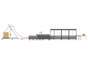

# Apparaten

Er draaien bij Monta verschillende apparaten waar informatie over te vinden is.

| [Pick To Light](../../Algemene-informatie/Apparaten/Pick-To-Light) | [Monta Pacman](../../Algemene-informatie/Apparaten/Monta-Pacman) | [Echeckwall](../../Algemene-informatie/Apparaten/Echeckwall) |
|---|---|---|
|  |  |  |
| [Put To Light](../../Algemene-informatie/Apparaten/Put-To-Light) | [Montabots](../../Algemene-informatie/Apparaten/Montabots) | [Goederenheffer](../../Algemene-informatie/Apparaten/Goederenheffer) |
|  |  |  |
| [BVM](../../Algemene-informatie/Apparaten/BVM) | [Sorteermachine](../../Algemene-informatie/Apparaten/Sorteermachine) | [LedControl](../../Algemene-informatie/Apparaten/LedControl) |
|  |  |  |
| [Echeck To Light](../../Algemene-informatie/Apparaten/Echeck-To-Light) | [Label Applicator (S-Lane)](../../Algemene-informatie/Apparaten/Label-Applicator-\(S%2DLane\)) | [MontaCast](../../Algemene-informatie/Apparaten/MontaCast) |
| [%20(100%20x%2070%20mm)%20(150%20x%20150%20px)-ab1d3a83-32f1-4995-b7fb-b492fe94e6b8.png)](../../Algemene-informatie/Apparaten/Echeck-To-Light) | ) |  |
| [Autostore](../../Algemene-informatie/Apparaten/Autostore) | | |
|  | | |

Voor het uitlezen en doormelden van machine meldingen wordt een systeem ontwikkeld dat [Machine Whisperer](../../Algemene-informatie/Apparaten/Machine-Whisperer) genoemd wordt.

