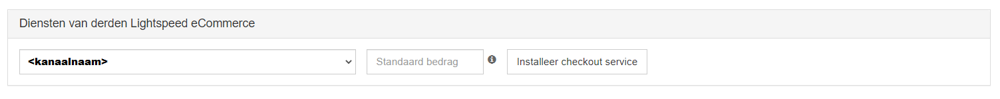
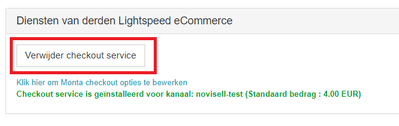

# Lightspeed Checkout

Met de checkout module kan de klant verschillende functionaliteiten tonen in zijn webshop bij het afrekenen.

## Belangrijk bij Lightspeed checkout
 
Lightspeed heeft geen specifieke app voor de checkout nodig. Wél moet je de checkout  'installeren' via de Order Import dataflow binnen de Montaportal:

## Talen
De volgende talen worden ondersteund in de Lightspeed checkout:

- Nederlands
- Engels

## Configuratie

1. Zorg dat de doel-webshop al is gekoppeld via connector
2. Zorg dat alle tarieven en verzendmethoden + opties juist staan in de Monta portal.
3. Installeer de checkout module via de order-import dataflow.
4. Test de checkout

## Algemene informatie en functies

Van de volgende functies is bekend dat Lightspeed het **wel** ondersteunt:
- Berekenen van verzendmethoden inclusief prijs
- Weergeven van verzendopties
- Leverdag kiezen (Alleen nieuwe lightspeed checkout)
- Weergeven van levertijden (Alleen nieuwe lightspeed checkout)
- Bedrag na korting is gebruikt voor berekening van de verzendkosten. Deze updaten ook bij verwijderen en toevoegen van kortingscodes

Van de volgende standaard functies is bekend dat Lightspeed het **niet** ondersteunt:

Van de volgende aanvullende functies is bekend dat Lightspeed het **niet** ondersteunt:
- UPS '	Altijd met UPS Express Saver verzenden '

## Known issues & bugs

- Gratis verzending coupons werken niet en hebben geen directe invloed op de prijs van verzendkosten.

De checkout wordt niet weergegeven

De checkout module moet worden 'geactiveerd' in de order import dataflow binnen de Monta portal. Soms is er sprake van een bug waar de module al is geactiveerd.

Wanneer dit gebeurd kan je hem verwijderen met de 'Verwijder checkout service' knop.
Als dit niet werkt kan de checkout handmatig worden verwijderd uit de database door IT.

Na het opnieuw installeren van de module zou hij weer moeten werken.

