# Checkout module

Met een checkout module kan de klant bezorgopties tonen in zijn webshop bij het afrekenen.

## Algemene beschrijving

De checkout module is een module/plug-in/app die de klant op zijn website kan laten tonen. Deze
module zorgt ervoor dat de consument op de website een vervoerder kan kiezen. De beschikbare
vervoerders worden door middel van slimme programmatuur door Monta geselecteerd. De
klant kan gelijk zien wanneer zijn pakketje aankomt en wat het hem kost. De webshop eigenaar kan
zelf instellen hoeveel een klant voor een bepaalde vervoerder betaalt (Instelbaar per land). Ook kijkt
het systeem of verzending met deze vervoerder mogelijk is in combinatie met o.a. het gewicht; cutoff
tijden en voorkeur van verkoper.

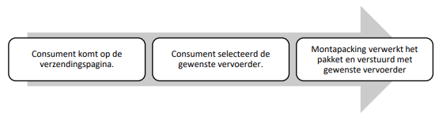

Monta heeft voor een aantal webshop platforms een checkout module ontwikkeld. Dit is een extra dienst die gratis gebruikt kan worden. Monta kan niet garanderen dat onze checkout module goed werkt in alle verschillende klantsituaties. Monta garandeert niet dat problemen die in een bepaalde sitatie ontstaan worden opgelost. Voor meer informatie zie [Hoe gaan we om met problemen?](#hoe-gaan-we-om-met-problemen).

Het is niet verplicht om de Monta checkout te gebruiken. Het is ook mogelijk om helemaal geen verzender keuze aan te bieden in de webshop. Er wordt dan een vervoerder bepaald door Monta. Nadeel is dat de consument ook niet de mogelijkheid heeft om bijvoorbeeld een afhaalpunt te kiezen.

Het is ook mogelijk om een andere checkout module te gebruiken of dat de klant zelf iets ontwikkelt. Hierbij moet dan wel ingeregeld worden dat de gekozen verzender in de koppeling wordt overgenomen, zodat Monta het pakket met de gekozen verzender verzend. Zie hiervoor [Kopppeling - Order import - verzenderkeuze importeren](../../Algemene-informatie/Koppelingen/1.-Koppelingen-dataflow#verzenderkeuze-importeren).

## Hoe ziet deze module eruit?

Hoe deze module eruitziet is een beetje verschillend per webshop platform. Op sommige platformen kan de klant ook aanpassingen doen. In de kern ziet de module er zo uit:

 WooCommerce 

 In WooCommerce is er sprake van een dynamische weergave. Standaard wordt de default shipper getoond: 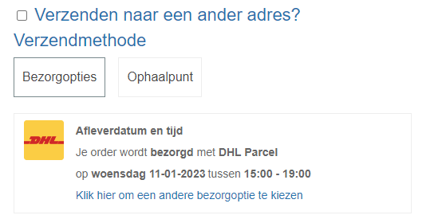

  Wanneer je een andere bezorgoptie wilt zien is dit de weergave:
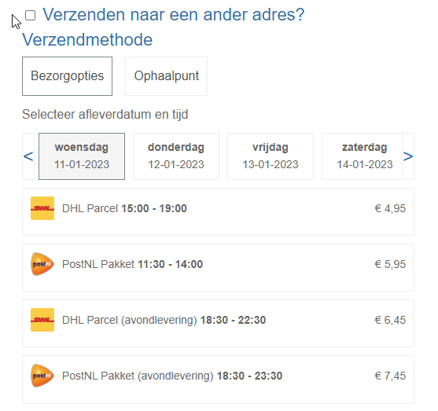

  Voor ophaalpunten is dit de weergave:
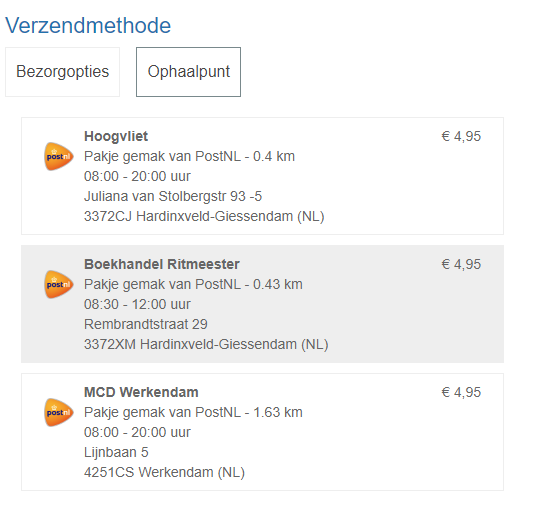

 Shopify

In Shopify is er sprake van de volgende weergave.

Aanvullende verzendopties worden in het zelfde schema weergegeven als extra te selecteren opties. Denk hierbij aan: Pick-up punten (Te definiëren in instellingen, standaard 3), Avondlevering, Handtekening etc.

 Magento 

De Magento weergave heeft veel weg van de WooCommerce weergave:
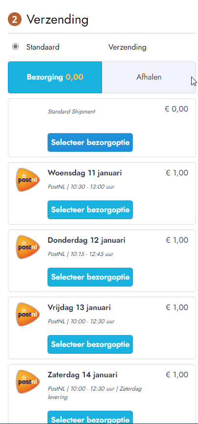

En heeft ook een apart venster voor ophaalpunten:
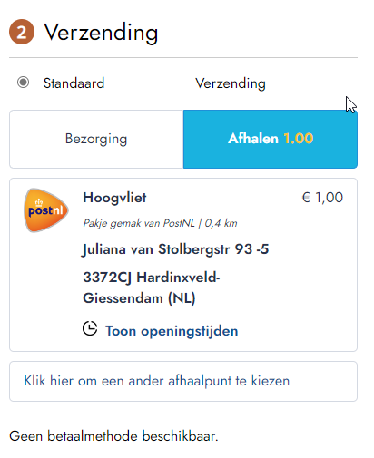

 Lightspeed 

De Lightspeed checkout is vrij gelimiteerd. Dit is een bekende weergave:
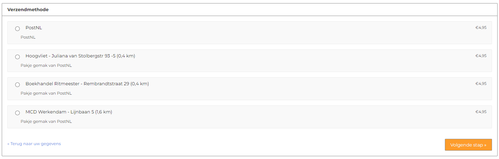

 BigCommerce

Voor BigCommerce zijn op het moment van schrijven nog geen actieve klanten die de checkout gebruiken.

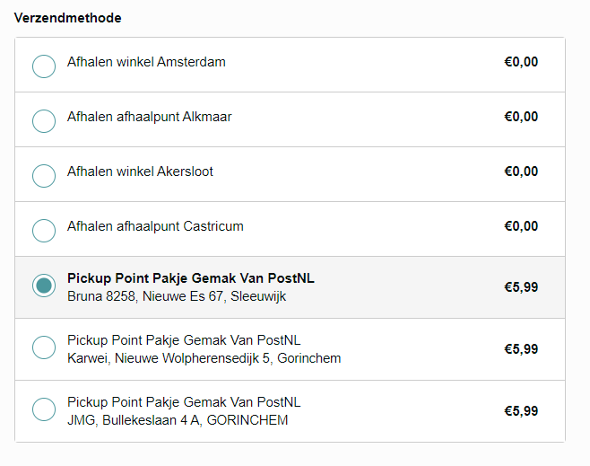

## Checkout beschikbaar bij platformen

- [WooCommerce: Checkout WooCommerce ](https://wordpress.org/plugins/montapacking-checkout-woocommerce-extension/#description)
- Lightspeed
- [Shopify: Montapacking Checkout ](https://apps.shopify.com/montapacking-checkout)
- [Magento: Montapacking Checkout ](https://marketplace.magento.com/montapacking-montacheckout.html)
- [Bigcommerce Checkout](https://www.bigcommerce.com/apps/monta-checkout/)

## Functionaliteiten

 Berekenen van verzendmethoden inclusief prijs

 
Met deze functie berekent de app alle geschikte vervoerders die ingesteld staan in de montaportal en weergeeft deze in de webshop. Dit is afhankelijk van de adresgegevens en het product. Daarnaast is het mogelijk om prijzen, limitaties en kortingen mee te geven.
 

 Weergeven van verzendopties

 
Met deze functie weergeeft de app alle ingestelde bezorgopties. Denk hierbij aan avondlevering, pick-up points, handtekening bij ontvangst etc.

  _Voorbeeld uit Woocommerce:_

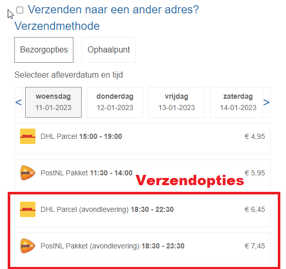

 Weergeven van levertijden 

 
Met deze functie weergeeft de app de geschatte leverdatum per vervoerder. Deze informatie komt overeen met de getoonde informatie in de montaportal bij de
berekening.

 _Voorbeeld uit Shopify:_

 Leverdag kiezen 

 
Deze functionaliteit biedt de consument de optie om de levering uit te stellen, er kan een datum geselecteerd worden en per datum zal worden berekend welke vervoerders en tijdvakken er beschikbaar zijn.

 _Voorbeeld uit Woocommerce:_

 Korting bij uitgestelde leverdag

Het is mogelijk om korting in te stellen voor de consument voor bepaalde afleverdagen.

Zo'n 70% van de consumenten kiest voor een uitgestelde leverdag als ze daarmee korting kunnen krijgen.

Uitgestelde aflevering zorgt voor een efficiëntere logistieke verwerking: er is minder piekbelasting en er kan beter gepland worden.

Hieronder sceenshots hoe de korting eruit ziet in de verschillende checkouts:

Shopify: 

Magento: 
)

Lightspeed: 
)

Shopware: 
)

 

In de onderstaande tabel kun je gemakkelijk zien welke functionaliteiten _in grote lijnen_ worden ondersteund door een CMS. Voor specifieke informatie kun je hier terecht:

[Shopify Checkout](../../Algemene-informatie/Checkout-module/Shopify-Checkout) -[Woocommerce Checkout](../../Algemene-informatie/Checkout-module/Woocommerce-Checkout) -
[Lightspeed Checkout](../../Algemene-informatie/Checkout-module/Lightspeed-Checkout) -
[BigCommerce Checkout](../../Algemene-informatie/Checkout-module/BigCommerce-Checkout)- [Magento Checkout](../../Algemene-informatie/Checkout-module/Magento-Checkout)

||Shopify|WooCommerce|Lightspeed | BigCommerce |Magento  |
|--|--|--|--|--|--|
|**Afleverdatum weergeven**| Ja |Ja  |Nee  | Onbekend | Ja |
|**Aanvullende actie vereist?**  | App nodig  | Plug-in nodig |Checkout aanzetten via order-import in MP  | App nodig | App nodig |
|**Standaard in CMS beschikbaar?**  | Module of advanced abbonement nodig | Ja | Ja |Ja  | Ja  |
|**Verzendopties**  |Ja  | Ja  | Ja*  |Onbekend  |Ja  |
| **Pick-Up Points**|Ja|Ja  |Ja|Ja |Ja |
| **'Standard delivery**' | Ja  | Ja | Nee | Onbekend | Ja |
| **Leverdag kiezen** | Nee| Ja | Nee | Onbekend | Ja |
| **Check product on SKU** |Ja | Ja | |Nee | |
| **Leading Stock** | Ja|  | |Nee | |
| **Controleren op afmetingen (in de cms)**||Ja  ||Nee | |

*In Lightspeed worden niet alle verzendopties ondersteund. Kijk voor meer info in: [Lightspeed Checkout](../../Algemene-informatie/Checkout-module/Lightspeed-Checkout)

## Instellingen mogelijk

- Welke vervoerders beschikbaar zijn per land.
- Verzendkosten voor consument per land, dus ook naar afhaalpunten in het
buitenland.
- Per vervoerder verschillende Shipper Options zoals: gratis levering vanaf,
avondlevering, niet bij de buren afleveren, tekenen voor ontvangst, etc.
- Afwijkende verzendkosten vanaf een bepaald gewicht. Dit kan met het weegschaal knopje.
- Pick up Points

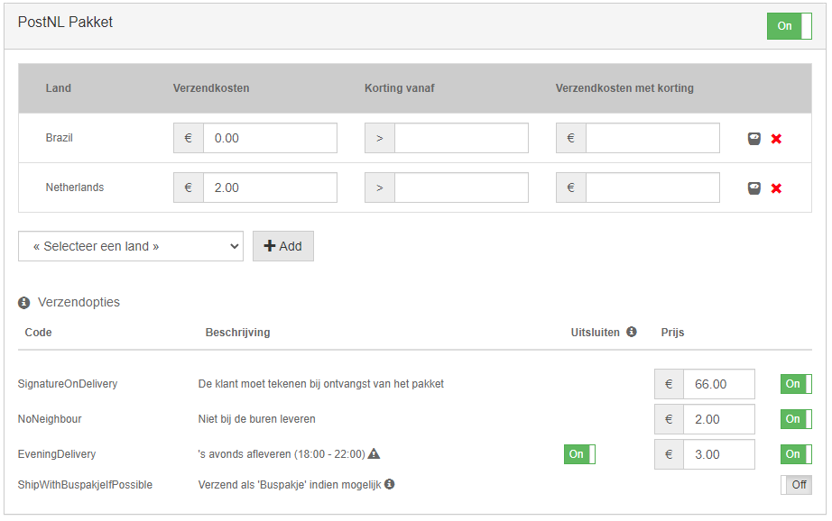

## Eigenschappen en bijzonderheden:

Pickup points worden niet meegenomen in de gewichten/lengte calculatie. Die worden dus altijd getoond. Dit is bij elke checkout van toepassing.

### Leading Stock
Met de optie leading stock kun je specificeren welke voorraadstanden moeten worden gebruikt bij het berekenen van de levertijd/verzendmethode

### Check Product on SKU
Als de opties check product on sku aan staat, gaan we rekenen met de gewichten/afmetingen die in de MP bekend zijn. Aan de hand van die gegevens worden de beschikbare verzenders getoond.

### Controleren op afmetingen
Bij de WooCommerce checkout is het mogelijk om in te stellen dat de checkout rekening houdt met de afmetingen van de producten om de verzender te selecteren. Als in, het is in de restapi ingebouwd, alleen moet er dan een product meegestuurd worden. En dit wordt alleen in woocommerce gedaan. Andere checkout modules houden hier dus geen rekening mee.

### Afleverdatum berekenen
In de checkout berekent Monta de verwachte leverdatum. Dit doen wij op basis van de volgende parameters:
1. Voorraad: Monta kijkt of er voorraad is van het artikel. Indien geen voorraad zal dit de verwachte afleverdatum beïnvloeden.
2. Cutoff: Monta kijkt naar de afhaaltijden van de vervoerder om de inschatting te maken wanneer de order zal worden verzonden.

## Configuratie

Voor de installatie van één van onze checkouts vragen we altijd de klant een google api key in te vullen.
Deze is middels deze url te verkrijgen: https://developers.google.com/maps/documentation/javascript/get-api-key.

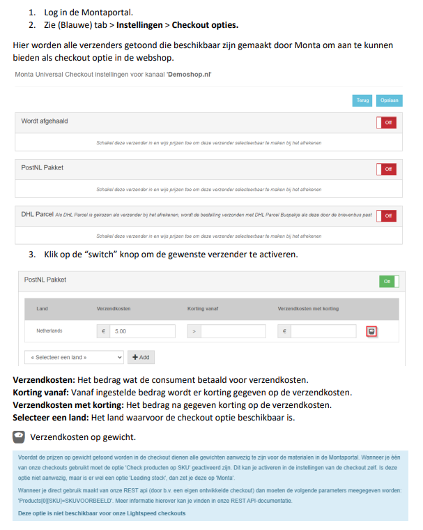
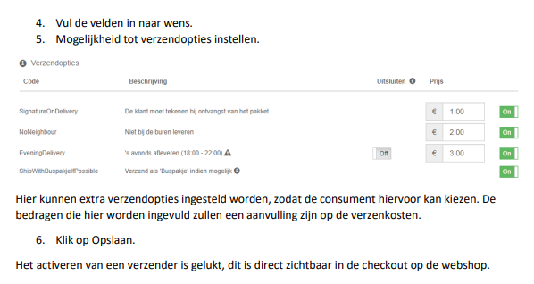

## Hoe gaan we om met problemen / aanpassingen vanuit klant?

Shopify en Lightspeed zijn SaaS-oplossingen. De programmatuur is hierbij standaard en
de checkout module werkt hierbij dan ook vlekkeloos.

WooCommerce en Magento checkout zijn softwarepakketten die u zelf op een server installeert en onderhoud. Onze checkout module ondersteund de standaard WooCommerce en Magento installatie. Het kan echter zijn dat uw webshop aanpassingen heeft, bijvoorbeeld andere plugins, waardoor problemen ontstaan met de Monta checkout plugin. Het is voor Monta niet te doen om alle plugins van de wereld goed samen te laten werken. Daarom hebben we de programmacode vrij beschikbaar gemaakt op GitHub zodat de klant zelf een aangepast versie van de checkout kan (laten) maken om deze problemen op te lossen. Bij problemen met veelgebruikte plugins kunnen we natuurlijk kijken of we een oplossing kunnen bieden in onze standaardversie.

## Veel gestelde vragen

 Wat is de functie 'standard delivery'? 

 
Standard delivery is een optie die onder één noemer (standaard verzending) alle mogelijke vervoerders (te selecteren in de montaportal) laat zien; waar je bij andere vervoerders apart de vervoerders laat zien. Wij berekenen dan als de order binnen komt de meest geschikte vervoerder op basis van de informatie die bij ons bekend is.

 Pick-up points worden niet getoond 

 
Problemen met het tonen van pickuppoints worden mogelijk veroorzaakt door de google api key:

- De googlekey is niet correct ingesteld (het ontbreken van creditcard gegevens in je google account)
- De googlekey heeft niet al de correcte regels.

Deze instellingen kunnen worden gedaan in de Montaportal onder:
Home-> Settings -> Checkout options

