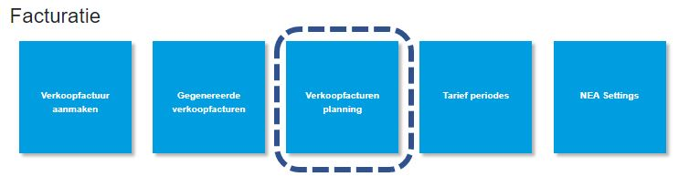
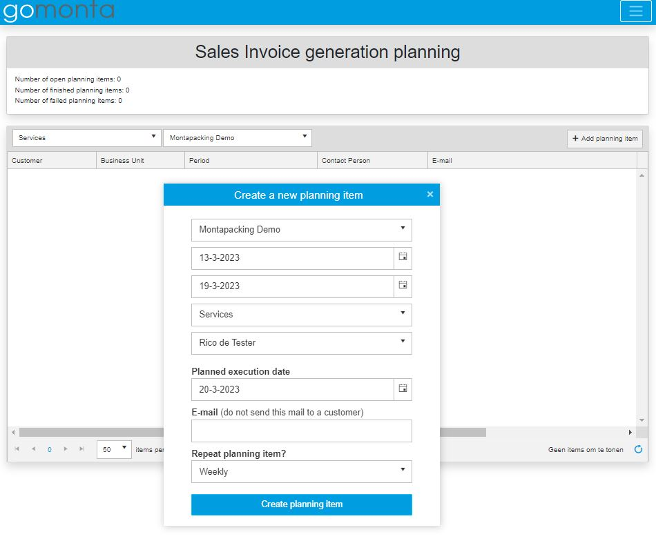

# Facturatie planning

Binnen gomonta is er een mogelijkheid om automatisch verkoop facturen te laten genereren. Er kan bijvoorbeeld ingesteld worden dat 's nachts de verkoopfactuur gegenereerd wordt, zodat je niet hoeft te wachten op het genereren van de verkoopfactuur, maar de verkoopfactuur direct kunt controleren.

## Instelmogelijkheden

Zoals te zien is in het instellingen scherm kan een verkoopfactuur of een weekfactuur of een maandfactuur automatisch gegenereerd worden.

## Wanneer is dit handig
Bij verkoopfacturen die relatief eenvoudig zijn, zal het na het automatisch genereren van de verkoopfactuur vaak voorkomen dat er geen missende tarieven zijn en kan de verkoopfactuur na controle definitief gemaakt worden.

Ook kan het handig zijn bij verkoopfacturen die gebaseerd zijn op veel orders de verkoopfactuur al te laten genereren, om zo niet te hoeven wachten op het proces van verkoopfacturen genereren.

Maar het is ook mogelijk om net voor het einde van de maand vast een verkoopfactuur te laten genereren om vast te checken of er missende tarieven zijn. Zodat in de korte periode dat de verkoopfacturen definitief gemaakt moeten worden er minder tijd besteed wordt aan het toevoegen van missende tarieven.

