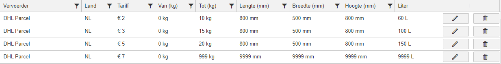

# Facturatiemogelijkheden

Op deze pagina staan verschillende diverse facturatie opties binnen Monta beschreven. Er is meer beschikbaar dan op deze pagina beschreven staat.

## Tarief instellingen

### Value added service orders
Het 'Value added service orders' vinkje bij het tabblad Outbound is bedoelt voor het **uitsluiten** van verpakkingsorders. Verpakkingsorders worden dan **niet** meegerekend bij de arbeid van orders (orders, lines en items).

### Weekendtoeslag

Het is mogelijk om een toeslag te rekenen voor orders die op zaterdag of zondag verzonden worden.

Er wordt rekening gehouden met orders die eigenlijk op een andere dag verzonden hadden moeten worden.

De toeslag wordt gerekend als de geplande verzenddatum op zaterdag of zondag is en het ook daadwerkelijk op de geplande verzenddatum verzonden is.

Je kunt deze toeslag in de tariefperiode instellen bij Outbound pick-pack kosten.

### Opslag kosten
De opslag wordt elke week berekend in de nacht van woensdag op donderdag. Dat bleek een opslag hoeveelheid te geven die het weekgemiddelde het beste benaderd.

### Volume gewicht (bedrag)
Volume gewicht fee is een fee die op item basis berekend wordt. Dit is een manier om de pick pack van grote producten duurder te maken dan de pick pack van kleine producten. De toeslag komt bovenop de ingevulde tarieven bij pick pack. Kijk ook even hieronder, bij volume gewicht factor, dat is eigenlijk de aanbevolen manier om met volume gewicht te werken.

### Volume gewicht factor
Volume gewicht factor wordt gebruikt om zowel bij de Inbound, Retoruren als Outbound een factor toe te passen op de itemfee's. Hiermee kun je grote producten duurder maken en kleine producten goedkoper.

Er wordt een factuurregel toegevoegd met de factor van het bedrag. Dus als je 20% korting wilt geven bij een volume gewicht categorie, moet je 0,8 invullen als factor.

### Verzender tarieven
Het instellen van verzender tarieven kan op verschillende manieren.

#### Standaard
Standaard wordt er gebruik gemaakt van gewicht staffels. Valt het gewicht van het verzonden pakket binnen de staffel zal dat tarief gerekend worden. Zie het voorbeeld hieronder, een pakket van PostNL binnen NL van 7kg zal dus €5 kosten.

#### Volume gewicht
Het tarief kan ook berekend worden op basis van het volume gewicht van het verzonden pakket. Om dit te gebruiken moeten de volgende velden worden ingevuld: Gewicht Tot, Lengte, Breedte, Hoogte en Liters. Hieronder is te zien hoe dat ingesteld moet worden bij de verzender tarieven:

Let op:
- Gewicht Van hoeft niet ingevuld te worden als je gebruikt maakt van volume gewicht facturatie
- Geen van de velden (Lengte, Breedte, Hoogte) mag leeg gelaten worden. Ze zijn verplicht bij het gebruik van volume gewicht.
- Als je de combinatie verzender en land hebt waarvan er bij 1 geen en 1 wel volume gewicht is ingevuld zal dit niet werken. Hij zal dan altijd diegene pakken waar geen volume gewicht is ingevuld.

Hoe wordt het tarief dan berekend?

In het kort: Eerst wordt er bij de verzender opgevraagd of ze het verzonden pakket al gemeten en gewogen hebben, als dat zo is pakken we de informatie van de verzender, is dat nog niet beschikbaar gebruiken we de gegevens die we binnen Monta zelf hebben.

Voor een uitgebreide uitleg, zie onderstaand diagram:

_MontaMoney = GoMonta_ ↑

#### Volume gewicht sleutel
Het factureren met een volume gewicht sleutel wordt alleen gebruikt als een verzender dit hanteert en het is aangegeven in de tariefsheet. De gehanteerde sleutel is per verzender verschillend en is ingesteld door IT.

Het factureren van de volume gewicht sleutel werkt als volgt:

- Staat het vinkje 'Gebruik volume gewicht sleutel' aan, haal dan de volume gewicht sleutel op van de verzender.
- Het systeem controleert vervolgens of de afmetingen van de gebruikte drager of het grootste materiaal in de zending gebruikt moeten worden voor de verdere berekening.
- Het systeem gebruikt de gekozen afmetingen om de volgende formule uit te voeren: (=L* B *H in cm / Volume gewicht sleutel)
- Vervolgens wordt het resultaat van de formule vergeleken met het gewicht van het pakket. Hier wordt de grootste van de twee van gepakt. Dat wordt je volume gewicht.
- Het systeem gebruikt dat nieuwe (volume) gewicht om de rest van de tarieven te bepalen zoals dat normaal ook gaat.

Let op! Als je de combinatie verzender en land hebt waarvan er bij 1 geen en 1 wel 'Gebruik volume gewicht sleutel' is aangevinkt zal dit niet werken. Er zal dan een error geschreven worden dat bij die combinatie alle volume gewicht sleutel vinkjes aangevinkt moeten worden. Daarnaast kan in de tariefsheet alleen het vinkje aangezet worden bij een verzender waarbij ook echt een volume gewicht sleutel is ingevoerd door IT.

#### Toeslagen en boetes
Bij Toeslagen/boetes is het tarief dat je invult, het percentage marge op de inkoopprijs. Wil je geen marge, dan vul je 0,00 in. Wil je bijvoorbeeld 8% marge, dan vul je 8,00 in. Let op! Toeslagen en boetes worden pas gefactureerd wanneer de facturen van de verzenders zijn ontvangen en ingelezen. Dit kan later zijn dan de porto wordt gefactureerd.

### All-in facturatie
De all-in tarieven worden toegepast per verzonden pakket. Dit is in te stellen onder het kopje 'Vervoerders' (GoMonta - Verkooptarieven). Daar kan per verzender een verdeling ingesteld worden waaruit het all-in tarief bestaat. De verdeling zal bestaan uit Porto, Arbeid, Verzendverpakking en Opslag (optioneel). De som van deze verdeling zal het totaalbedrag zijn die de klant op zijn factuur ziet staan en ook zal moeten betalen per zending.

Het ingestelde all-in tarief zal er als volgt uit zien (Arbeid: €1, Porto: €3, Drager: €1 - Totaal: €5):

Het is belangrijk om deze verdeling goed in te vullen zodat de kosten op de juiste posten worden weggeschreven.

Op de factuur zal dit er zo uit zien (grijze regels zal de klant niet zien):

**Let op!** Als er bij een verzender tarief een all-in tarief is ingesteld zal dit bij alle andere verzender tarieven ook ingesteld moeten worden.

**Let op!** Het gebruik van opslag bij all-in is optioneel. Als hier een tarief is ingesteld zal de opslag per order worden doorberekend en **niet** meer zoals op de gebruikelijke manier. Houd er rekening mee dat een tarief van 0 euro ook een ingesteld tarief is. Wil je dat de opslag niet all-in is, laat het veld all-in opslag dan helemaal leeg.

### RMA uitbetalingen

De klant heeft in de MontaPortal ingesteld hoeveel de consument betaald voor zijn RMA zending. Deze betalingen doet de consument via het betaalsysteem Mollie. Bij het maken van de factuur geven wij deze bedragen terug aan de klant.

Dit gaat als volgt bij het factureren:

1. Wij maken een factuur aan voor de klant
2. Op dat moment vragen we alle betalingen, binnen de periode van de factuur, voor die specifieke klant, op bij Mollie en maken hier een totaal bedrag van
3. Vervolgens berekenen we alle transactiekosten die gemaakt zijn bij Mollie, die transactiekosten trekken we van het totaal bedrag af wat het uiteindelijke bedrag vormt wat we terug geven aan de klant

### Postonderzoeken uitbetalingen
Postonderzoeken worden automatisch gefactureerd op een factuur. Postonderzoeken worden uitbetaald als er in GoMonta bij een postonderzoek een claimbedrag is ingevuld en de status Gesloten of Claim accepted heeft. Als een claim bedrag is gefactureerd kan deze in GoMonta niet meer worden aangepast. Export 16 is beschikbaar om per eorder te bekijken welk claim bedrag er is uitbetaald.

### Korting bij extra verzenddagen

Voor magazijnen is het prettig als niet alle orders dezelfde dag verzonden hoeven te worden. Om dit te stimuleren is het mogelijk korting te geven op orders met extra verzenddagen.

Extra verzenddagen kunnen op de volgende manier ingesteld worden bij orders:
1. Bij het kanaal kan ingesteld worden dat alle orders van dat kanaal extra verzenddagen krijgen.
2. Vanuit de koppeling kunnen extra verzenddagen worden meegegeven. Zie toelichting hieronder.

#### Extra verzenddagen vanuit de koppeling

Als de webshop door de consument wil laten kiezen voor extra verzenddagen moet het vanuit de koppeling worden meegegeven.

Dit kan op twee manieren:
1. via een [verzenderkeuze mapping](../../../Algemene-informatie/Koppelingen/1.-Koppelingen-dataflow#verzenderkeuze-mapping).
2. via de Monta checkout. Zie [checkout - functionaliteiten - korting bij uitgestelde leverdag](../../../Algemene-informatie/Checkout-module#functionaliteiten). **LET OP: de korting bij extra verzenddagen die bij de facturatie kan worden ingesteld werkt nog niet voor orders die via de Monta checkout binnenkomen. Dit omdat de orders met een uitgestelde verzenddag vanuit de Monta checkout altijd in Etransit komen omdat consument een specifieke afleverdag kiest. Er wordt aan gewerkt om ook in de checkout een 'datum range' optie te maken (bijv 2-5 werkdagen) waarbij de korting wel toegepast wordt.**

## Tarief periode instellingen

### Tariefperiode per magazijn
Het is mogelijk om voor een relatie per magazijn andere tarieven toe te passen. Dit doe je door een tariefperiode te koppelen aan een magazijn. Het koppelen doe je in GoMonta bij het aanmaken of aanpassen van een tariefperiode. Gebruik deze optie alleen als een klant in meerdere magazijnen ligt en verschillende tarieven hanteert.

Voorbeeld: _Een klant ligt in Breda en Den Bosch. In Breda kost het verwerken van een order 2 euro en in Den Bosch 2 euro en 50 cent._

### Status
Een tarief periode kan vier verschillende statussen hebben. De statussen zijn:
1. Open
2. Afgewezen
3. Geaccepteerd
4. Gearchiveerd

Een tarief periode kan pas gebruikt worden als hij de status 'Geaccepteerd' heeft. Een nieuw aangemaakte of pas aangepaste tarief periode zal de status 'Open' krijgen, waarna hij door iemand controleert en geaccepteerd moet worden. Het is erg belangrijk dat bij de controle goed wordt gekeken of de juiste tarieven zijn ingevuld. Mocht dit niet het geval zijn moet aan de tarief periode de status 'Afgewezen' worden gegeven, waarna er tarieven worden aangepast en opnieuw gecontroleerd.

### Is MontaWMS
Wanneer het vinkje IsMontaWms is aangevinkt bij een sales invoice tarief periode, zal bij sales invoices die in die periode gemaakt worden ook worden opgeslagen dat het gaat om een MontaWMS sales invoice.
De sales invoice is niet anders dan andere sales invoices, het enige verschil is dat als de financiële details naar het boekhoudpakket Exact worden doorgezet, dat 1 grootboek verschillend is. Waar bij reguliere sales invoices een deel van de omzet op arbeid (grootboek 8000) komt, zals bij een MontaWMS sales invoice die omzet op licenties (grootboek 8410) komen.

### Is MontaWms WarehouseOwner
Wanneer een WMS klant vanuit zijn magazijn orders verzend van andere en/of meerdere relaties kan met de optie "Is MontaWMS warehouse owner" aangegeven worden.
Als dit aan staat worden de orders van de verschillende relaties op 1 factuur gezet worden richting de betreffende WMS klant.

De orders worden bij de verschillende relaties als gefactureerd gemarkeerd.

