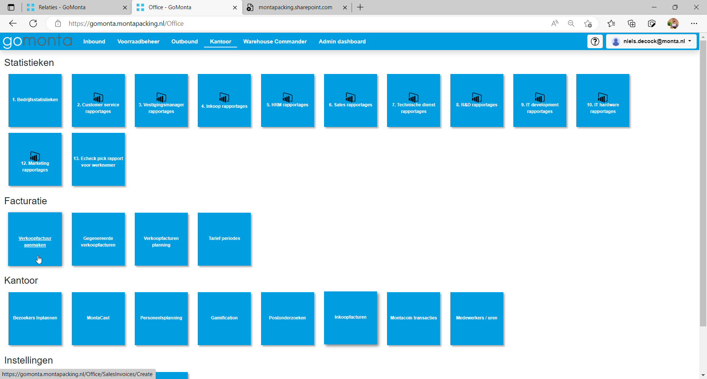
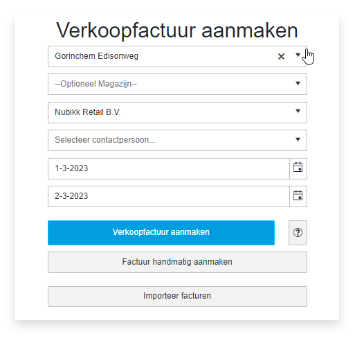
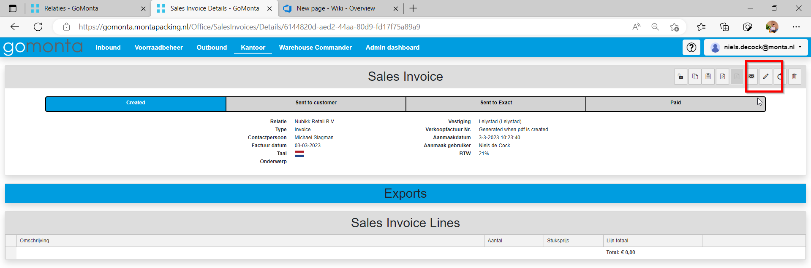
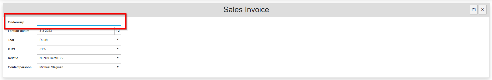
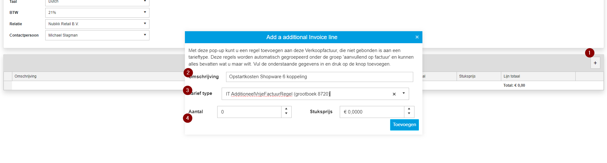
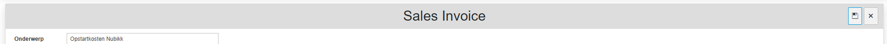
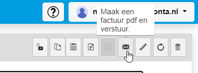
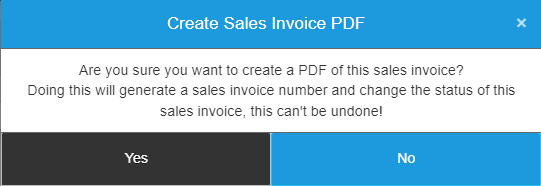
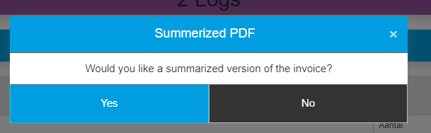
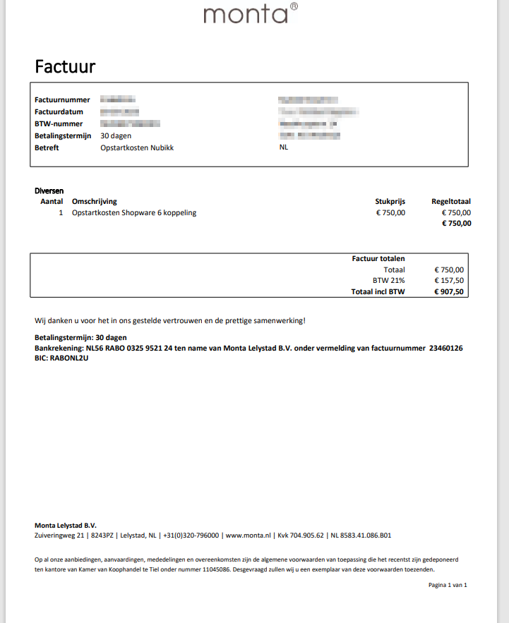

# Factuur aanmaken IT projecten

## Factuur aanmaken IT projecten

 

Ga naar Kantoor -> Verkoopfactuur aanmaken:

Vul de volgende gegevens in en klik op handmatig aanmaken:

Klik Rechtsboven op Factuur bewerken:

Pas het onderwerp naar behoren aan:

**Het onderwerp op factuurkopniveau is altijd: IT kosten.**
De omschrijving op de regel is variabel.

Maak een nieuwe factuurregel aan (1)

Plaats een omschrijving (2); Selecteer grootboek 8720; en voer het bedrag in.
Druk vervolgens op toevoegen.

Sla de factuur op:

Maak de factuur en verstuur PDF:

Genereer de PDF, klik op yes:

Bij de volgende vraag, klik op NEE: (Anders komt de omschrijving van de factuurregel niet op de factuur terecht)

Verwijder de specificaties in de bijlage en verstuur de factuur aan de klant.

 

## Voorbeeld Factuur:

