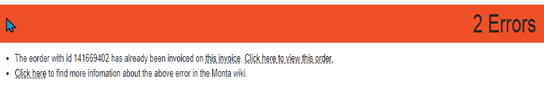
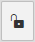

# Probleemoplosser

Op deze pagina staan verschillende oplossingen van errors die op de facturen kunnen voorkomen.

## Errors op facturen
### Eorder already invoiced

**Oplossing:**
1. Klik op het slotje rechtsbovenin bij de factuur  
2. Er opent nu een scherm waarin het eorder id ingevuld moet worden om de eorder vrij te geven. Het eorder id is te vinden in de error.
3. Klik op opslaan en maak de factuur opnieuw aan.
