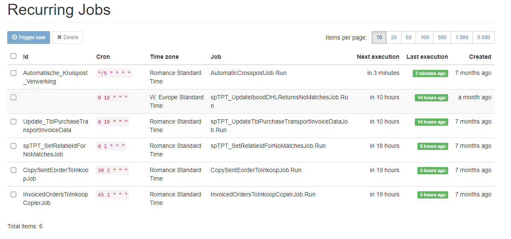

# Transport inkoop facturen

## Transport inkoopfacturen
Voor het inlezen van transport inkoopfacturen die we krijgen van de verschillende verzenders wordt een software tool gebruikt. Bij de meeste verzenders is het inmiddels zo dat de bijlagen van de transport inkoopfacturen ingelezen kunnen worden, zodat de verzendkosten gematcht kunnen worden aan eorders.

## Inlezen van transport inkoopfacturen
De tools die gebruikt worden bij het inlezen en verwerken van de transportinkoopfacturen worden hieronder toegelicht. In principe is alles gemaakt en bedacht door Haiko van der Velden en Remy van Strien met onderstaande taakverdeling:.

- Alles in T-SQL --> Remy
- Functionele ontwerpen --> Remy
- alles in C# gemaakt --> Haiko
- Techniek / tools die gebruikt worden om functionele ontwerp te realiseren --> Haiko

********** De informatie hieronder is meer van technische aard **********

## Waar draaien de websites/services
De transport inkoopfacturen website bestaat uit verschillende onderdelen die allemaal op de MP-WEB09 draaien. Jasper Verhaar heeft geholpen bij de recente migratie van de web07 naar web09 en onderhoud de MP-WEB09.

**toeslagservice.monta.nl**
Zou een service moeten zijn die voor TransportinkoopfacturenV2.monta.nl de instructies voor de toeslagen doorzet naar ??sqlgraph??, omdat die beter werkt met T-sql instructies. Hiermee worden de instellingen opgehaald voor de verwerking van de ingelezen inkoopfactuurregels.
- Devops: https://dev.azure.com/MontaDev/_git/MontaInkoopTransportServiceSolution?path=/MontaInkoopTransportService/ToeslagService

**transportinkoopfacturen.monta.nl**
Website voor de controle van de ingelezen inkoopfacturen, het verwerken van de kruisposten en hier moeten alle configuratieschermen komen voor de TPT voor alle acties die nu rechtstreeks in de DB worden uitvoerd. Inloggen op de website gaat via Azure Active Directory. Hierbij moet de gebruiker (via inheritance) de Gomonta Finance rol hebben. Iedereen met een IT rol heeft dit.
- Website: https://transportinkoopfacturen.monta.nl/
- Devops: https://dev.azure.com/MontaDev/MontaTransportPurchaseTools

**transportinkoopfacturenv2.monta.nl**
Inlezen, transformeren en wegschrijven van de inkoopfacturen. Via de website worden de bestanden (.xlsx en .csv bestanden) per verzender ingelezen en vervolgens via deze service verwerkt en gematcht (veelal via TT code) aan een eorderid. Het resultaat wordt in de correcte tabellen op de Finance DB (SQL06) gezet. De belangrijkste tabellen hierbij zijn:

1. tblInkoopDetail: bevat alle regels met de gematchte inkoopregels
1. tblInkoopDetailTransportKruispostNoMatch: bevat alle regels met nomatch inkoopregels
1. tblInkoop: bevat alle eorderid's van orders waarvoor we transportkosten verwachten en die dus gebruikt wordt voor het matchen met een samenvatting van enkele belangrijke ordergegevens voor rapportage doeleinde en KPI.

Echter zijn er nog veel meer tabellen met allemaal instellingen, die nodig zijn bij het verwerkingsproces. Op de website log je in via je AD account, onduidelijk is of hier nog specifieke rechten voor nodig zijn.

- Website: https://transportinkoopfacturenv2.monta.nl/
- Devops: https://dev.azure.com/MontaDev/MontaInkoopTransportServiceSolution

**transportinkoopfacturenwebservice.monta.nl**
Dit is de aparte service waarin Hangfire nu draait. Oorspronkelijk was dit onderdeel van Transportinkoopfacturen.monta.nl maar de taken die we schedulen hierin gingen dan alleen starten als ook de website een keer was geopend door iemand en dat was niet handig voor taken die welke dag moeten draaien. Toen heeft Haiko daar een aparte service voor gemaakt.
- Devops: https://dev.azure.com/MontaDev/InkoopTransportJobs

## Hangfire taken
Rondom de transport inkoopfacuturen draaien een aantal periodieke taken. Deze worden uitgevoerd door hangfire. Een dashboard van de uitgevoerde taken is te zien via https://transportinkoopfacturen.monta.nl/hangfire/
en hier https://transportinkoopfacturen.monta.nl/Home/Jobs

w.google
