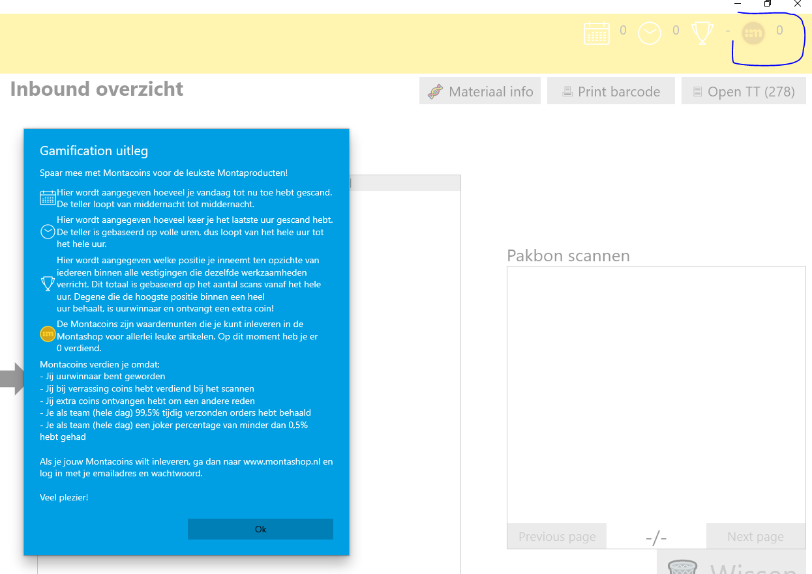
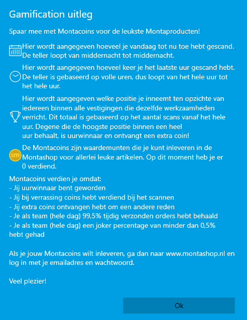
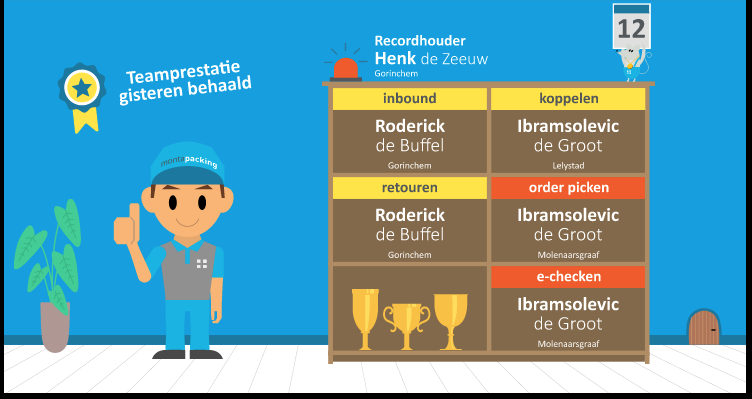
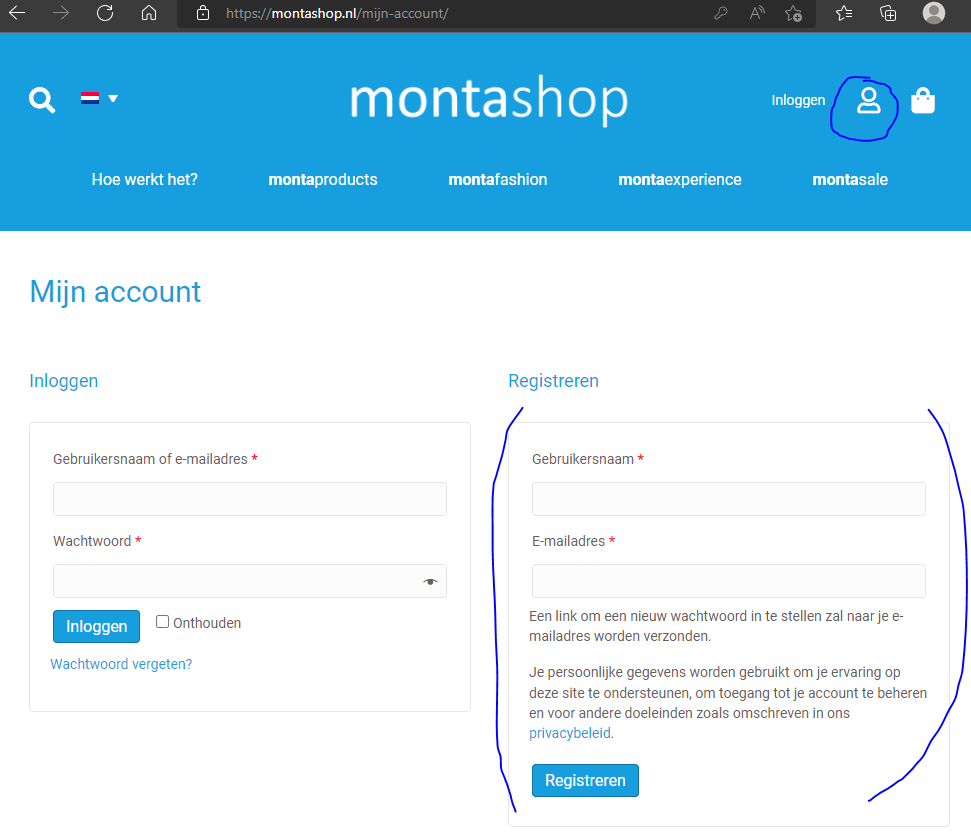
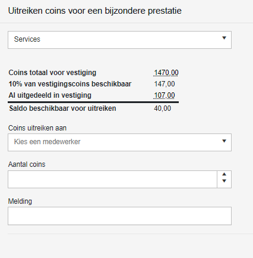
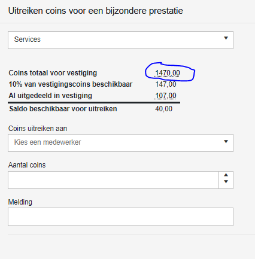
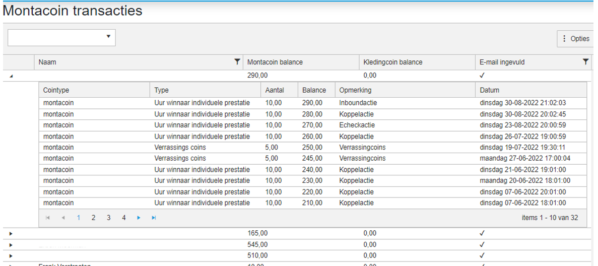
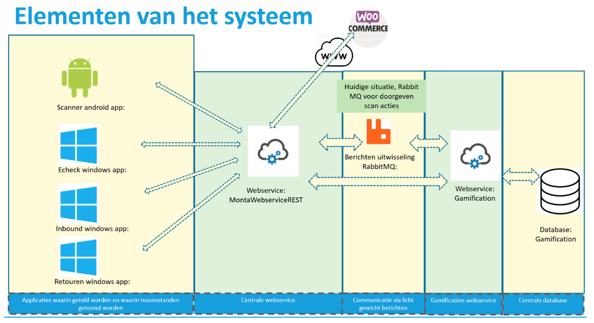
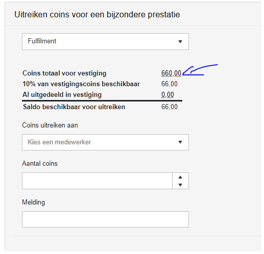

# Gamification

Binnen Monta wordt er gebruik gemaakt van een gamification systeem.

Gamification is een project dat begin 2020 gebouwd is met een aantal doelen;

Een leuke beloning/aardigheidje mogelijk maken voor logistieke medewerkers die een stapje harder lopen.

Een manier om het verstrekken van bedrijfskleding bij nieuwe medewerkers te managen.

Het opzetten van een systeem waar later ook ander typen beloningen/doelgroepen in mogelijk zijn

## Gouden montacoins
Bij gamification kunnen collega's op verschillende manieren montacoins krijgen
Door individueel uurwinnaar te zijn in een bepaalde activiteit zoals inbounden, picken, echecken etc.

Door als team de dagprestatie te halen. De dagprestatie is een combinatie van outbound tijdigheid van 99,5% of hoger, tt01 op 0 en een joker percentage van 0,5% of lager.

Ook krijg je soms random montacoins, gewoon om waardering te laten zien dat je aan het werk bent.

En als je jarig bent, krijg je montacoins.

Dan is er ook nog de mogelijkheid dat een vestigingsmanager coins kan uitdelen aan medewerkers die werkzaamheden doen die niet in het systeem gemeten worden en waar dan ook geen montacoins mee verdiend kunnen worden. 10% van het aantal montacoins dat op een vestiging verdiend is kan op deze manier extra uitgedeeld worden.

Dit zijn allemaal gouden montacoins

## Zilveren montacoins
Als je in dienst komt bij Monta, krijg je van HR zilveren montacoins. Deze kun je besteden om bedrijfskleding te bestellen in de montashop.

## Inzicht in je montacoins
In de meeste software die gebruikt wordt in de magazijnen, is rechts bovenin te zien hoeveel coins je hebt.

En er is ook te zien hoe je dat uur staat ten opzichte van de uurwinnaar. Door op de icoontjes te klikken, komt er een popup met informatie over de icoontjes.

## TV
In alle vestigingen hangt een TV waarop te zien is wie de uurwinnaars zijn.

## Montashop
Montacoins kunnen worden uitgegeven in de montashop. Bereikbaar via montashop.nl
Om te kunnen bestellen op montashop.nl is het belangrijk dat je prive email adres is doorgegeven aan HR of aan je leidinggevende. Die kunnen dat email adres invullen in MontaMoney. Vervolgens kun je via montashop.nl een account aanmaken met datzelfde email adres:

Je krijgt dan een email waarin een link staat om een wachtwoord aan te maken. Als dat gelukt is, kun je inloggen in de montashop en kun je met de montacoins die je gespaard hebt producten bestellen. Bij het bestellen kun je het afleveradres kiezen waar je de producten geleverd wilt hebben.

## Inzicht in montacoins historie
Vestigingsmanagers kunnen in [gomonta](https://gomonta.montapacking.nl/Office/Gamification/Index) een stukje historie van montacoins zien.
Gomonta --> kantoor --> gamification
Dan kom je in een scherm dat gebruikt kan worden om coins uit te delen aan collega's binnen een vestiging die werkzaamheden doen die niet gemeten worden en die de vestigingsmanager toch wil belonen met montacoins.

De melding die ingevuld kan worden komt dan ook op de gamification TV van die vestiging.

Om in de historie van montacoins te komen, kan op het linkje zoals onderstaand gemarkeerd geklikt worden.

Daarnaast is er ook een scherm in [gomonta](https://gomonta.montapacking.nl/Office/Gamification/UserCoinBalance) waar je per persoon kunt zien wat het montacoin saldo is en of er een email adres bekend is.
Gomonta --> kantoor --> Montacoin transacties

********** De informatie hieronder is meer van technische aard **********

## Technische informatie bij gamification

## RabbitMQ
Rabbit MQ vormt een berichten bus tussen verschillende losstaande systemen.  Het sturen van RabbitMQ berichten gebeurd in de MontaWebserviceREST. De berichten verlopen via de classe ContractProcessor.cs. Inloggen op de Rabbit MQ server kan via http://mp-rabbit01.montapacking.nl:15672/, de inlognaam en het wachtwoord staan in passwordstate.

## GamificationService
De GamificationService die de RabbitMQ berichten verwerkt draait op de MP-Web10.

In de GamificationService zit een klasse RowProcessService, welke de berichten uit RabbitMQ leest. Deze leest de berichten uit en zet deze in een aparte database.

De database staat op de volgende plek: Server=MP-SQL06.montapacking.nl\\MSSQL;Database=Gamification
Standaard hebben developers geen rechten op deze database. Mocht het echt nodig zijn, kunnen rechten worden gevraagd bij servicedesk.

Voor de rest functioneert de GamificationService ook als API voor de resultaten. Hiervoor zitten drie controllers in waar je de informatie uit kan halen.

Performance controller: Hier kan je de performance van het huidige uur, de huidige uur leiders, de record houder, de team prestatie van gisteren en de gebruiker geschiedenis opvragen.

Company controller: Hier kan je opvragen hoeveel coins een vestiging kan uitgeven en heeft uitgegeven opvragen. Verder kan je hier coins uitreiken aan een medewerker vanuit een vestiging. Een vestigingsmanager kan 10% van het aantal verdiende coins in de vestiging uitdelen aan mensen die acties doen die normaliter niet met coins beloond worden. Denk aan een CS medewerker of iemand die oud papier opruimt. Het toekennen van deze extra coins zit in gomonta. https://gomonta.montapacking.nl/Office/Gamification/Index

User controller: Hier haal je de transacties op. Deze zijn te zien in GoMonta -> Admin -> Montacoin transacties. Ook kan de huidige balans worden opgevraagd. Verder kan hier een transactie worden gedaan vanuit de webshop (order of coins uitreiken aan collega's), en zit hier een mogelijkheid in voor HR om coins te geven aan medewerkers.
URL van de GamificationService is: http://servicegw.montapacking.nl/gamification/

## Wanneer worden welke RabbitMQ berichten geplaatst
Inbound: Bij elke inbound die wordt uitgevoerd.
Echeck: Bij elke regel die geëchecked wordt.
Picken: (Elke keer als je producten uit de stelling pakt. 1 pickactie voor 2 orders bij S kratten. Ook 1 pickactie voor 2 orders bij M karren.)
Retouren: Bij elke retour regel.
Koppelen: Bij elke koppel actie

## Coins (gold):
Uiteindelijk worden de getelde acties van de medewerkers omgezet in coins.
Elk uur krijgt de medewerker die het meeste koppelacties heeft x coins, zo ook voor de medewerker die de meeste echeck acties heeft, enzovoort. Dit is om individuele prestaties te belonen.

Daarnaast worden elke dag coins toegekend aan teams binnen vestigingen die de doelstelling gehaald hebben qua outbound tijdigheid, tt01 op 0 en een laag joker percentage. Dit is om teamwork te belonen

Verder wordt twee maal in het uur random coins toegekend aan medewerkers en kun je x coins krijgen als je jarig bent. Dit is gewoon om het leuk te maken

De random coins worden als volgt gegeven: Van alle medewerkers, die een actie hebben uitgevoerd in het afgelopen half uur, wordt 1 persoon random gekozen. Hierbij maakt het niet uit hoeveel acties een persoon heeft gedaan.

## Coins (silver):
Personeelszaken kan zilveren coins toekennen aan nieuwe medewerkers om te besteden aan bedrijfskleding. Dit toekennen van coins doet PZ in de tool montamoney.

## Monitor:
Voor de gamification is een monitor ontwikkeld om de statistieken te tonen in het magazijn. Dit project staat in devops met de naam "GamificationMonitor". De resultaten van de gamificationmonitor zijn op de meeste vestigingen op een grote TV te zien. Dit is een TV met een raspberry PI erachter.

## Webshop:

Collega's kunnen de coins die ze gespaard hebben besteden in een webshop www.montashop.nl.
Producten worden ontwikkeld en besteld door Marije IJzerman (marije@montapacking.nl) en aangemaakt in de woocommerce webshop montashop.nl. De koppeling tussen montashop en montaportal is een gewone woocommerce koppeling, net zoals andere woocommerce webshops.
In montashop.nl zit een stukje maatwerk tbv het inloggen van de gebruikers en het opvragen van het coinsaldo en het afboeken van de coins als er iets besteld is. Dit maatwerk in woocommerce roept bij montapacking de api rest.montapacking.nl/v0 aan. ​​​​​​​Hiervoor zijn credentials aangemaakt, die staan in de tabel tblMontaGamificationShopCredentials. Documentatie voor de Gamification webshop api is te vinden op S:\8.0 Automatisering\1.0 Software\8.0.3 Webshops\communicatiebestanden\Gamification webshop REST api
​​​​​​​De hosting van montashop.nl wordt gedaan door vd Perk groep. contact: Marc Strootman – 06-26927726

## Troubleshooting:
De meest gestelde vraag is dat collega's niet kunnen inloggen. Marije pakt die vragen meestal op en vaak blijkt dan het prive email adres van de collega nog niet goed in montamoney te zijn ingevuld door de leidinggende die de medewerker aangemaakt heeft in montamoney.
Soms vraagt een collega inzicht in hoeveel coins er verdiend zijn, als er twijfel is of het goed gegaan is. Meestal verwijzen we die vraag dan door naar de vestigingsmanager van die vestiging, die kan in gomonta een rapport oproepen waar de coin history te zien is. ( gomonta.montapacking.nl/Office/Gamification/Index ) Door op het coin totaal getal te klikken, komt de vestigingsmanager in een rapport waar history te zien is

