# Handleiding inbounden

Hier staan informatieve videos en uitleg over het Inbound-proces.

## Wat is de Inbound?
<embed style="width:720px; height:450px;" src="https://www.youtube.com/embed/9jcSnQehTug"></embed>

De inbound is een stukje van het logistieke proces, waar de producten van klanten in de Monta warehouses binnen komen. Daarbij is het belangrijk voor zowel onszelf als onze klanten om precies te weten hoeveel en welke producten er in onze warehouses liggen opgeslagen. Als inbounder ben jij een onmisbare schakel in het logistieke proces van Monta. Binnen Monta heeft alles wat met inbound te maken heeft de kleur geel.

## 1 Forecast en Inbounden
<embed style="width:720px; height:450px;" src="https://www.youtube.com/embed/YzyZweJU9TY"></embed>

### 1.1 Pallet met producten
De producten worden meestal met dozen vol op pallets afgeleverd.

 

Je zet de pallet met producten die je moet inbounden aan de ene kant van het inbound-station en een lege pallet of rolcontainer aan de andere kant.
 

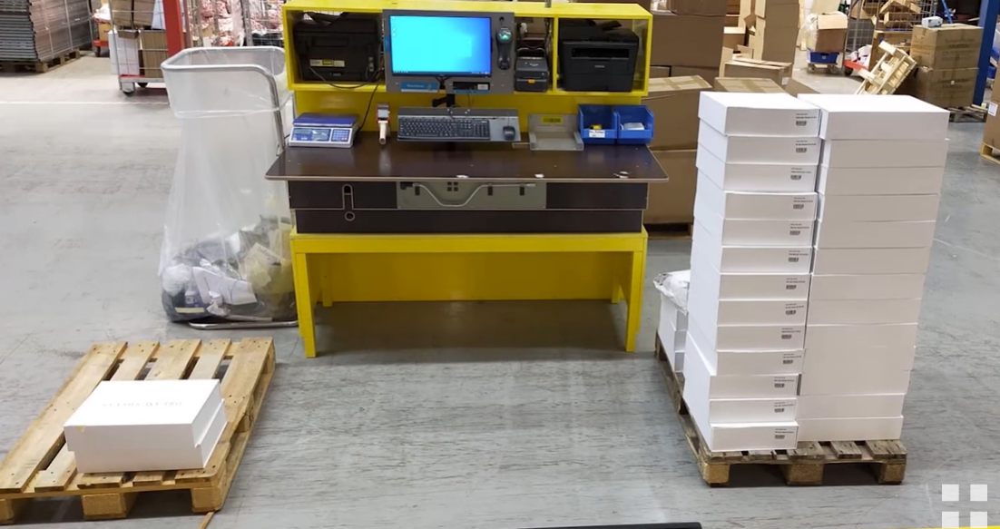
 

Plaats een doos met producten op de inbound-tafel. Scan met je handscanner 1 van de  producten uit de doos, plaats deze daarna weer terug in de doos.
 

 

### 1.2 Forecast
Een forecast is eigenlijk een digitale lijst met wat een klant besteld en naar ons toegestuurd heeft. Wij weten nu precies hoeveel producten we van deze klant binnen krijgen.

De klant heeft in dit voorbeeld 2 verschillende producten besteld, nu krijgen wij via de forecast te zien dat er 44 stuks van het ene en 48 stuks van het andere product aangeleverd zouden moeten zijn.

 

### 1.3 Geen forecast

Heeft de klant geen forecast, vraag dan aan je leidinggevende wat je hiermee moet doen. Het verschilt per klant of er met  of zonder forecast ingeboekt kan worden.

### 1.4 Plakbon
Als er een plakbon bij de levering is dan scannen wij die gelijk in. Het product is nu gescand, we tellen het aantal wat geleverd is en checken de barcodes. De barcode staat in de pop up na de productnaam.

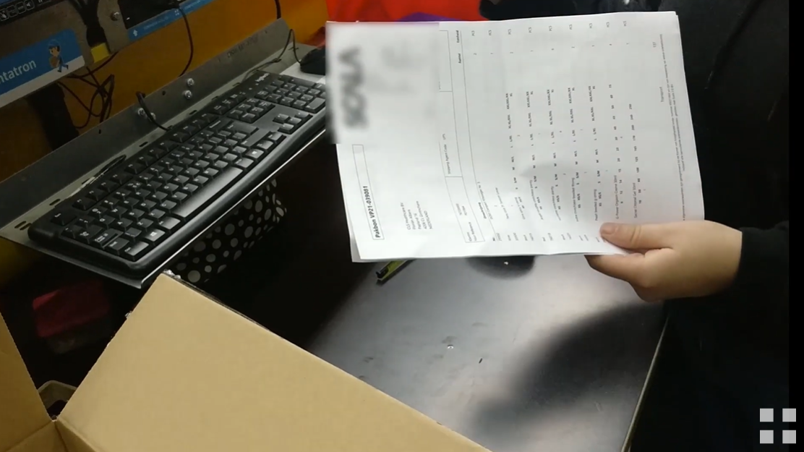
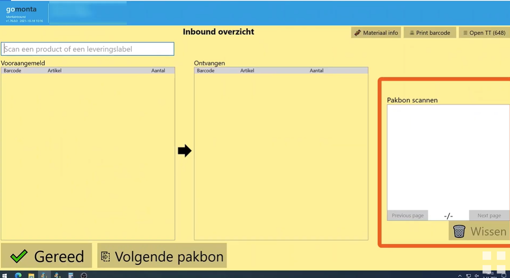

 

### 1.5 Barcode check
Voor het checken van de barcode kijk je of de laatste 4 cijfers overeenkomen.

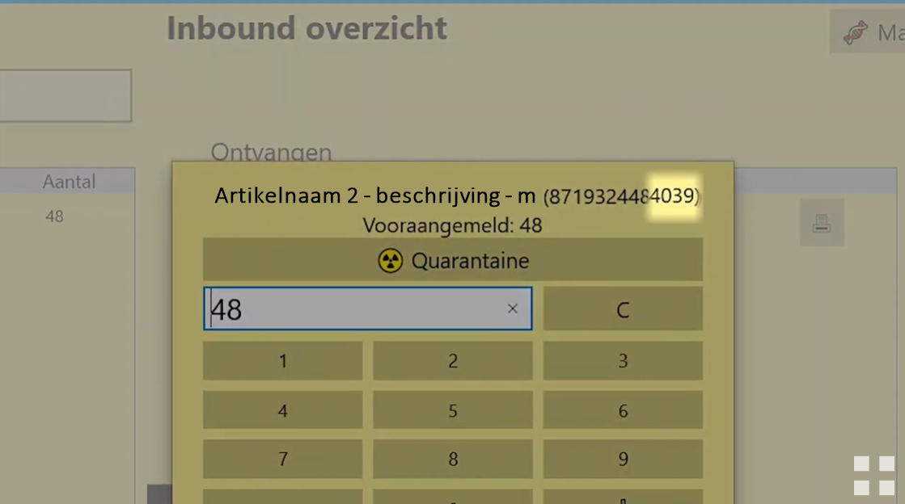

 

### 1.6 Maak inbound
Het aantal klopt, nu boek je het aantal in wat je net gecheckt hebt. Klik dan op maak inbound.

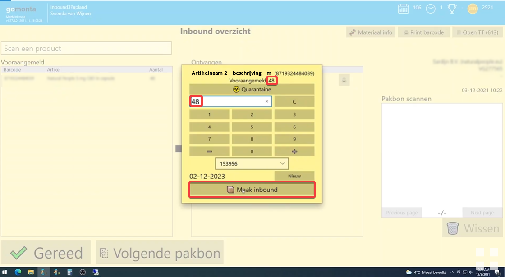

Komt het aantal niet overeen maar je klikt toch op maak inbound, dan verschijnt er een waarschuwing, met daarbij de vraag of dit daadwerkelijk klopt.
Het kan namelijk voorkomen dat er daadwerkelijk meer is geleverd dan is aangemeld, maar het kan ook een fout zijn.
Klopt het aantal daadwerkelijk, klik dan op ja, of op enter. Anders, kies nee, en pas het aantal aan

Je krijgt een koppellabel (ook wel TT-label genoemd) uit de labelprinter die je op de doos of krat plakt. De doos leg je nu op de pallet voor ingeboekte producten. De krat plaats je bijvoorbeeld in een kar. De pallet of kar kan meegenomen worden, zodat het daarna op de daarvoor bestemde locatie gekoppeld kan worden in het magazijn.

## 2 Batch maken
<embed style="width:720px; height:450px;" src="https://www.youtube.com/embed/zCIUKSzkQoo"></embed>

### 2.1 Lotnummer en houdbaarheidsdatum
Sommige producten werken ook met een batch. Deze producten hebben een lotnummer en een houdbaarheidsdatum. Deze gegevens kun je op het product vinden, zo niet ga naar je direct leidinggevende. Vul deze gegevens in en klik daarna op opslaan.

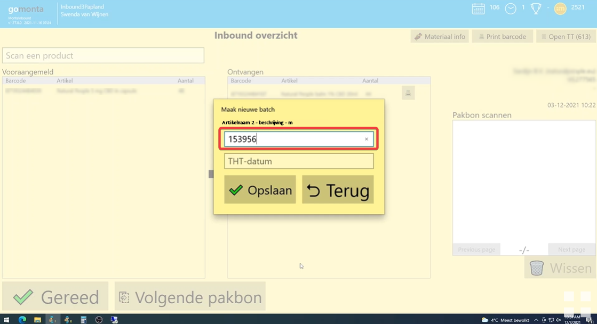

Je ziet het lotnummer en de houdbaarheidsdatum nu staan in het scherm waar je  ook het aantal producten invult.

De batch is nu nog aan te passen. Mocht je dit niet willen, dan kan dit in GoMonta uitgezet worden. Deze instelling is te  vinden onder **[Kantoor - Relatie](https://gomonta.montapacking.nl/Office/Relatie/Index) -> Inbound -> Mag vooraangemelde batch bewerken**. Deze instelling schakelt het dropdown veld uit als er een batch mee gegeven wordt aan de vooraanmelding.

Het aantal klopt, nu boek je het aantal in wat je net gecheckt hebt. Klik dan op maak inbound.

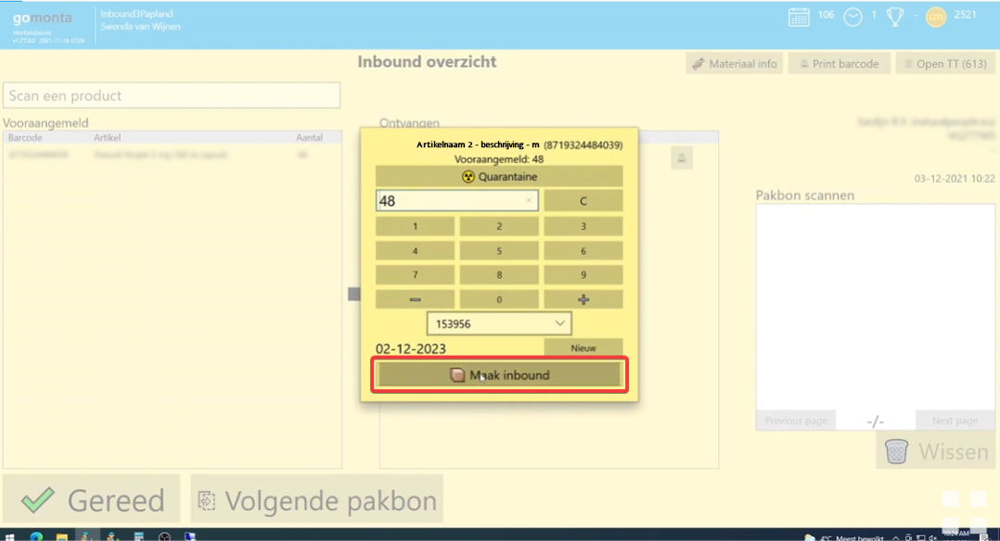

Je krijgt een koppellabel (ook wel TT-label genoemd) uit de labelprinter die je op de doos of krat plakt. De doos leg je nu op de pallet voor ingeboekte producten. De krat plaats je bijvoorbeeld in een kar. De pallet of kar kan meegenomen worden, zodat het daarna op de daarvoor bestemde locatie gekoppeld kan worden in het magazijn.

## 3 Crossdock & Fastlane
<embed style="width:720px; height:450px;" src="https://www.youtube.com/embed/5KumUrL67tU"></embed>

### 3.1 Backorder
Crossdock of fastlane betekent dat een binnenkomend product al in backorder staat en gelijk weer de deur uitgaat.
Bij dit voorbeeld worden er 44 producten ingeboekt, daarvan gaan er 43 naar de voorraad en 1 naar crossdock.

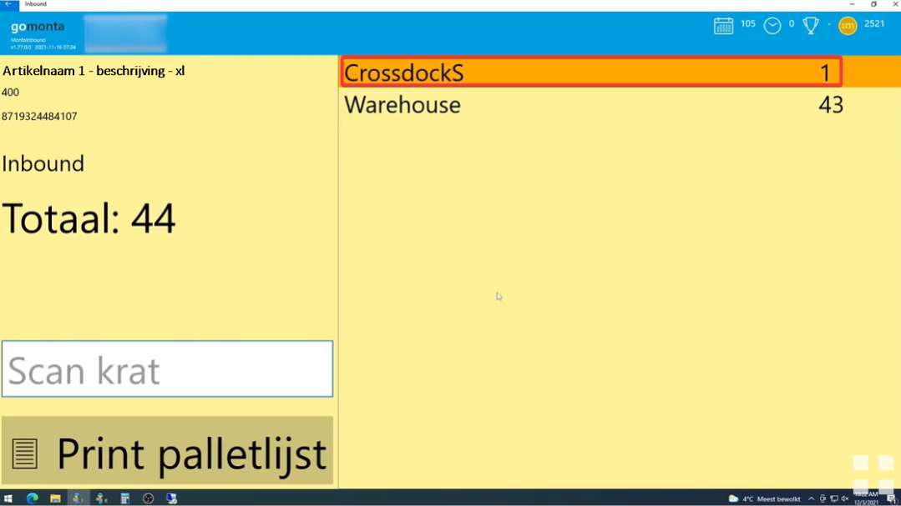

### 3.2 Orderformulier

Dit enkele product houd je apart, je krijgt nu een orderformulier uit je printer. Dit formulier voeg je toe bij het product en leg je neer in een blauwe krat.

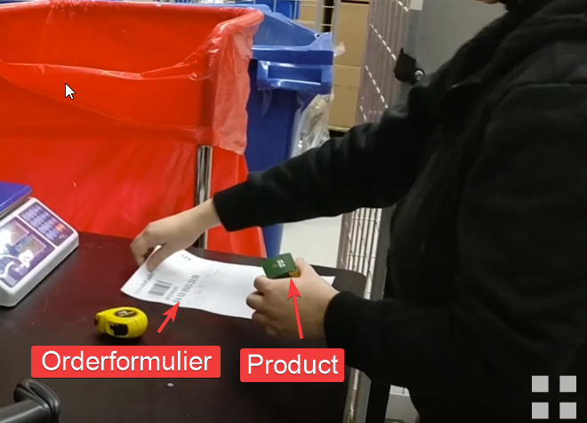

Zo ga je verder tot de forecast compleet is, is dat niet zo geef het aan bij je leidinggevende. Het kan zijn dat er nog een nalevering komt van deze klant, of dat er een product verkeerd is ingeboekt. Als de forecast compleet is klik je op gereed, zo niet klik dan op volgende pakbon.

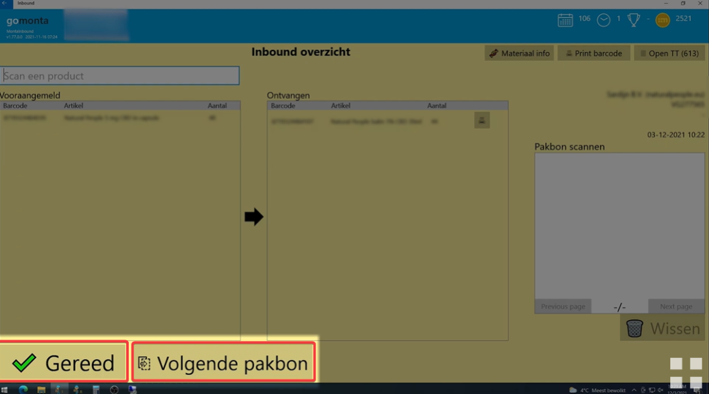

## 4 Mogelijke problemen Inbound
<embed style="width:720px; height:450px;" src="https://www.youtube.com/embed/EzjjoTvQZ9Y"></embed>

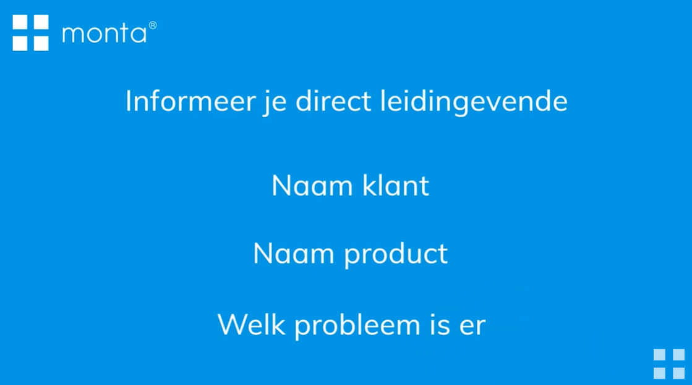

### 4.1 Overige vragen
Mocht je nog met bepaalde vragen zitten neem dan contact op met je direct leidinggevende.

