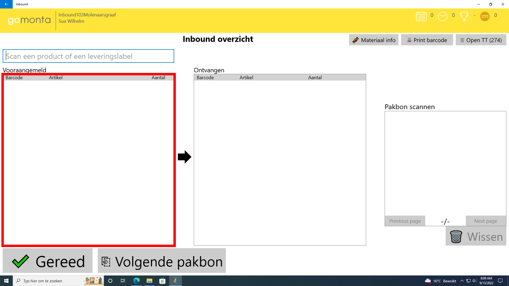
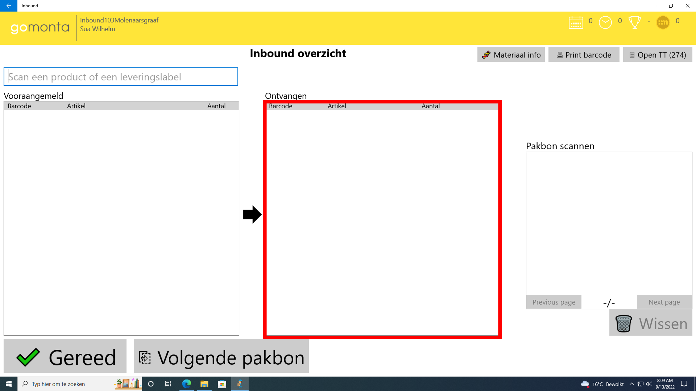
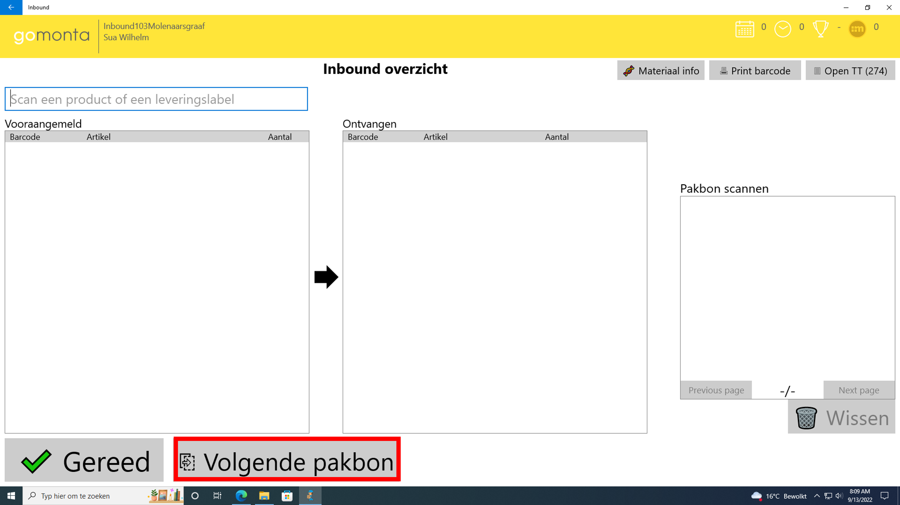
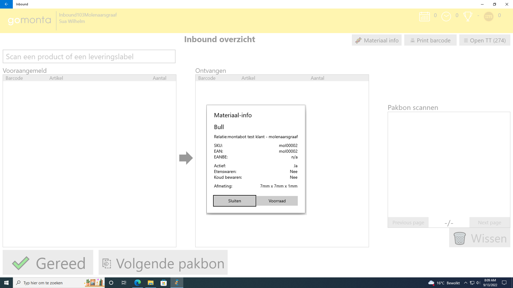
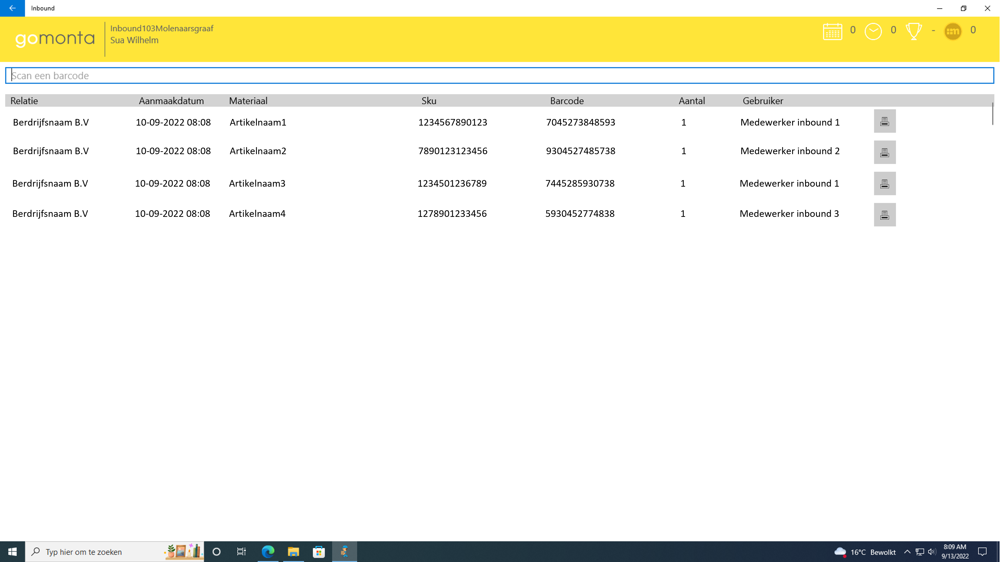

# Inbound applicatie schermen

Deze pagina geeft informatie over het verloop van de inbound-schermen.

## Inlogscherm
### Inloggen met de Montapas
Wanneer de applicatie geopend wordt kun inloggen door de Montapas te scannen met de handscanner.

### Inloggen met gebruikersnaam en wachtwoord
Een andere optie is het inloggen met gebruikersnaam en wachtwoord.

## Inbound overzicht
### Vooraangemeld
Hierin staan de artikelen die door de leverancier van te voren aangemeld zijn.

### Ontvangen
Hierin staan de artikelen die ingescant zijn door de inbound-medewerker.

### Volgende pakbon
Met deze knop kan de inbound-medewerker de volgende pakbon selecteren, voor artikelen van een andere leverancier.

### pakbon scannen
Dit is een overzicht van de gescande pakbonnen.

### Materiaal info
Met deze knop kan de barcode van een artikel ingescand/ingevoerd worden
om informatie weer te geven over het artikel.

### Print barcode
Met deze knop kan de barcode van een artikel ingescand/ingevoerd worden
en vervolgens uitgeprint.

### Open TT
Overzicht van alle ingeboekte artikelen van een ploeg.

### RFID
Met deze knop wordt het RFID overzicht weergegeven.

### Opmerking van vooraanmelding
Met deze knop is het mogelijk om de opmerking van een vooraanmelding aan te passen.
Deze knop opent een pop-up waarin de opmerking toegevoegd of bewerkt kan worden.
Dit veld heeft een limiet van 500 karakters.
Deze opmerking is ook in de Montaportal terug te vinden.
Dit staat op de detail pagina van de desbetreffende vooraanmelding

