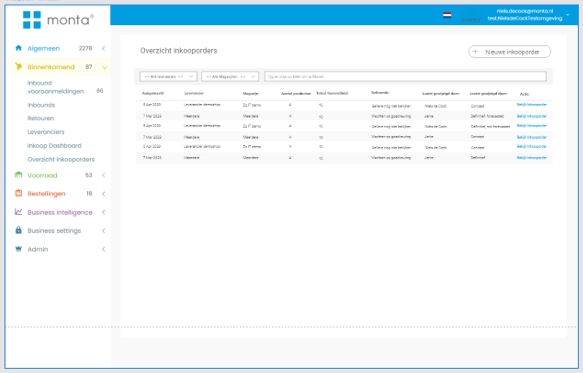

# Inkoopsysteem

De Montaportal bevat een inkoopsysteem. Dit systeem kan het volgende:
- Inkoopadvies maken,
- Inkoopadvies omzetten in inkooporder,
- Inkooporders per e-mail versturen naar de leverancier met een PDF en/of Excel,
- Inkooporders omzetten in inbound forecasts.

## Inkoopadvies maken

Een inkoopadvies maken kan vanuit de voorraadprognose (Stock forecast) [1]. De voorraadprognose laat een lijst zien van alle producten, met de huidige voorraad, de gemiddelde verkoop en (daaruit volgend) hoe lang de voorraad nog strekt.

Voor het berekenen van de gemiddelde verkoop kan gekozen worden hoe dit berekend moet worden [2]. Vanaf de eerste verkoop tot nu of gebaseerd op een bepaalde periode

Op basis van het resterend aantal dagen kan een inkoopadvies gemaakt worden [3]. Als bijvoorbeeld gekozen wordt om voor de komende tien dagen in te kopen, komen producten met minder dan tien dagen resterende voorraad in het inkoopadvies. De aantallen in het inkoopadvies kunnen vervolgens aangepast worden.

Er kan ook voor gekozen worden niet eerst een inkoopadvies te maken, maar direct een inkooporder.

Ook kan ervoor gekozen worden een inkoopadvies toe te voegen voor alleen de aangevinkte producten.

## Inkoopadvies omzetten in inkooporder

Opgeslagen inkoopadviezen zijn te vind in het scherm inkoopadviezen [1]. Hier kan het aantal te bestellen nog aangepast worden [2]. Ook kan de leverancier gekozen worden. Hier wordt automatisch de standaardleverancier van het product gekozen.

Bij elk getal en kolomkop is uitleg op te vragen door er met de muis overheen te gaan [3].

Inkoopadviezen kunnen omgezet worden naar een inkooporder door ze goed te keuren [4]. Goedgekeurde inkoopadviezen worden gegroepeerd per leverancier.

Het is ook mogelijk bij een product een "inkoopadvies notitie" in te stellen. Deze wordt zichtbaar met een waarschuwingsicoontje in het inkoopadvies [5]. Door met de muis over het waarschuwingsicoontje te gaan kan de notitie gelezen worden.

De goedgekeurde inkooporders van een leverancier kunnen omgezet worden in een inkooporder in het scherm inkooporders.

## Inkooporders per e-mail versturen en inbound forecast maken

De gemaakte inkooporder kan per mail verstuurd worden naar de leverancier [1]. Het standaard template voor deze e-mail is aan te passen bij Algemeen > Instellingen > Communicatie van montaportal.

Wanneer de datum bekend is dat de producten geleverd gaan worden, kan de inkooporder omgezet worden in een inbound forecast [2].

 
 
 
 
 
 

## Nieuwe inkoopmodule:

Monta heeft een inkoopsysteem die voor alle klanten beschikbaar is. Dit inkoopsysteem kan ook een advies uitdraaien op basis van de verkoophistorie met wat een klant moet inkopen.

**LETOP, Het inkoopsysteem is nog in ontwikkeling. niet alles wat in deze documentatie staat is al live**
**Nog in ontwikkeling (5-06 Niels de Cock) :**

 
 

## Het inkoopsysteem

Het Monta Inkoopsysteem is een krachtige en geïntegreerde oplossing die is ontworpen om inkoopprocessen te stroomlijnen en de efficiëntie te verbeteren. Of je nu een kleine onderneming bent die net begint met het automatiseren van inkoopactiviteiten, of een groot bedrijf dat op zoek is naar een geavanceerd inkoopsysteem, Monta is ontworpen om aan jouw behoeften te voldoen.

Het inkoopsysteem heeft meerdere functionaliteiten die over verschillende pagina's heen zijn verspreid. Onderstaand is een overzicht van alle pagina's met uitleg en functionaliteiten te vinden op deze pagina's

Om een inkooporder te plaatsen moet de klant de volgende flow doorlopen:

## Inkoop Dashboard

Het inkoopdashboard heeft het doel: Vraag beantwoorden; Wat in te kopen?

_Menu: Het dashboard valt onder het menu item: Binnenkomend -> Inkoopdashboard_

Het Inkoopdashboard is een pagina binnen het inkoopsysteem van Monta en biedt verschillende functionaliteiten. Het dashboard is het startpunt voor het maken van een inkooporder. Het Inkoopdashboard biedt dus een overzichtelijke en gebruiksvriendelijke manier om inkoopinformatie te bekijken en te analyseren. Door het gebruik van filters en de mogelijkheid om gedetailleerde informatie op te vragen, kan de gebruiker snel en efficiënt inzicht krijgen in de inkoopprocessen van het bedrijf.

Het dashboard bevat de volgende onderdelen:
- Periode: Dit geef een overzicht met de setting die worden gebruikt voor de berekening van het inkoopadvies. Monta® baseert de inkoopadviezen op basis van een bepaalde periode. De klant kan deze periode aanpassen in het dashboard. De gebruiker kan de gewenste periode aangeven en de gebruikte periode bekijken.
- Inkoop statistieken: Dit geeft een overzichtelijk beeld van wat moet worden ingekocht. Ook geeft het een gemakkelijke manier om naar andere pagina’s te navigeren.
- Producten overzicht: Dit geeft een overzicht van alle producten, met daarbij de gegevens hoeveel dagen resterende stock er nog is. Gesorteerd op Minste dagen.
- Inkoop Module: Module waarmee je een inkoop(advies) kan starten. Gemeten dat instellingen achter een tandwieltje mogen komen omdat deze minimaal gebruik worden.

 

## Inkooporder: Concept

Wanneer een inkooporder nog niet definitief is, en wordt aangemaakt, kom je op de concept pagina.
Dit is een pagina waarop je de inkooporder kan maken; aanpassen en goedkeuren. Een concept inkooporder kan op drie manieren worden gemaakt:
1.	Vanuit een inkoopadvies
2.	Vanuit een inkoopadvies gebaseerd op een selectie van artikelen
3.	Handmatige inkooporder

 
- **Product overzicht**: Hierin is een overzicht te zien van welke producten ingekocht gaan worden.

- **Inkoopoverzicht**:
Dit geeft een overzichtelijke summary van de inkooporder. Hier is ook te zien of de minimale en Franco waardes bereikt zijn.
Product kiezer: Dit is een veld waarmee je handmatig producten kan toevoegen aan de inkooporder.

 

## Inkoopoverzicht
Dit scherm geeft een overzicht van alle inkooporders. Zowel de concepten als de definitieve inkooporders.

 

### Ondersteunende pagina's

#### Productpagina:
Op de product pagina is data toe te wijzen aan producten die je kan gebruiken tijdens het maken van een inkooporder.

- (**Multi) leverancier toewijzen aan producten:**
Op de productpagina, of via een import, is het mogelijk om een leveranier toe te voegen aan een product. Dit is van belang om bij de inkooporders op levernacier te kunnen inkopen.
Mogelijkheid om meerdere leveranciers toe te voegen aan één product middels dropdown:

 

Overige functionaliteiten op pagina:
 

- **Minimum voorraad per magazijn instellen:** Met deze functie kunnen gebruikers de minimumvoorraad instellen voor elk magazijn waarin het product wordt opgeslagen. Dit is op de product detailpagina te wijzigen.

- **Minimale/Maximale inkoophoeveelheid product:** Het is nu mogelijk om een min en max in te stellen per product.

- **Weergave verkoopinformatie en geschiedenis:**

1.	De totale verkooptrend weergeven in percentages: Deze functie toont de totale verkooptrend in percentages, waarbij de groei wordt vergeleken met dezelfde maand vorig jaar en de afgelopen 28 dagen vergeleken met dezelfde 28 dagen vorig jaar. Wordt vermoedelijk in grafiek weergegeven.
2.	Omlooptijd inzichtelijk maken: Hiermee kunnen gebruikers de omlooptijd van het gehele assortiment en per product bekijken, en trends in een grafiek bekijken. Deze grafiek is te vinden in de Montaportal.
3.	De totale seizoen factor weergeven in percentages: Met deze functie wordt de totale seizoen factor weergegeven in percentages, waarbij de groei wordt vergeleken met een maand geleden en de afgelopen 28 dagen vergeleken met de 28 dagen daarvoor.
4.	Servicelevel per product:
“% uit voorraad leverbaar” inzichtelijk maken van het gehele assortiment en per product. En in een grafiek om trends te zien. % uit voorraad leverbaar = hoe vaak is een product uit voorraad is geweest terwijl je het had kunnen verkopen

#### Leverancier pagina
Op de leverancierpagina kunnen leveranciers worden beheerd en toegevoegd.

