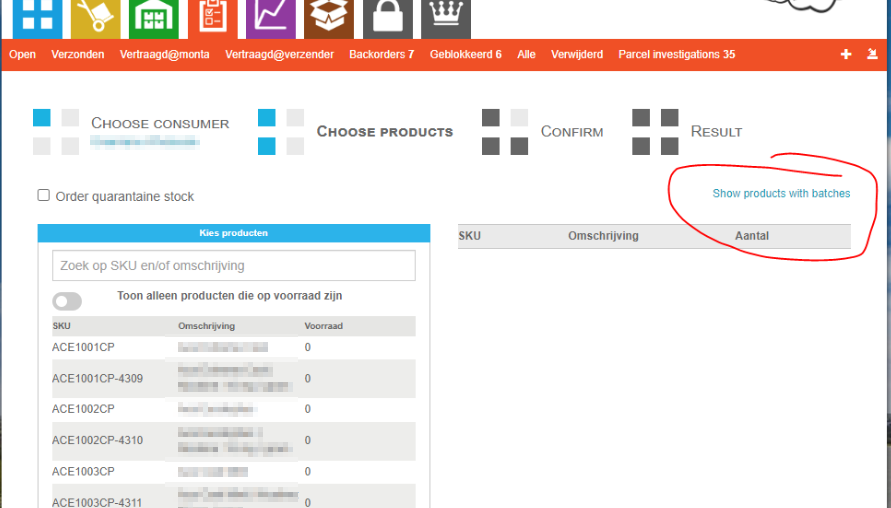

# Inbound

Inbound betreft de goederen die bij het magazijn geleverd worden.

## Flowchart

Deze flowchart beschrijft het inboundproces.

graph TD;
subgraph klant
product_info[Maakt productinformatie aan in Montaportal] -->
po_advice[Maakt inkoopadvies op Montaportal] -->
po_create[Maakt inkooporder op Montaportal] -->
place_po[Stuurt inkooporder naar leverancier]
inbound_forecast[Maakt inbound forecast aan]
inbound_forecast_ok_klant[Inbound forecast goedkeuren]
end
subgraph leverancier
supp_po_delivery_date[Bevestigd leverdatum en aantallen] -->
supp_ship[Verstuurt goederen naar magazijn]
end
subgraph magazijn
lvr[Levering registreren] -->
ib[Product inbounden] -->
inbound_forecast_check{Klopt het aantal met de forecast?} -- yes -->
inbound_forecast_ok_magazijn[Inbound forecast wordt automatisch goedgekeurd]
ib --> kopp[Voorraad koppelen op locatie]
inbound_forecast_check -- no -->
inbound_forecast_ok_klant
end
place_po --> supp_po_delivery_date
supp_po_delivery_date --> inbound_forecast
supp_ship --> lvr
style po_advice stroke-dasharray: 5 5
style po_create stroke-dasharray: 5 5
style lvr stroke-dasharray: 5 5

## Productinformatie

Voordat Monta producten van de klant (webshopeigenaar) op voorraad kan nemen (inbounden) moet Monta beschikken over de productinformatie. Productinformatie bestaat minimaal uit: SKU, omschrijving en één barcode.

Productinformatie kan op drie manieren bij Monta beschikbaar komen:

* Automatisch via een [koppeling](../../Algemene-informatie/Koppelingen)
* Handmatig op Montaportal​ meerdere producten tegelijk importeren met een Excel import
* Handmatig producten stuk voor stuk invoeren op Montaportal

### Barcodes

Zie [Voorraadbeheer - Barcodes](../../Algemene-informatie/Voorraadbeheer/Barcodes) voor meer informatie.

## Food/THT

Bij een product dat als Food gemarkeerd is, wordt bij de inbound de batch en THT geregistreerd.

Het is de verantwoordelijkheid van de klant om in de gaten te houden welke THTs bijna verlopen. Hiervoor zijn rapporten in de Montaportal (het is ook mogelijk die automatisch te mailen).

Food producten kunnen niet verstuurd worden als ze geen batch hebben of als de THT datum van de batch verstreken is. Orders komen dan in blocked.

Bij een product kunnen ook THT periodes ingesteld worden voor inbound en outbound.

THT periode inbound: aantal dagen voordat de THT bereikt is dat het niet meer mag worden geinbound.

THT periode outbound: aantal dagen voordat de THT bereikt is dat het niet meer verstuurd mag worden.

THTs die bijna over de datum gaan kan de klant afboeken door ze te bestellen. Dit kan met onderstaande knop op de Montaportal.

In het geval van een terugroepactie kan de klant een export maken welke batch verstuurd is in welke orders. Dit kan met het Excel knopje bij de batch op de product details pagina op Montaportal.

## Inkoopadvies en inkooporder Montaportal

Klanten kunnen op de Montaportal vanuit de stock forecast een inkoopadvies maken. Dit kan evt per leverancier. Dit inkoopadvies kan nog aangepast worden en dan omgezet worden in een inkooporder. De inkooporder kan vanuit de Montaportal gemaild worden naar de leverancier. Als de leverdatum bekend is kan de inkooporder omgezet worden naar een inbound forecast.

Zie [inkoopsysteem](../../Algemene-informatie/Inbound/Inkoopsysteem).

## Inbound forecasts

Een klant is verplicht bij ons aan te geven als producten bij ons geleverd gaan worden. Dit kan door middel van een "inbound forecast". Een inbound forecast kan op meerdere manieren gemaakt worden.

- Op Montaportal
- Via een koppeling
- Op ​Montaportal vanuit een purchase order

Bij het maken van een inbound forecast geeft de klant op welke aantallen van welke producten op welke datum geleverd gaan worden.

Per klant kan ingesteld worden of er ge-inbound mag worden zonder forecast en of er meer producten ge-inbound mogen worden dan in de inbound forecast staan.

### Inbound forecasts verwijderen
Hert is mogelijk om een prouductregel van een forecast te verwijderen. Dit kan op een paar manieren in Montaportal, zolang er nog niks van dit product is verwerkt.
Dit ios aangetoond door de status "Nothing yet".
Deze pagina is te vinden op **Binnenkomend->Vooraanmeldingen->view details**.

Je kan een regel indivudueel verwijderen door de regel te bewerken, en dan op "verwijder:  te klikken.
Je kan ook in bulk verwijderen. Als er nog niks van de vooraanmelding is verwerkt staat er onder aan de pagina een knop **🗑 Verwijder**.
Deze knop verwijdert alle geselecteerde regels.

.

Als er al wel wat verwerkt is, maar een deel nog niet, dan staat er de knop **🗑 Verwijder alles met status 'Nothing yet'**.
Deze knop verwijderd dan alle geselecteerde regels waarvan de status **Nothing yet** is, maar laat alle andere geselecteerde regels staan.

.

## Levering registeren

Het is mogelijk om te registreren dat de levering bij het magazijn is binnengekomen. Dit kan met de scanner. Hierbij kan ook aangegeven worden hoeveel dozen en pallets er zijn ontvangen.

Deze optie kan ingeschakeld worden bij het magazijn.

Hiermee ziet de klant sneller dat de levering in het magazijn is ontvangen, nog voordat de producten ingeboekt worden.

## Producten inboeken (inbounden)

Zie ook [Handleiding inbounden](../../Algemene-informatie/Inbound/Handleiding-inbounden).

Bij het inboeken van producten worden de volgende stappen doorlopen.
- Inbound forecast kiezen
- Pakbon inscannen
- Barcode producten inscannen (als niet gevonden dan kan een onbekende inbound gemaakt worden)
- Aantal invullen
- Afmetingen en gewicht invullen
- Optioneel is het mogelijk om een foto te maken van het product. Bij de klant moet ingeschakeld worden worden deze knop beschikbaar komt.
- Crossdock
- Koppellabel wordt geprint (niet bij crossdock). Het is ook mogelijk om een krat te scannen. De producten worden op de krat geboekt ipv een koppellabel.

### Melding/instructie

In GoMonta kan bij producten een inboundinstructie ingesteld worden, deze wordt als melding getoond bij het inbounden van het product.

### Crossdocken

Als er backorders zijn van het product dat geinbound is, dan kunnen die meteen door naar de outbound (Echeck). Na het scannen van het product en het invullen van het aantal wordt aangegeven hoeveel producten er gecrossdockt kunnen worden. Er moet een kar of krat gescand worden waar de producten ingelegd worden. Of er kan een papieren crossdock bon geprint worden.

Dit kan alleen voor orders die geschikt zijn. Een order is geschikt voor crossdocken als hij uit één product bestaat (met één of meer items). Echeck toevoegproducten tellen hierbij niet mee.

#### Aantal te crossdocken

Het kan zijn dat maar een deel van het te inbounden aantal gecrossdockt kan worden. Dit heeft er mee te maken dat alleen S en HM orders gecrossdockt kunnen worden. Als er andere (M, L) backorders zijn die eerder verstuurd moeten worden, moet eerst voorraad voor die orders in het warehouse gelegd worden.

#### Crossdock annuleren

Dit kan in GoMonta. De orders gaan dan terug in backorder en de producten moeten opnieuw ingeboekt worden.

#### B2b orders crossdocken

Het is mogelijk om grote backorders meteen vanuit de crossdock te verzamelen op een locatie. Hiervoor moet in GoMonta een magazijnlocatie worden toegewezen aan de order.

#### Crossdock in of uitschakelen
De mogelijkheid om te crossdocken is standaard ingeschakeld.
Indien gewenst kan per magazijn het crossdocken worden uitgeschakeld door in GoMonta bij Magazijn Inbound Instellingen het schuifje om te zetten.

### Barcodestickers printen

Als de producten niet (correct) voorzien zijn van (scanbare) barcodestickers, is er bij de inbound een optie om alsnog correcte barcode stickers te printen, zodat de producten verder in het proces wel correct te identificeren zijn dmv een barcode scan.

Het printen van de barcod​​estickers wordt geregistreerd zodat dit aan de klant gefactureerd kan worden.

### Inbound banner

Het is mogelijk om bij de inbound een A4 vel te laten printen met informatie over het product. Deze kan op de pallet bevestigd worden om deze makkelijker te kunnen herkennen in het magazijn.

Het printen van de inbound banner kan ingeschakeld worden per klant.

### Mobiele inbound

Een mobiele inbound is bijv een laptop met de inbound applicatie. Dan hoeft er geen koppellabel geprint te worden, maar kan meteen de locatie gescand worden waar het op gekoppeld kan worden. Een inbound station kan als mobiele inbound gemarkeerd worden.

### Inbounden met de scanner

Het is ook mogelijk om te inbounden met de scanner. Dan hoeft er geen koppellabel geprint te worden, maar kan er meteen op locatie gekoppeld worden. Bij inbound met de scanner kan er niet gecrossdockt worden.

### Inbounden met mutaties

Als er een aantal product ingeboekt moet worden die niet vanuit een levering binnengekomen zijn, kunnen deze met positieve mutaties ingeboekt worden. Om dit in GoMonta te doen is echter veel handwerk. Daarom is het ook mogelijk om te inbounden met mutaties. Er hoeft dan alleen een product gescand te worden en er wordt een kopellabel geprint. De inbounds worden niet zichtbaar op Montaportal.

### Onbekende inbounds

Het is mogelijk om producten die (nog) niet bekend zijn toch in te boeken. Bij de inbound moet dan een omschrijving ingevuld worden en dan wordt het product alsnog aangemaakt. Bij een klant is ook in te stellen dat hierbij verplicht een foto gemaakt moet worden. De klant krijgt een waarschuwing op de Montaportal en kan het product accepteren als nieuw product of samenvoegen met een bestaand product.

Deze werkwijze heeft als voordeel dat er geen onbekende producten blijven rondslingeren op de vloer.

Per klant is in te stellen of onbekende inbounds zijn toegestaan.

Als een onbekende inbound per ongeluk gedaan is kan deze ongedaan gemaakt worden door de inbound te verwijderen.

### Inbound ongedaan maken (verwijderen)

Het is ook mogelijk om een inbound te verwijderen zo lang de voorraad nog op de locatie staat waar het is gekoppeld.

### Verkeerde inbound forecast gekozen

Als bij de inbound het product op de verkeerde forecast is ingeboekt kan dit op de Montaportal gecorrigeerd worden. Het product kan verplaatst worden naar een andere forecast.

### Inbounden op krat / papierloos inbounden

Het is ook mogelijk producten die ge-inbound worden te koppelen aan een krat. De "koppelaar" scant de krat, waarvanuit de producten gekoppeld worden op locatie. Als de krat leeg is "meld" de koppelaar deze af, w​​aarbij het systeem kan controleren of de producten correct gekoppeld zijn.

### Quarantaine inbound

Producten kunnen oo​​k direct geinbound worden als quarantaine voorraad, bijvoorbeeld als geconstateerd wordt dat de producten beschadigd zijn.

## Koppelen

Nadat het product geinbound is moet het op locatie gekoppeld worden. Dit kan:
* In GoMonta
* Met de scanner door het koppellabel te scannen

Koppelen met de scanner gaat door eerste het koppellabel of de krat te scannen en daarna de locatie waar het op gekoppeld moet worden.

### Controles

* Gewone voorraad mag alleen op niet-quarantaine locaties gekoppeld worden. Quarantaine voorraad mag alleen op quarantaine locaties gekoppeld worden.
* Er mag maar één product of batch op een locatie gekoppeld worden, tenzij multiproduct ingesteld staat. Zie [voorraadbeheer - Multiproductlocaties](../../Algemene-informatie/Voorraadbeheer#multiproductlocaties). Hierbij wordt ook gekeken naar de [fysieke voorraad](../../Algemene-informatie/Voorraadbeheer#soorten-voorraad). Omdat een order die klaarstaat om gepickt te worden geannuleerd kan worden. Als er dan een ander product gekoppeld is zou een multiproduct locatie ontstaan.
* Bij een magazijnlocatie kan ingesteld zijn dat alleen producten van een bepaalde supplier gekoppeld mogen worden.
* Bij een magazijnlocatie kan ingesteld zijn dat alleen een bepaald product gekoppeld mag worden.

### Locatie/zone suggestie

Op het koppellabel wordt een locatie geprint waar het product bijgeplaatst kan worden (als het al ergens ligt). Als het nog niet ergens ligt kan per klant een zone ingesteld worden waar het product geplaatst moet worden. Dit wordt dan op het koppellabel geprint.

Op de scanner worden ook de locaties getoond waar het product al ligt.

### Alternatieve tekst zone suggestie

Als een product nog niet gekoppeld is op een magazijnlocatie en er geen zonesuggestie ingesteld staat voor de betreffende klant is het mogelijk een tekst in te stellen dat op het koppellabel getoond wordt.

Dit kan in GoMonta bij de relatie ingesteld worden onder het kopje Inbound:

### Openstaande orders

Het is mogelijk om een "B" te laten printen op het koppellabel als er backorders zijn van een ge-inbound product (en crossdocken is niet mogelijk omdat het bijvoorbeeld M orders zijn). De producten kunnen dan dicht bij de echeck gelegd worden zodat ze snel weer gepickt kunnen worden als de order uit backorder komt.

Dit kan ingeschakeld worden in GoMonta bij Inbound instellingen "Print TT01 backorder label".

### ABC advies

Op het koppellabel wordt een A, B of C getoond wat aangeeft wat de omloopsnelheid van het product is. Vaak verkopende product (A) moeten op goed bereikbare locaties in het magazijn gelegd worden.

Zie [R en D update - ABC tool](../../Updates/R&D-Updates#abc-tool-update-15-21-02-2023).

 
 
 
 
 
 
 

Zoekwoorden: i
,in
,inb
,inbo
,inbou
,inboun
,inbound
<!--
,Opens
,Openst
,Opensta
,Openstaa
,Openstaan
,Openstaand
,Openstaande
,Openstaande
,Openstaande o
,Openstaande or
,Openstaande ord
,Openstaande orde
,Openstaande order
,Openstaande orders
-->
