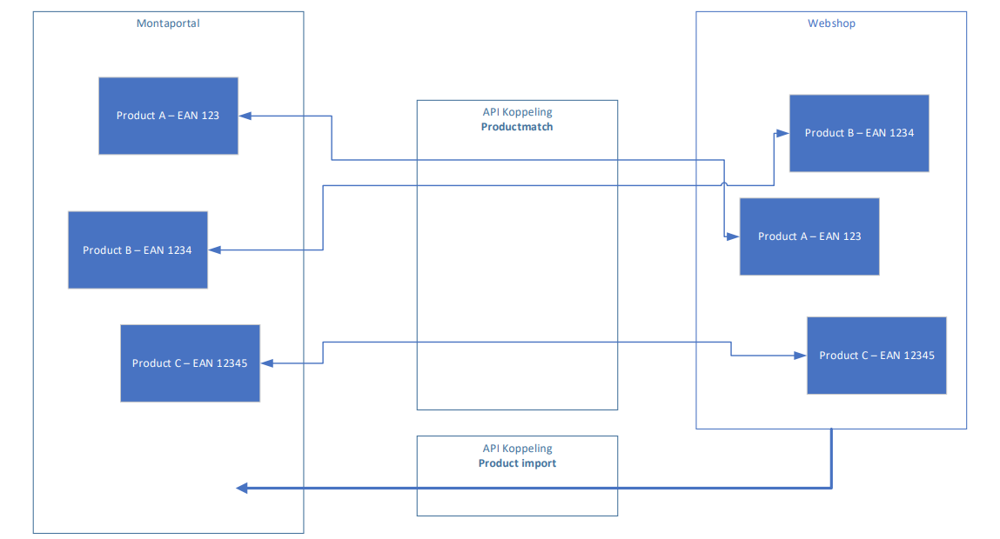

# 1. Koppelingen dataflow

Bij Monta hebben we standaard koppelingen die voor al onze klanten werken. Op deze manier kunnen we de bedrijfszekerheid van de koppelingen garanderen.

Er zijn een aantal standaard onderdelen die onze koppelingen hebben. Welke onderdelen de koppelingen precies hebben is afhankelijk van de [type koppelingen](../../../Algemene-informatie/Koppelingen/2.-Platformen).

 

## Algemene onderdelen

De meeste koppelingen bevatten de volgende onderdelen. Afhankelijk van het [platform](../../../Algemene-informatie/Koppelingen/2.-Platformen) kan je zien welke onderdelen de koppeling precies bevat.
- Productimport (producten vanuit webshop in Monta omgeving)
- Product Match (producten vanuit webshop gekoppeld met de producten in de Monta omgeving)
- Stockupdate (Voorraad die bij Monta ligt wordt verstuurd naar webshop)
- Order import (Orders worden in Monta geïmporteerd)
- Order status update (Orderstatus wordt naar webshop doorgestuurd)
- Refund update (Van retouren met de status "Please refund" wordt een refund gemaakt in de webshop waarmee de consument zijn geld terugkrijgt)

**Letop: Niet alle koppelingen hebben alle onderdelen!**

 

## Productimport

De product import importeert de producten uit de shop en plaatst deze informatie in de Montaportal.
afhankelijk van het platform worden verschillende gegevens geïmporteerd.

## Product match

De nieuwe koppeling draait naast een Product Information Import ook een Product Match.
De Product Import importeert de producten uit de webshop en plaatst deze in de
Montaportal. De Product Match koppelt de producten die bij Montapacking bekend zijn met
de producten die in de webshop staan. Dit heeft als voordeel dat de voorraadupdate nu per
product kan worden uitgezet.

`Wel belangrijk hierbij is dat er NOOIT 2 producten in de webshop mogen zijn met twee
keer dezelfde barcode. `

De productmatch doet de match op basis van eerst de SKU en daarna de barcode.
Als één van de twee overeenkomt zal hij de match maken.

## Order Import

De order import haal de ordergegevens van de webshop binnen. De meeste koppelingen filteren hierbij op de status `PAID` en `PROCESSING`. We halen dus de openstaande en betaalde orders binnen. Alle andere orders zullen niet worden meegenomen in de Orderimport. Bekijk per koppeling welke statussen we binnenhalen, en of het mogelijk is om deze statussen uit te bereiden met andere statussen.

### Verzenderkeuze importeren

In de order kan meegegeven worden met welke verzender Monta de order moet verzenden. Dit kan op twee manieren: met een mapping en 'hardcoded'.

#### Verzenderkeuze mapping

In een aantal systemen kan de klant zelf verzendopties aanmaken. Deze krijgen dan een code of nummer. In de instellingen van de order import kan deze code of dit nummer 'gemapt' worden naar een Monta verzender.

Bij de mapping kunnen ook verzendopties worden toegevoegd. En kan een aantal extra verzenddagen worden ingesteld (zie [Outbound - Geplande verzenddatum](../../../Algemene-informatie/Outbound#geplande-verzenddatum)).

De volgende platformen kunnen de verzenderkeuze importeren met een mapping: AFAS, Amazon Vendor, BigCommerce, CCVShop, Exact Online, Excel/CSV over FTP, Lightspeed eCom, Magento, PrestaShop, Shopify, Shopware, Silius, WooCommerce, Leroy Merlin.

#### Harcoded verzenderkeuze import

Sommige platformen hebben 'vaste' verzendopties. Bijvoorbeeld Bol.com. Ook kunnen er in webshopsystemen plugins geïnstalleerd worden die bepaalde verzendopties aanbieden. Het importeren van deze verzendopties gebeurd automatisch zonder dat er iets voor ingesteld hoeft te worden, als wij dit ondersteunen voor het betreffende platform/de betreffende plugin. Zie hiervoor de documentatie van het betreffende platform.

## Order Update

De order Update koppelt aan de webshop terug dat een order is verzonden. Dit doet hij samen met de track&trace informatie. Welke informatie precies wordt verstuurd is te vinden bij de koppelingen uitleg.

## Stock Update

Monta is leidend als het gaat om de voorraadstand. Alle voorraad wordt door Monta geteld en opgeboekt in het magazijn. Het is mogelijk om deze voorraadstand naar de webshop te sturen.
Dit kan door middel van 2 verschillende flows.
1. Full stockupdate
Deze flow stuurt 1 keer per dag alle voorraadstanden van alle producten naar de shop.
2. Changed StockUpdate: Deze stuurt gedurende de dag alle voorraadstanden die bij veranderd.

Alle voorraad is op Relatieniveau. Dit betekend wanneer een klant meerdere koppelingen heeft, en er bij 1 koppeling een order komt; dat de voorraadstand bij alle koppelingen wordt geupdate.

##  Refund update

Monta kan via de koppeling zorgen dat de consument het aankoopbedrag van een retour terugkrijgt. De retour moet dan op de opvolgactie "Please refund" gezet worden. Er wordt dan in de webshop een credit gemaakt. De webshop maakt dan via de payment provider een refund.

## Stock mutation update

Enkele koppelingen hebben een StockMutaion dataflow. Deze stuurt de voorraadstand van enkel de volgende mutaties:
1. Mutation: Breuk of kwijt. (Geen opboeking, die lopen via de FullStock)
1. Transfer: Omboeking naar ander matriaal of andere Batch
1. Unknown return: Retouren zonder vooraanmelding

## Purchase order export
Monta kan de aangemaakte MontaPortal inkooporders exporteren naar Exact Online.
Deze inkooporders kunnen weer verder verwerkt door de Inbound forecast import en Inbound update.

