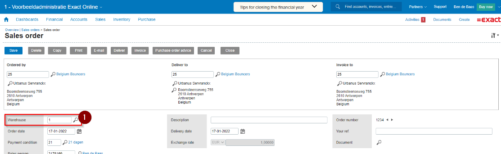

# Exact Online

## Dataflows:

- Inbound Forecast Import
- Order Import (Filter op status open)
- Inbound Update
- Order Update
- Changed Stock Update
- Full Stock Update:
Loopt nu via queue items van alle materialen. Hierdoor worden bij groot assortiment niet iedere keer alleen van de 1e 300 producten een stockupdate verstuurd. Nu gaat na crash (bijvoorbeeld too many request) de full stock verder met de volgende producten uit de queue.

(Letop: Exact Online bevat geen product import).

 

## Instellingen

### Inbound forecast Import:
`OnlyFromSetWarehouse` = Met deze instelling aan importeren we alleen purchase orders van het ingestelde magazijn in de platform-settings.
Bij Inboundforecastimportsettings is het mogelijk om in te stellen dat wij regels importeren die op een later moment aan de inkooporder in Exact toegeveogd worden.
Voeg hierbij het RelatieSystemConnectionID toe en geef bij DisableUpdate; False in.

### Order Import:
`DeliveryStatussen` : Standaard is hier de status 12 ingevuld(open). Mogelijke aanvullingen zijn; 20 = Partial, 21 = Complete, 45 = Cancelled.

`UsePlannedShipmentDate` : Standaard haalt Monta de geplande verzenddatum niet mee. Als je deze instelling aanzet haalt monta deze data wel mee, en zal de gewenste leverdatum worden gebruikt in de order.

`ImportOrdersAsB2b` = Standaard importeerd monta alle orders als B2C. Wanneer je deze instelling aanzet zal de order worden gemarkeerd als B2B.

#### Verzendopties importeren

De "verzendmethode beschrijving" wordt uitgelezen en kan gemapt worden aan een verzender met evt. opties.
 
### Order Update.
##### Shipping Method terug sturen naar Exact.
om de Shipping Method terug te kunnen sturen naar Exact moet de guid ingesteld worden in tblRelatieSystemConnectionDataFlowOrderImportSettingsShippers want bij de order update wordt gecheckt naar de guid in dit table, als het ingesteld is dan wordt de guid naar Exact gestuurd anders blijft dit property leeg bij default.
 

 

## Bijzonderheden

### DE en NL versie koppeling
Voor Exact Online is het mogelijk om voor NL of DE een nieuwe koppeling te maken, door in de popup bij het aanmaken van de koppeling voor NL of DE te kiezen in de dropdown.

De urls en de credentials voor de Exact Online omgeving voor NL en DE staan in passwordstate.
 

### Orderwijzigingen:
Met de instelling UpdateWhenAlreadyExistsAndPlatformSupportsIt kunnen we orderwijzigingen en annuleringen importeren.
 

### Financiele voorraadstanden
Sommige exact online omgevingen hebben de financiele stock nodig ipv de beschikbare voorraad. Hiervoor hebben we een mogelijkheid ingebouwd, dit is echter nog geen instelling. Dit moet worden gedaan door iemand van monta IT.

[[Doelgroep: IT

De instelling moet in de code worden gedaan op line: 60 in code
https://dev.azure.com/MontaDevelopment/Montapacking/_git/RelatieSystemsConnector?path=/RelatieSystemsConnector/Platforms/ExactOnline/ExactOnlineStockUpdateType.cs

 

### Inbound Update goedkeuren
Koppelen na goedkeuring in de montaportal het aantal terug die zijn ingeboekt in het magazijn.
Dit kan dus verschillen met wat er is vooraangemeld (zowel positief als negatief).
Als de inbound forecast niet overeen komt met de inbound dan moet deze door de klant handmatig worden goedgekeurd.

 

### API-snelheidslimieten:
Exact online heeft strenge snelheidslimieten, die de werking beperken met het aantal verzoeken dat de koppeling gedurende een bepaalde periode mag verzenden. Elke limiet heeft een specifiek gedrag wanneer deze wordt overschreden.

Minuutlimiet - uw app kan 60 API-aanroepen doen, per bedrijf, per minuut.

Dagelijkse limiet - uw app kan 5.000 API-aanroepen doen, per bedrijf, per dag.

Het kan dus zijn dat de koppeling in sommige gevallen over zijn limiet heengaat, met name bij een groot assortiment. Houdt hier rekening mee bij het besluit voor het koppeling via Exact Online.

 

### WarehouseID:
Bij het aanmaken van de koppeling is het verplicht om een magazijnID in te vullen. Het magazijnID is te vinden in een salesorder in Exact Online via:

# Exact online

## Dataflows:

- Inbound Forecast Import
- Order Import (Filter op status open)
- Inbound Update
- Order Update
- Changed Stock Update
- Full Stock Update:
Loopt nu via queue items van alle materialen. Hierdoor worden bij groot assortiment niet iedere keer alleen van de 1e 300 producten een stockupdate verstuurd. Nu gaat na crash (bijvoorbeeld too many request) de full stock verder met de volgende producten uit de queue.

(Letop: Exact Online bevat geen product import).

 

## Instellingen

### Inbound forecast Import:
`OnlyFromSetWarehouse` = Met deze instelling aan importeren we alleen purchase orders van het ingestelde magazijn in de platform-settings.
Bij Inboundforecastimportsettings is het mogelijk om in te stellen dat wij regels importeren die op een later moment aan de inkooporder in Exact toegeveogd worden.
Voeg hierbij het RelatieSystemConnectionID toe en geef bij DisableUpdate; False in.

### Order Import:
`DeliveryStatussen` : Standaard is hier de status 12 ingevuld(open). Mogelijke aanvullingen zijn; 20 = Partial, 21 = Complete, 45 = Cancelled.

`UsePlannedShipmentDate` : Standaard haalt Monta de geplande verzenddatum niet mee. Als je deze instelling aanzet haalt monta deze data wel mee, en zal de gewenste leverdatum worden gebruikt in de order.

`ImportOrdersAsB2b` = Standaard importeerd monta alle orders als B2C. Wanneer je deze instelling aanzet zal de order worden gemarkeerd als B2B.

#### Verzendopties importeren

De "verzendmethode beschrijving" wordt uitgelezen en kan gemapt worden aan een verzender met evt. opties.
 
### Order Update.
##### Shipping Method terug sturen naar Exact.
om de Shipping Method terug te kunnen sturen naar Exact moet de guid ingesteld worden in tblRelatieSystemConnectionDataFlowOrderImportSettingsShippers want bij de order update wordt gecheckt naar de guid in dit table, als het ingesteld is dan wordt de guid naar Exact gestuurd anders blijft dit property leeg bij default.
 

 

## Bijzonderheden

### DE en NL versie koppeling
Voor Exact Online is het mogelijk om voor NL of DE een nieuwe koppeling te maken, door in de popup bij het aanmaken van de koppeling voor NL of DE te kiezen in de dropdown.

De urls en de credentials voor de Exact Online omgeving voor NL en DE staan in passwordstate.
 

### Orderwijzigingen:
Met de instelling UpdateWhenAlreadyExistsAndPlatformSupportsIt kunnen we orderwijzigingen en annuleringen importeren.
 

### Financiele voorraadstanden
Sommige exact online omgevingen hebben de financiele stock nodig ipv de beschikbare voorraad. Hiervoor hebben we een mogelijkheid ingebouwd, dit is echter nog geen instelling. Dit moet worden gedaan door iemand van monta IT.

[[Doelgroep: IT

De instelling moet in de code worden gedaan op line: 60 in code
https://dev.azure.com/MontaDevelopment/Montapacking/_git/RelatieSystemsConnector?path=/RelatieSystemsConnector/Platforms/ExactOnline/ExactOnlineStockUpdateType.cs

 

### Inbound Update goedkeuren
Koppelen na goedkeuring in de montaportal het aantal terug die zijn ingeboekt in het magazijn.
Dit kan dus verschillen met wat er is vooraangemeld (zowel positief als negatief).
Als de inbound forecast niet overeen komt met de inbound dan moet deze door de klant handmatig worden goedgekeurd.

 

### API-snelheidslimieten:
Exact online heeft strenge snelheidslimieten, die de werking beperken met het aantal verzoeken dat de koppeling gedurende een bepaalde periode mag verzenden. Elke limiet heeft een specifiek gedrag wanneer deze wordt overschreden.

Minuutlimiet - uw app kan 60 API-aanroepen doen, per bedrijf, per minuut.

Dagelijkse limiet - uw app kan 5.000 API-aanroepen doen, per bedrijf, per dag.

Het kan dus zijn dat de koppeling in sommige gevallen over zijn limiet heengaat, met name bij een groot assortiment. Houdt hier rekening mee bij het besluit voor het koppeling via Exact Online.

 

### WarehouseID:
Bij het aanmaken van de koppeling is het verplicht om een magazijnID in te vullen. Het magazijnID is te vinden in een salesorder in Exact Online via:

