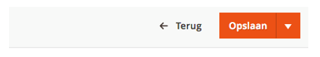

# Aanmaken Api Keys

##Aanmaken API Keys

Stap 1: Ga naar de beheeromgeving van uw Magento 2 webshop.

Stap 2: Kies voor Integraties.

Stap 3: Kies voor Toevoegen van nieuwe integratie.

 
Stap 4: Vul velden in bij Integratie info.
Naam: Montapacking
E-mailadres: Eigen Email adres

Stap 5: Klik op API.

Stap 6: Vink de volgende rechten aan en klik op opslaan.
Alle rechten die te maken hebben met producten; orders; voorraad en fulfilment.

Stap 7: Activeer de integratie.

Stap 8: Geef Integratie Details door aan Montapacking.
Samen met het baseURL

