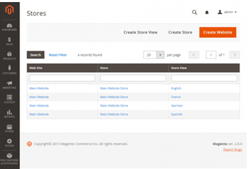
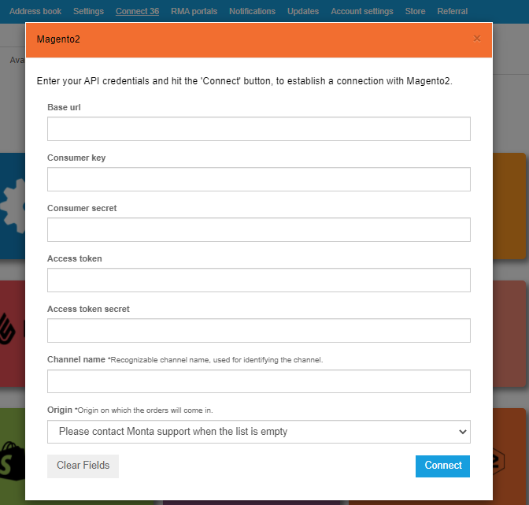
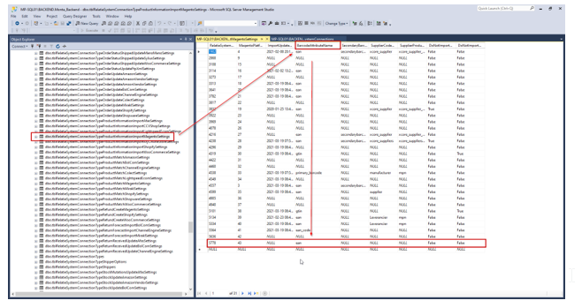
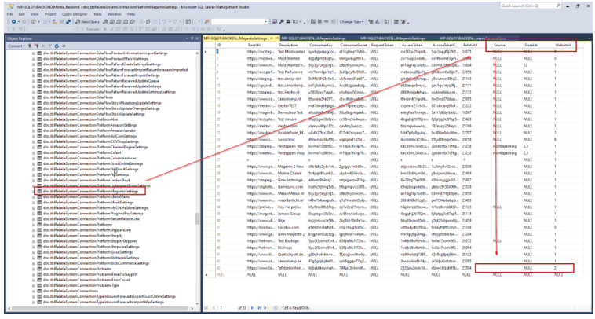
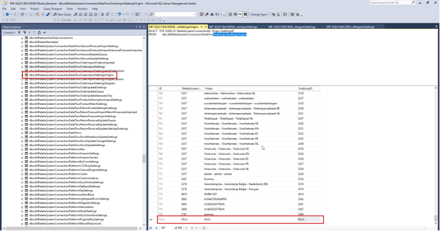

# Koppeling maken Magento

## Benodigde gegevens

### Api Keys Magento2
Om de koppeling te maken heb ik een aantal api Keys nodig. Zou jij de volgende gegevens naar mij door willen sturen:
- Base url
- Gebruikers sleutel
- Consumer geheim
- Toegangstoken
- Toegangstoken geheim

Tijdens het aanmaken van de api kun je ons bepaalde rechten toekennen. Wij hebben lezen en schrijven rechten nodig voor alles wat te maken heeft met voorraad; producten; fulfilment en orders.
[Informatie over het aanmaken van Api Keys in magento2](../../../../../Algemene-informatie/Koppelingen/2.-Platformen/Magento-2/Koppeling-maken-Magento/Aanmaken-Api-Keys)

### Opbouw Magento omgeving
Om te zorgen dat wij enkel de juiste orders ophalen hebben we een overzicht nodig van hoe jullie je Magento hebben opgebouwd. Wij moeten weten wat de verhouding is tussen Website, store en storeview. Kun je een screenshot sturen van deze pagina, en de bijbehorende ID-nummer naar mij sturen?

### Attributen name
Om de koppeling juist te kunnen mappen heb ik een attributen name van het barcodeveld binnen Magento nodig. Dit kan bijvoorbeeld zijn EAN. Letop, dit is hoofdletter gevoelig.

 

## Koppeling maken
De koppeling kan gedeeltelijk via de montaportal worden gemaakt.
Ga naar Koppelingen > Available > Magento2

Maak de koppeling aan via de montaportal met de gegevens van hierboven:

Vervolgens moet een Monta medewerker de koppeling verder instellen. Neem contact op met Monta.

## Koppeling instellen in backend

Nadat de koppeling is aangemaakt via de Montaportal moeten er een aantal instellingen worden gedaan:

### EAN code attributen name
In `tblRelatieSystemConnectionTypeProductMatchMagentoSettings`
Mappen in welke atribute veldnaam de EAN code staat: Letop dit veld is hoofdletter gevoelig.

 

### In het geval van meerdere shops:
In magento is het mogelijk om meerdere shops te hebben. Normaal gesproken komen alle kanalen van Magento binnen in 1 esetting. Naast deze optie zijn er ook nog 2 andere opties:
1. Bepaalde source of store selecteren, al het andere negeren
2. Meerdere stores mappen naar meerdere esettings.

### 1. Bepaalde source of store selecteren, al het andere negeren

In `PlatformMagentoSettings`kan je een bepaalde webshop selecteren. Als je deze hier invuld dan worden alle andere stores niet meegenomen in de koppeling. De websiteID en eventueel Source en StoreID invullen.

 

### 2. Meerdere stores mappen naar meerdere esettings

In `tblRelatieSystemConnectionDataFlowOrderImportSettings` de depault Esetting naar NULL zetten.

Hiermee zullen de orders niet in 1 standaard esetting belanden, maar zullen ze gebruik maken van `DataflowOrderImportSettingsOrigings`.

in `DataflowOrderImportSettingsOrigings` de Origin mapping toevoegen, aangeven naar welke esetting dit moet.

Gebruik hierbij de opbouw "website - store - storeview" met de formatting zoals in dit voorbeeld.

In Dataflow productmatch settings een Regel toevoegen:

### Veelvoorkomende foutmeldingen

_X failed with the following message: Gebruiker is niet gemachtigd tot %resources_
Wanneer dit voorkomt, moet de gebruiker van de API de volgende optie aanzetten:
‘Allow OAuth Access Tokens to be used as standalone Bearer tokens’

Om dit aan te zetten moeten de volgende stappen worden doorlopen:

Ga in je Magento 2 admin omgeving naar 'Stores' en kies hier voor 'Configuration'. Ga vervolgens naar 'advanced' en kies hier voor 'Oauth'.

Onder het tabje 'Access Token Options' selecteer je 'Allow OAuth Access Tokens to be used as standalone Bearer Tokens'.

