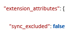

# Magento 2

## Dataflows
- Import orders
- Product import (Vervangen door de Product Match) (Letop: Dit onderdeel wordt niet standaard aan de koppeling toegevoegd.
- Order status update (multi colli; update returnlabel)
- Stock updates
- Full stock update
- Product match (Incl Product import)

[[Doelgroep: IT
### Speciale onderdelen:
Speciale onderdelen zijn onderdelen van een koppeling die wel bestaan, maar die actief worden aangeboden. Dit is vaak omdat dit óf instabiele koppelingsonderdelen zijn; óf omdat hier data over heen gaat die extra aandacht nodig heeft.
- Create refunds in Magento2
- Stock updates to Magento2 from inbounds only
- Changed Product Match Magento

 

## Instellingen

### Product match

- `Barcode Attributen Name` = Normaal gesproken halen we de barcode (barcode; EAN) niet binnen met de koppeling, omdat er geen standaardveld voor is binnen Magento. In Magento kan het zijn dat dit veld wel is aangemaakt als [customField].
Door de naam van dit veld in te vullen kunnen we deze gegevens wel importeren.
Vul de (veld)naam van het attribuut in.

- `SecondaryBarcodeAttributeName` = Standaard halen we de secondary barcode (Tweede barcode) niet binnen met de koppeling, omdat er geen standaardveld voor is binnen Magento. In Magento kan het zijn dat dit veld wel is aangemaakt als [customField].
Door de naam van dit veld in te vullen kunnen we deze gegevens wel importeren.
Vul de (veld)naam van het attribuut in.

- `SupplierCodeAttributeName` =
Standaard halen we de supplier code (Leverancierscode) niet binnen met de koppeling, omdat er geen standaardveld voor is binnen Magento.
In Magento kan het zijn dat dit veld wel is aangemaakt als [customField].
Door de naam van dit veld in te vullen kunnen we deze gegevens wel importeren.
Vul de (veld)naam van het attribuut in.

- `SupplierProductCodeAttributeName` =
Standaard halen we de Supplier Product Code (Artikelnummer van leverancier) niet binnen met de koppeling, omdat er geen standaardveld voor is binnen Magento.
In Magento kan het zijn dat dit veld wel is aangemaakt als [customField].
Door de naam van dit veld in te vullen kunnen we deze gegevens wel importeren.
Vul de (veld)naam van het attribuut in.

- `DoNotImportDisabledProducts` =
Standaard halen we alle productinformatie in de webshop binnen. Wanneer deze instelling wordt aangezet zullen de Disabled producten niet worden meegenomen in de import.

- `DoNotImportConfigurableProducts ` =
Standaard halen we alle productinformatie beschikbaar in de webshop binnen. Wanneer deze instelling wordt aangezet zullen de configurable producten niet worden meegenomen in de import.

<small>Meer informatie over configurable producten</small>

Een configureerbaar product ziet er uit als een enkel product met vervolgkeuzelijsten met opties voor elke variatie. Elke optie is eigenlijk een afzonderlijk eenvoudig product met een unieke SKU, waardoor het mogelijk is om de voorraad voor elke productvariant bij te houden. U zou een soortgelijk effect kunnen bereiken door een eenvoudig product te gebruiken met aangepaste opties, maar zonder de mogelijkheid om de voorraad voor elke variatie bij te houden.

 

- `PurchasePriceAttributeName` =
Standaard halen we de Purchase Price (inkoopprijs) niet binnen met de koppeling, omdat er geen standaardveld voor is binnen Magento.
In Magento kan het zijn dat dit veld wel is aangemaakt als [customField].
Door de naam van dit veld in te vullen kunnen we deze gegevens wel importeren.
Vul de (veld)naam van het attribuut in.

-  `SellPriceAttributeName`=
Standaard halen we de Sell Price (verkoopprijs) niet binnen met de koppeling, omdat er geen standaardveld voor is binnen Magento. In Magento kan het zijn dat dit veld wel is aangemaakt als [customField].
Door de naam van dit veld in te vullen kunnen we deze gegevens wel importeren.
Vul de (veld)naam van het attribuut in.

 

### Order import

-  `ImportVirtualOrders` =
Met deze instelling is het mogelijk om volledig virtuele orders te importeren. _(Virtuele producten of digitale goederen vertegenwoordigen niet-tastbare items zoals lidmaatschappen, services, garantiesm abonnementen en digitale downloads van boeken, muziek, video's en andere producten.)__

- `ImportVirtualProducts` = Onze koppeling haalt normaal gesproken de virtuele producten uit een order. Met deze instelling is het mogelijk om virtuele producten te importeren in de order.
_(Virtuele producten of digitale goederen vertegenwoordigen niet-tastbare items zoals lidmaatschappen, services, garanties of abonnementen en digitale downloads van boeken, muziek, video's of andere producten.)__

- `ImportInvoices` = Deze instelling maakt het mogelijk om de invoice (factuurgegevens) mee te importeren.

- `RequestedDeliveryDateFieldName` =
Standaard halen we de Requested Delivery Date(Gewenste afleverdatum) niet binnen met de koppeling, omdat er geen standaardveld voor is binnen Magento. In Magento kan het zijn dat dit veld wel is aangemaakt als [customField].
Door de naam van dit veld in te vullen kunnen we deze gegevens wel importeren. Vul de (veld)naam van het attribuut in.   
De gewenste afleverdatum is de datum waarop je wenst dat een order wordt **afgeleverd**. Monta bepaalt wanneer de order wordt verzonden om datum te behalen.

- `ShippingDeadlineFieldName` =
Standaard halen we de Shipping Deadline (Uiterlijke verzenddatum) niet binnen met de koppeling, omdat er geen standaardveld voor is binnen Magento. In Magento kan het zijn dat dit veld wel is aangemaakt als [customField].
Door de naam van dit veld in te vullen kunnen we deze gegevens wel importeren. Vul de (veld)naam van het attribuut in.   
De Uiterlijke verzenddatum is de datum waarom je wenst dat een order wordt **verzonden**.
De klant bepaalt de uiterlijke verzenddatum, anders wordt de order overdue.

- `ShopUsesBundledProducts` = Het is mogelijk om in Magento bundels aan te maken. Met deze instelling wordt het mogelijk om deze gegroepeerde producten tijdens het importeren op te splitsen in de onderliggende producten. (Het is ook mogelijk om de bundels aan te maken in de Montaportal)

- `DropshipFilterFieldName`= Het is mogelijk om in Magento bij de Order Line een veld te definiëren. Wanneer dit veld is gevuld met de tekst 'Dropshipment' dan zal deze orderline worden overgeslagen in de order import.

-  (Staff Functie) `FilterOnSyncExcludedProducts` =
In Magento kan er op product Niveau een veld worden aangemaakt genaamd  `[sync excluded]`. Deze kan True, False of _NULL_ zijn. Door deze instelling aan te zetten wordt het mogelijk om op Order line-niveau hierop te filteren. Als de waarde `[sync excluded]` op True staat zullen we deze order line niet importeren. Wanneer het veld op False / NULL staat zullen we de line wel importeren.
LETOP: INVULLEN IN PLATFORMSETTINGS, EN NIET BIJ ORDER IMPORT SETTINGS

- `SurprisePackFieldName` = Een optie om een surprisepack optie uit de extenstion attributes van een Magento orderregel te halen. Hier in moet de key/naam van de extension attribute waar de suprisepack option in zit, ingevuld worden.

<small>Meer informatie over Sync exclude producten</small>

De klant moet op orderregel niveau een nieuwe attribuut aanmaken. Dit attribuut kunnen we uitlezen in de koppeling. Vervolgens krijg je de volgende attributen mee in de order: 

 

- (Staff Functie) `DoNotUseParentLineAsLineItem`
Standaard importeren we de parent lines; maar je kan child lines met bijvoorbeeld kleurnummers hebben. Deze child lines kunnen we dan ook importeren.

- `ReferenceFieldName` = Het is mogelijk om in Magento bij de Order custom velden te definiëren. Voor het doel om een reference bij de order te importeren kan de veldnaam die hiervoor gebruikt wordt in Magento in deze instelling ingevuld worden

- `OriginFieldName` = Het is mogelijk om in Magento bij de Order Line custom velden te definiëren. Vul de naam van het attribuut in om de waarde van dit veld op te halen. Als de order een waarde heeft die overeenkomt met de naam van het attribuut, wordt deze waarde ingevuld als origin van de order.

- `InvoiceDebtorNumberFieldName` = Het is mogelijk om in Magento bij de Order Line custom velden te definiëren. Vul de naam van het attribuut in om de waarde van dit veld op te halen. Als de order een waarde heeft die overeenkomt met de naam van het attribuut, wordt deze waarde ingevuld als invoicedebtornumber van de order.

- Wijzigingen en annuleringen binnenhalen: =
Bij deze koppeling is het mogelijk om wijzigen en annuleringen binnen te halen.
Dit is in te stellen in de ``Type settings`` van de koppeling.

#### Verzendopties importeren

De verzendmethode van de order wordt uitgelezen en kan gemapt worden aan een verzender met evt opties.

##### PostNL plugin

Als er Magento PostNL plugin gebruikt wordt om verzendopties te kiezen, worden deze ook geïmporteerd.

##### Monta checkout plugin

Als de Monta checkout plugin gebruikt wordt om verzendopties te kiezen, worden deze ook geïmporteerd.

### Order update

De orderupdate van Magento meld alle colli en bijbehorende TT info terug naar Magento in de "tracks".

- `CustomerNotified` =
Wanneer deze instelling aanstaat zal Monta een trigger geven aan Magento om de klant een mail te sturen. Deze mail moet geconfigureerd zijn in Magento.

- `DisableNotesWithTrackAndTrace` =
Standaard plaatst Monta de Track&Trace van de vervoerder in het notitieveld van Magento.
Als deze instelling aan staat dan zetten we de Track&Trace niet meer in de notities.

- `AddTrackAndTraceLink` =
Standaard stuurt Monta alleen de `[Track&Trace Code]`. Als je deze instelling aanzet, dan sturen we in het veld [Tracknumber] de `[Track&Trace Code]` en de `[Track&Trace Link]`.

- `AddTrackAndTraceLinkWithoutCode` =
Standaard stuurt Monta alleen de `[Track&Trace Code]`. Als je deze instelling aanzet, dan sturen we In het veld [Tracknumber] alleen de `[Track&Trace Link]`.

### Stock update
- `DontUpdateStockToNotInStock` = In Magento heb je een vinkje genaamd `[Stock to not in stock]`. Als je deze aan zet geef je aan dat het product niet op voorraad is. Door deze instelling aan te zetten zorg je ervoor dat Monta geen stock update doet bij de producten waarvan `[Stock to not in stock]` op True staat.

- (Staff Functie) `MissiOn` = Als deze instelling aanstaat in Magento doet zowel Monta als Magento voorraadreserveringen voor orders. Hierdoor wordt er dus 2 keer afgeboekt. Door deze instelling aan te zetten doen wij geen reservering meer.

  

## Koppeling maken
Om de koppeling te maken moeten er contact zijn met een Medewerker van Monta. We zullen daarbij vragen naar een aantal gegevens die we nodig hebben om een koppeling te maken. Ga naar [koppeling maken](../../../../Algemene-informatie/Koppelingen/2.-Platformen/Magento-2/Koppeling-maken-Magento) om de benodigde gegevens te bekijken.

  
## Bijzonderheden

#### Deelleveringen:

Als een (Monta®)-order volledig is verstuurd koppelen we naar het platform terug dat de gehele order is verzenden.
De koppeling kijkt hierbij niet naar het aantal of de Lines die zijn verzonden.
Dit doen we op deze manier omdat er vaak verzendkosten e.d. uit de order wordt verwijderd.
Door de order dan volledig op verzonden te zetten, zonder te controleren op de Lines, blijven deze orders niet open staan op het platform.
Wanneer er echter een gesplitste order is in Monta® kijken we bij de eerst verstuurde orders wel naar de order Lines.
Dit om verwarring op de platformen te voorkomen.

Dit resulteert in de volgende situaties:
-	Order volledig verstuurd = Order volledig verzonden gezet op platform, zonder controle op Lines.
-	Order gesplitst, 1 vd 2 verstuurd = Orderregels worden op verzonden gezet op platform, overige regels blijven open staan.
-	Order gesplitst, 2 vd 2 orders verstuurd = Order volledig verzonden gezet op platform, zonder controle op Lines.
-	Orderlines aangepast op origine order = Order volledig verzonden gezet op platform, zonder controle op Lines.

[[ Doelgroep: IT

##### Uitzondering:
Het is eventueel ook mogelijk om hardcoded in de koppeling een relatieID toe te voegen. Dit zorgt ervoor dat monta wel de deelleveringen per line terugstuurd.
In de toekomst zal dit een instelling worden in de koppeling.

]]

