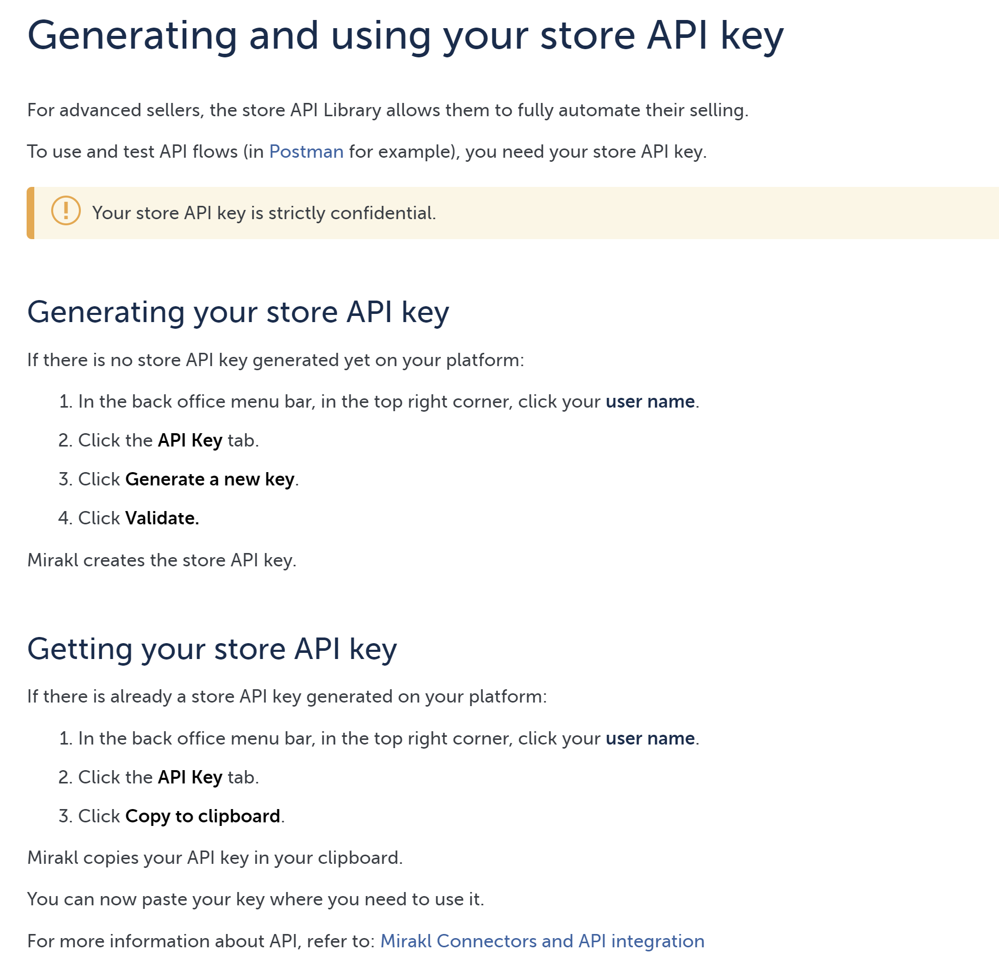

# Mirakl

## Mirakl

Mirakl is een Frans cloudgebaseerd e-commercesoftwarebedrijf met een gezamenlijk hoofdkantoor in Parijs, Frankrijk en Somerville, Massachusetts. Het levert online marktplaatssoftware aan retailers, fabrikanten en groothandels.

Monta heeft een koppeling met Mirakl voor de volgende platformen
1. Fonq
2. Brico Privé
3. Eprice
4. Fnac
5. Blokker
6. Decathlon

De api key kan op de volgende wijze verkregen worden:

### Orderwijzigingen:
Met de instelling UpdateWhenAlreadyExistsAndPlatformSupportsIt kunnen we orderwijzigingen en annuleringen importeren.

