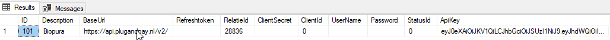
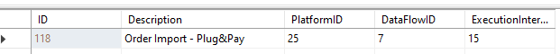

# Koppeling maken

## Benodigde gegevens

Description
BaseUrl: https://api.plugandpay.nl/v2/
RelatieId
ApiKey

Hierna dient er nog een orderimport dataflow toegevoegd te worden:

tblRelatieSystemConnectionTypes
Zoek hier het ID op van de orderimport dataflow van Plug&Pay

De relatieconnection gaan we dan aanmaken via: tblRelatieSystemConnections
Hier maken we een nieuwe entry en geven we het RelatieID en TypeID in en zetten we de kolom Disabled op True.

tblRelatieSystemConnectionTypeOrderImportPlugAndPaySettings

Maak ten slotte de dataflow instellingen aan in tblRelatieSystemConnectionDataFlowOrderImportSettings en vergeet het DefaultEsettingsID niet in te vullen.

