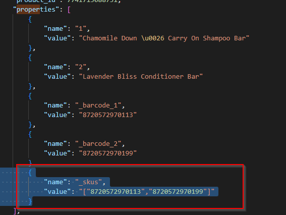

# Shopify

## Dataflows

- Full stock update
- Order status shipped
- Stock updates
- Import orders
- Product match (Incl. Product informatie import)

## Webhooks
Voor de orders en producten worden bij het aanmaken van nieuwe  koppelingen nu ook webhooks aangemaakt bij Spotify. Dit gaat om de order create/update/cancel en  product create/update webhooks.

[[Doelgroep: IT
### Speciale onderdelen

Speciale onderdelen zijn onderdelen van een koppeling die wel bestaan, maar die niet actief worden aangeboden. Dit is vaak omdat dit óf instabiele koppelingsonderdelen zijn; óf omdat hier data over heen gaat die extra aandacht nodig heeft. Mocht er interesse zijn in een speciaal onderdeel, _neem dan contact op met Monta IT._

- Create refunds in Shopify


<br><br>


## Instellingen


Er zijn een aantal instellingen die we kunnen doen bij een Shopify koppeling.

#### Product match
- `Enable/disable Product Information Import`=
Met deze setting zet je de Product informatie import aan of uit.

- `Automatically enable/disable stock update for new linked products`=
Wanneer de productmatch een nieuwe link maakt (meer uitleg) dan staat de stockupdate standaard niet aan. Dit omdat we willen voorkomen dat we voorraadstanden van "0" gaan sturen richting de shop. Met deze instelling kan je instellen dat de stockupdate wel standaard aan wordt gezet bij een nieuwe link.
Je geeft dus eigenlijk aan dat we bij alle nieuwe producten standaard de stockupdate aanzetten.

- `ImportExtraProductInfo`= Hiermee kunnen extra attributen worden ingeladen, zoals de HS code en Land van herkomst.


#### Order import
- `Shippers Mappen` = Het is bij shopify mogelijk om verzenders aan te maken in de checkout. Deze verzenders hebben dan hun eigen `shippercode`. Deze code kunnen we vervolgens mappen naar een vervoerder van Monta. Op die manier kan de consument de gewenste vervoerder selecteren.

- `Deny orders with unknown shipper codes` = In het verlengde van `ShippersMappen` is het ook mogelijk om alle orders waarbij de shippercode niet bekend is bij monta te negeren. De orders met een onbekende shippercode zullen dan niet worden geïmporteerd.

#### OrderUpdate
`Notify Customer`= Als je deze instelling aanzet dan geeft monta Shopify de trigger om een mail te sturen naar de consument.

`UpdateReturnTTcode`= Als je deze instelling aanzet dan stuurt monta de Retour TT die is gegenereerd bij de outbound (aparte instelling) mee richting shopify.

##### Orderwijzigingen:
Met de instelling UpdateWhenAlreadyExistsAndPlatformSupportsIt kunnen we orderwijzigingen en annuleringen importeren.


#### Speciale instellingen Order Import

- `[tblRelatieSystemConnectionTypeOrderImportShopifyIgnoreTags]`= Het is in Shopify mogelijk om [bepaalde tags toe te voegen aan een Order](https://help.shopify.com/en/manual/shopify-admin/productivity-tools/using-tags). Met deze instelling is het mogelijk om bepaalde tags, ingesteld in Shopify, te negeren bij de orderimport.

- `[HasPostNLPlugin]`: Als de klant een PostNL plugin gebruikt kan je deze instelling aanzetten.
Dan kunnen we vervolgens de shippercodes gebruiken bij het importeren van de order.

- `[OnlyOrdersWithShippingMethodFilter]` =
Alle orders waarbij een shipper meekomt die niet in de dataflow settis is gemapt worden niet meegenomen.


- `[ExtraFulfillmentStatus]`=
Hier kan je andere orderstatussen instellen; waardoor je meerdere order statussen kan importeren. Dit is een komma gescheiden lijst.
Mogelijke waardes zijn:
shipped = 1,
partial = 2,
unshipped = 3,
any = 4,
unfulfilled = 5

- `[OverrideOrderNumberWithColumnName]`=
Je kan een custom veld aanmaken in shopify. Dit veld kan je vervolgens mappen naar het order nummer in monta. Dus wanneer aan overschrijven we het standaard ordernummer(veld) met de test in deze custom kolom.

- `[OverrideClientNumberWithColumnName]`=
Voor het order invoice debtor nummer kan je een custom veld aanmaken.

- `[OverrideOrderNumberWithNameString]`= Als je deze instelling aanzet dan krijg je de gehele orderID uit shopify inclusief alle prefix instellingen.


- `[GiftWrappingCode]`=
Hiermee kan je aangeven dat je een suprisepack instelling wilt gebruiken.

- `[GiftWrappingNoteName]`='
Hierin kan je de tekst plaatsen die we gebruiken bij de instelling 'Suprise pack'.
Daarmee kan je bijvoorbeeld deze tekst op een verzendlabel laten afdrukken.
Deze instelling gaat altijd in combinatie met `[GiftWrappingCode]`.


- `[UseCheckLocation]`= Als je deze instelling aanzet kijken we bij de Order import naar de locatie die door shopify is geselecteerd. Standaard importeren we gewoon alle orders, ongeacht of er door shopify is gekozen dat de order op locatie monta staat.
```
Situaties bij deze instelling:
- Orderlines volledig op locatie Monta: Order wordt geïmporteerd.
- Orderlines volledig op locatie "klant": Order wordt niet geïmporteerd.
- Orderlines gedeeltelijk op locatie Monta en Klant: Order wordt volledig geïmporteerd.

Als deze instelling niet aan staat halen wij altijd de order op.
```
`[ImportPOSOrders]` =
Shopify heeft een POS (kassa)systeem. Als je deze instelling aanzet dan importeren we deze orders ook richting de Montaportal.


### Full Stockupdate / Changed Stockupdate:
- `Includes stock in transit` = Standaard updaten we de voorraadstand inclusief de voorraad in transit.
Het is mogelijk om deze voorraad niet mee te sturen in de stockupdate. (Stock in transit: Voorraad die al wel is ingeboekt, maar nog niet op locatie gelegd).

- `Stock from warehouses` = In sommige gevallen is het mogelijk dat voorraad verdeeld is over verschillende magazijnen. Standaard sturen we de voorraadstand van alle magazijnen. Het is echter mogelijk om de voorraad van een specifiek magazijn te sturen. Dan moet deze instelling worden aangepast.


- `Stock for origin` = Het is mogelijk om voorraad de alloceren (reserveren) voor een bepaald origin (kanaal). Met de instelling `Stock for origin`zal alleen de voorraad van  een bepaalde origin worden teruggekoppeld naar de site.


<br>

## Koppeling maken

Om de koppeling te maken moeten er een aantal stappen worden doorlopen. Meer informatie hierover is te vinden op:
[Koppeling maken Shopify](../../../../Algemene-informatie/Koppelingen/2.-Platformen/Shopify/Koppeling-maken-Shopify)


<br><br>
## Bijzonderheden

### Wijzigingen en annuleringen binnenhalen

Bij deze koppeling is het mogelijk om wijzigen en annuleringen binnen te halen.
Dit is in te stellen in de ``Type settings`` van de koppeling.

### Tags

Je kunt in Shopify tags meegeven aan een order. Hiermee kun een waarde meegeven die gemapt kan worden met een origin in de Montaportal. De mapping hiervoor moet je instellen in de tabel ``tblRelatieSystemConnectionDataFlowOrderImportSettingsOrigins``. Je kunt ook andere waarden meegeven in die tags, maar daar doen wij niks mee. Let op twee zaken bij de tags:
1. Wanneer je meerdere waardes invoert, die mappen met meerdere origins aan onze kant, weten wij niet naar welke origin we moeten mappen. We blokkeren dan de order met reden dat er meerdere origins zijn aangegeven in de tags.
2. Gebruik in je waardes geen spaties of komma's, daar splitten wij namelijk de waardes op.

### Fraudepreventie

Shopify heeft een ingebouwde fraude analyse. Zie https://help.shopify.com/en/manual/orders/fraud-analysis#fraud-recommendations.

Als deze fraude analyse risico's vind, waarbij de aanbeveling is om de order te annuleren of te onderzoeken, dan wordt de order in Montaportal geblokkeerd met de reden: "Shopify recommendation".

### Voorraadkoppeling

Shopify houd zelf 'gereserveerde voorraad' bij voor orders, maar dit wordt overschreven door de Monta voorraad koppeling. Dit werkt als volgt:
* een nieuwe order is geplaatst in Shopify, de beschikbare voorraad in Shopify wordt lager
* de order wordt geïmporteerd in Monta en afgeboekt van de voorraad, omdat order een voorraadreservering krijgt of wordt klaargezet om te picken
* de voorraadkoppeling stuurt de nieuwe voorraadstand naar Shopify, maar dit levert geen wijziging op omdat de voorraad in Shopify ook al niet meer beschikbaar was.

Let op dat dit mis kan gaan bij het cancellen van orders. Standaard staat hierbij een vinkje ingeschakeld dat de voorraad weer opgeboekt moet worden. Dit vinkje moet de gebruiker dus <u><em><b>uit</b></em></u>schakelen. Anders wordt er voorraad opgeboekt die er niet is, want het was door de voorraadkoppeling van Monta al afgeboekt. Zie https://help.shopify.com/en/manual/orders/cancel-delete-order#cancel-an-order.


### Bundels
Naast de standaard bundelfunctionaliteiten van Shopify en Monta kan de klant ook zelf in shopify de programmatuur bouwen om bundels te maken. Als deze bundels via het format van Monta wordt aangeleverd kunnen we deze uitlezen.
In de properties van een order moeten de SKUs die in de bundels zitten worden meegestuurd, via het volgende format:




