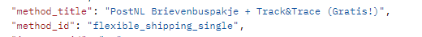

# Woocommerce ondersteunde plugins

## Plugins
Op deze pagina zijn alle plugins bekend bij monta te zien. Deze plugins ondersteund monta voor bepaalde klanten.
**Letop: Het is geen garantie dat dit altijd zal werken!**

 

#### Paazl: Verzendmethodes importeren

#### Octolize: Verzendmethodes importeren
Als de klant de plugin Octolize gebruikt voor het aanmaken van verzendopties dan zal Monta ipv het verzend method_id de verzend method_title importeren. In deze titel staat namelijk de code die de klant heeft aangemaakt.
Voorbeeld:

Letop: Als de klant de verzendmethode aanpast dan moet de verzendmapping ook worden aangepast.
https://octolize.com/product/flexible-shipping-pro-woocommerce/

 

#### Shipment-Tracking: Verzenddetails richting woocommerce:
Als de klant Shipment-Tracking gebruikt om de verzendgegevens te verwerken in Woocommerce dan is hiervoor een instelling in de orderupdate.
Zie order update instellingen.
https://woocommerce.com/products/shipment-tracking/?quid=27c4439f820a675148f22b1339a33560
