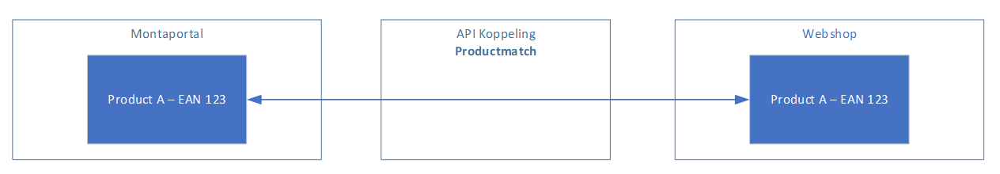
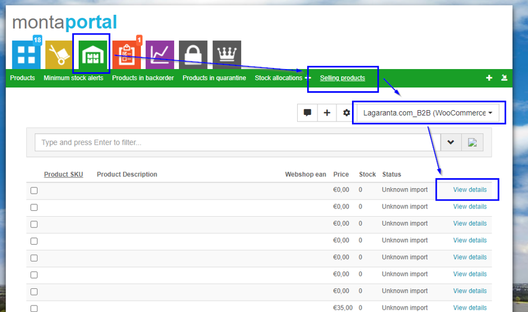
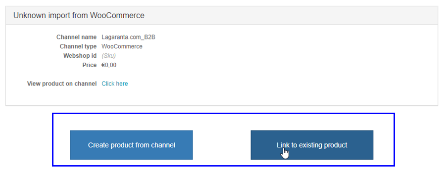

# Selling products

In de webshop staan de producten die worden verkocht. In de Montaportal staan producten die bij ons op voorraad staan. De product match, een onderdeel van de koppeling, legt een link tussen de producten bekend bij Montapacking en de webshop.

Wanneer de informatie van het product 1 op 1 hetzelfde is bij zowel de Montaportal als de webshop dan zal het systeem automatische de koppeling leggen. Wanneer er gegevens afwijken, bijvoorbeeld de Barcode of SKU, dan zal de koppeling handmatig moeten worden gemaakt. Dit kan worden gedaan op de sellingproduct pagina.

Letop,
•	Een barcode en SKU moeten uniek zijn voor een product. Er mogen dus geen verschillende producten zijn met dezelfde barcode of SKU.
•	Het hergebruiken van barcodes is ook niet aangeraden.
•	Wanneer er in de webshop een SKU wijzigt zal Monta dit zien als een nieuw product. Deze moet dan opnieuw worden gelinkt.
