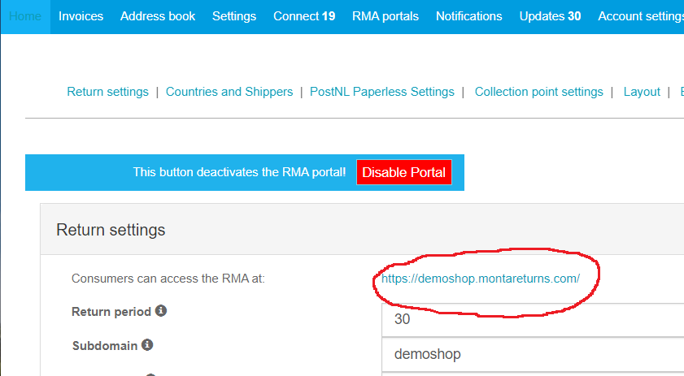
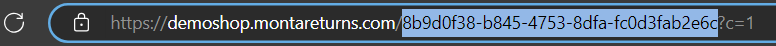

# MontaTracking

Hier volgt meer informatie over MontaTracking. Wat het is en hoe het ingericht moet worden.

MontaTracking is een Track & Trace pagina voor de consument, waar de order statussen te bekijken zijn.

## Settings
Op het moment maakt MontaTracking gebruik van de RMA settings. Er is dus een actieve RMA nodig om te kunnen werken. Hoe deze gemaakt en ingesteld kan worden is hier te vinden: [RMA Module](../../Algemene-informatie/Retouren/RMA-Module).

## Url
Om de goeie GUID te krijgen die achter https://www.montatracking.com/{GUID} moet komen te staan moet er eerst naar de RMA portal genavigeerd worden in MontaPortal. Door op de link te klikken (zie foto) wordt er genavigeerd naar de RMA.

Vervolgens kan de GUID verkregen worden door in adresbalk de cijfers te kopiëren na de / en voor het ? teken. (zie foto)

## Login
De consument kan op dezelfde manier inloggen als bij de bijbehorende RMA, dit ligt aan de login settings van die RMA. Deze worden hier uitgelegd [RMA Module](../../Algemene-informatie/Retouren/RMA-Module) onder het hoofdstuk 'RMA instellen' en dan het kopje 'Settings'.

Met de standaard RMA settings kan de consument inloggen met webshop ordernummer en e-mail.
