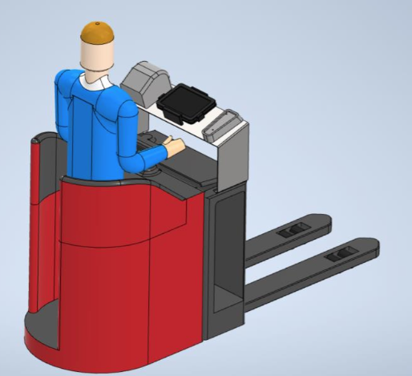
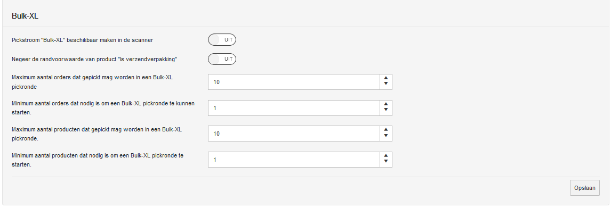

# BulkXL pickstroom

In deze pickstroom worden de verzendlabels geplakt tijdens het picken. Op deze manier wordt het picken en Echecken samengevoegd.

Deze pickstroom is ingericht voor orders met grote artikelen (XL orders), met artikelen die zijn gemarkeerd als `eigen verpakking drager`.

De bulkXL pickstroom kent twee soorten, verzendlabels vooraf printen en verzendlabels tijdens picken printen.

## 1. Vooraf printen

Route van de order: Vooraf printen

- Pickstroom wordt bepaald op basis van X-criteria (Groot volume; aantal colli).
- Pickstroom wordt geselecteerd.
- Krat wordt gescand (Picklabel).
- Verzendlabels worden gedrukt via de echeck.
- Picker wordt gestuurd naar locatie.
- Artikel wordt gescand; Verzendlabel wordt gescand.
- Verzendlabel wordt op artikel geplakt, artikel wordt opgestapeld.
- Pickroute wordt afgerond.

## 2. Tijdens picken printen

Route van de order: Tijdens picken printen

- Pickstroom wordt bepaald op basis van X-criteria (Groot volume; aantal colli).
- Pickstroom wordt geselecteerd.
- Krat wordt gescand (Picklabel).
- Picker wordt gestuurd naar locatie.
- Artikel wordt gescand;
- Verzendlabel wordt ter plekken afgedrukt
- Verzendlabel wordt gescand.
- Verzendlabel wordt op artikel geplakt, artikel wordt opgestapeld.
- Pickroute wordt afgerond.

Note: Voor de pickstroom tijdens het picken printen is er speciale hardware nodig:

## Meer informatie over bulkXL

Randvoorwaarde:
- Artikelen zijn altijd een eigen verzendverpakking (Dit is ingevoerd in Gomonta).
- Meerdere colli bij 1 artikel niet mogelijk.
- Pickvolgorde wordt bepaald op basis van looproute, magazijn wordt ingericht op basis van groot naar klein om stapelen van pallets goed te krijgen.
- Artikelen zijn groter dan ingesteld (Afmetingen en gewichten moeten kloppen)
- Orders vallen binnen de XL of S* Pickstroom
- Orders vallen binnen de itemaantallen ingesteld in gomonta.
- Orders moeten niet door een pallet verzender verzonden worden.
- Er is een verzender geselecteerd

*Note: binnen S-orders word geen onderscheid gemaakt in formaat, daarom worden de S-orders die aan de rest van de eisen voldoen meegeteld.

In Gomonta zijn instellingen te vinden betreffende deze pickstroom: <a href="https://gomonta.montapacking.nl/WMS/Shift/WarehouseSettings">Outbound > Magazijn outbound instellingen</a> onder "Algemene pickstromen":

Voor deze pickstroom is het minimum en het maximum van het aantal orders en producten, dat in een pickronde mag voorkomen, in te stellen. Deze zijn te vinden op de hierboven genoemde pagina.
Bij deze pickstroom is het niet mogelijk zijn om op ‘krat vol’ te klikken, want dan gaat iemand anders de orders picken terwijl de verzendlabels al geprint zijn. Wel is het mogelijk om verder te picken op een volgende krat (zoals bij put-to-light).
In het geval dat alle producten al een eigen verzendverpakking hebben, is er ook de optie om deze randvoorwaarde te negeren. Dit voorkomt dat een product niet gepickt kan worden als er een product nog niet goed staat.

Bij een joker kunnen ze proberen het product ergens anders te vinden en te scannen (dan hoeft het geen joker te worden). Als ze het product niet ergens anders vinden moeten ze de producten die eventueel al gepickt zijn van de pallet af halen en apart leggen.
