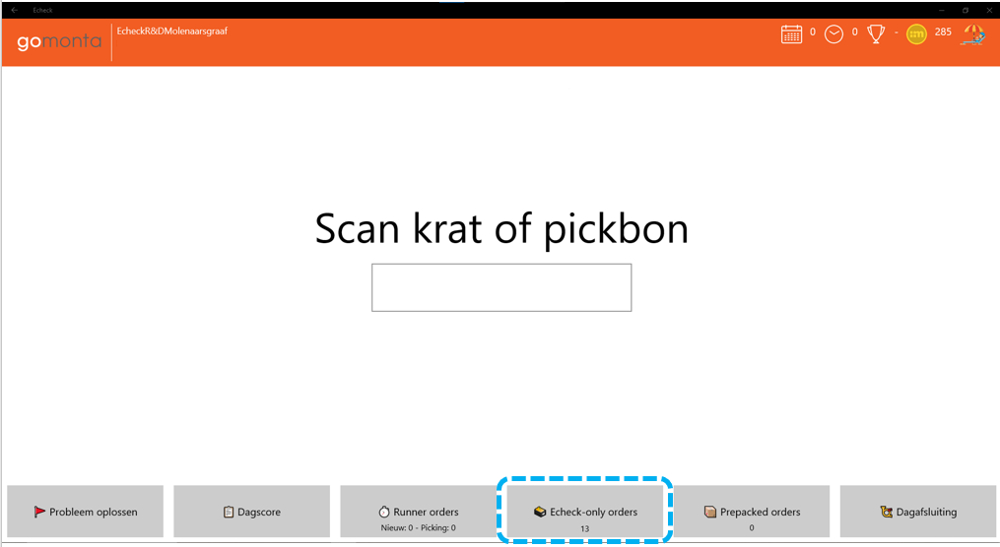
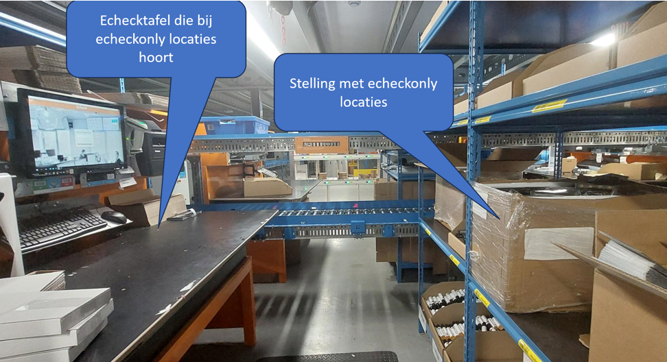
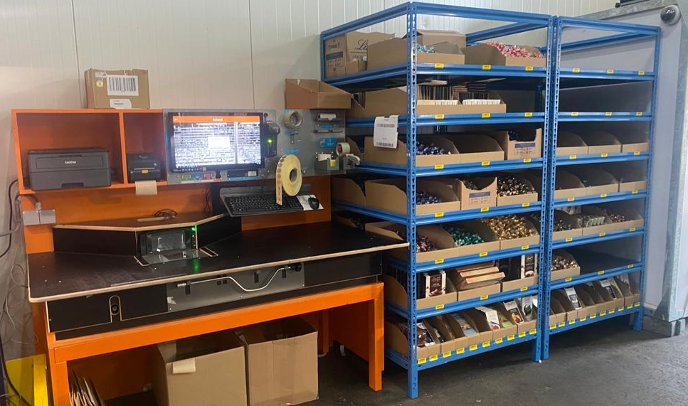

# Echeck only

### Echeck toevoegproducten

Producten die in veel orders voorkomen kunnen bij de echeck gelegd worden. Ze hoeven dan niet gepickt te worden waardoor meer S en HM orders ontstaan die efficiënter (in bulk) gepickt kunnen worden. Het type magazijnlocatie dat we hiervoor gebruiken noemen we een echecklocatie.

Zie [Voorraadbeheer - Echeck locaties](../../../Algemene-informatie/Voorraadbeheer#echeck-locaties).

Als producten op echeck locaties worden gelegd, kan het ook gebeuren dat er orders komen van producten die alleen op echeck locaties liggen. Deze hoeven dan niet via de scanner gepickt te worden. We noemen dit 'echeck only' orders. Op het hoofdscherm van de echeck staat een knop waarmee deze orders te vinden zijn. De knop gaat knipperen als er 'echeck only' orders beschikbaar zijn.

### Echeck Only
Op dit 'echeck only' idee is een concept gebaseerd dat het voor klanten met weinig SKU's (bijvoorbeeld minder dan 20) en redelijk veel orders (bijvoorbeeld minimaal 50 per dag) mogelijk maakt om alle producten op echecklocaties te leggen, waardoor de hele stap van orderpicken wordt overgeslagen. Dit concept kan leiden tot hoge productiviteit, omdat een complete processtap wordt overgeslagen. Een 'echeck only' order wordt gestart in het echeck scherm, de producten worden gepakt vanuit een 'echeck only' locatie en gescand, waarbij de scan direct de echeck scan is. Dit 'echeck only' concept wordt nu op enkele vestigingen gebruikt. Als er interesse is het ook te gaan gebruiken, mail even met [techniek@monta.nl](mailto:techniek@monta.nl) en dan zullen we analyseren welke klanten binnen je magazijn mogelijk geschikt zijn. Het mooie van 'echeck only' is dat het vrijwel geen investeringen vraagt, er is alleen een stukje stelling nodig om wat magazijnlocties van het type echecklocatie in te maken en een aantal instellingen in de software.

Voorbeeld van een opstelling in Molenaarsgraaf

filmpje van werking echeck only in Molenaarsgraaf
[filmpje echeckonly](https://www.loom.com/share/9097699481f6405c9f35c0f06f8e8e98?sid=20e7446a-a2e0-4b56-b759-5e562a67a767)

<embed style="width:720px; height:450px;" src="https://www.loom.com/share/9097699481f6405c9f35c0f06f8e8e98?sid=20e7446a-a2e0-4b56-b759-5e562a67a767"></embed>

Voorbeeld van een opstelling in Oud Gastel

### Echecktolight
Er bestaat ook een luxere variant van 'echeck only' die we EcheckToLight noemen. Dit werkt hetzelfde als 'echeck only', alleen is er ondersteuning van lichtjes die gaan branden bij de juiste locaties. Dat maakt EcheckToLight geschikter als het assortiment bijvoorbeeld wat breder is (bijvoorbeeld enkele tientallen SKU's) en het aantal orders wat hoger (bijvoorbeeld minimaal 150 orders per dag)'. Op deze pagina is een uitgebreider beschrijving te vinden van [EcheckToLight](../../../Algemene-informatie/Apparaten/Echeck-To-Light)
