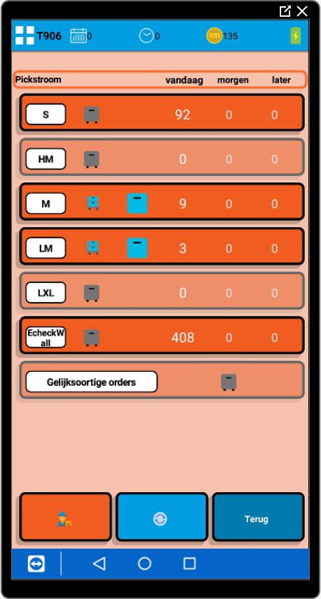

# Picken en consolideren

Voor het picken en consolideren zijn er een aantal bouwstenen beschikbaar: de echeckwall, de PutToLight en PickToLight.
De echeckwall en PutToLight zijn er beide op gericht om zoveel mogelijk in bulk te picken en vervolgens uit te sorteren. De PickToLight is bedoeld voor klanten met een smal assortiment en kleine producten maar wel een hoge omloopsnelheid.

### Echeckwall
Inmiddels zijn er drie varianten van de echeckwall. Hieronder staan de verschillende varianten beschreven:

#### Reguliere echeckwall
Dit is de meest voorkomende variant van de echeckwall. Dit is een modulaire unit waarbij de vak indeling vooraf te kiezen is.

Zoals op onderstaande foto te zien is, zijn de modulaire units los te gebruiken, maar zijn ze ook aan elkaar te koppelen om er een grotere echeckwall van te maken met meer capaciteit.

#### Echeckwall XL
De echeckwall XL is speciaal ontworpen voor klanten met grote producten, die in batches te picken zijn en maximaal 5 items in een order hebben.

Onderstaande foto geeft een voorbeeld weer uit breda. Deze echeckwall XL is ontwikkeld voor een dekbedden webshop.

De werking van deze grote echeckwall is volledig gelijk aan de reguliere echeckwall, enkel zijn de vakken groter.

-da1e0d67-c193-40c1-b04a-e5f09a3578a4.jpeg)

#### Virtuele echeckwall
De virtuele echeckwall is bedoeld voor vestigingen die wel graag in bulk de orders willen picken, maar waarbij het sorteren minder belangrijk is.

Hierbij wordt er geen fysieke echeckwall geplaatst, maar wordt enkel de pickroute van de echeckwall gebruikt.

Een voorbeeld hierbij is de vestiging in Den Bosch. Hierbij kunnen er meerdere orders tegelijk gepickt worden op een pallet. Omdat in deze situatie de producten vaak groot en duidelijk te herkennen zijn, is het sorteren in een fysieke echeckwall niet nodig. De batch met gepickte items wordt na het picken direct bij de echeckwall verwerkt.

